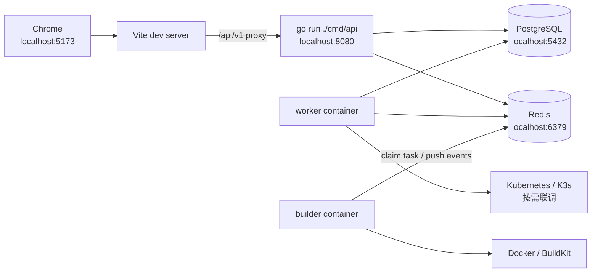

<p align="center">
  
</p>

<h1 align="center">Liteyuki DevOps</h1>

<p align="center">
  面向个人开发者和小团队的 DevOps 应用交付平台。
</p>

<p align="center">
  <a href="docs/01-产品与一体化方案.md">产品方案</a>
  ·
  <a href="docs/03-产品原型.html">产品原型</a>
  ·
  <a href="TODO.md">开发计划</a>
  ·
  <a href="AGENTS.md">开发规范</a>
</p>

## 项目定位

Liteyuki DevOps 将代码仓库、镜像站、构建、部署、网关和域名打通，让开发者只需要维护代码、`Dockerfile` 和少量配置，就能把应用交付成一个可访问的服务。

第一阶段聚焦一条稳定闭环：

```text
绑定仓库
  -> 平台构建镜像
  -> 推送制品库
  -> 部署到 Kubernetes / K3s
  -> 配置 Ingress / Traefik
  -> 分配域名
  -> 展示状态与发布记录
```

## 核心能力

| 模块 | 能力 |
| --- | --- |
| 项目与应用 | 项目空间、应用、成员和权限管理 |
| 认证准入 | 本地账号、OIDC、邀请/导入、准入策略 |
| 代码仓库 | Gitea / GitHub 账号授权、仓库绑定、Webhook |
| 平台构建 | 平台 Builder + BuildKit 构建镜像 |
| 镜像站 | Harbor / Gitea Registry / DockerHub 接入 |
| 部署发布 | Kubernetes / K3s 部署、Release 记录、回滚 |
| 网关域名 | Ingress / Traefik、自定义域名、HTTP Challenge 证书 |
| 站点配置 | title、logo、favicon、登录页副标题等公开配置 |
| 体验基础 | light / dark / system 主题、i18n、友好错误页 |

## 技术栈

| 领域 | 技术 |
| --- | --- |
| 后端 | Go, Gin, GORM, PostgreSQL, Redis, Asynq, client-go, OpenAPI |
| 前端 | Vite, React, TypeScript, Tailwind CSS, shadcn/ui, TanStack Query |
| 表单与体验 | React Hook Form, Zod, i18next, react-i18next, Sonner |
| 运维与构建 | Docker Compose, 平台 Builder, BuildKit, Traefik / Ingress |
| Python 工具链 | uv |

## 快速开始

启动开发依赖：

```bash
docker compose -f docker-compose-dev.yaml up -d
```

开发依赖 compose 使用独立项目名 `liteyuki-devops-dev`，并把 PostgreSQL / Redis 暴露到宿主机 `5432` / `6379`，供 `go run` 的 API、worker 和本地工具连接。

准备本地环境变量：

```bash
cp .env.example .env.development
printf 'APP_ENV=development\n' > .env
```

启动 API：

```bash
go run ./cmd/api
```

启动 worker：

```bash
go run ./cmd/worker
```

启动前端：

```bash
pnpm --dir web install
pnpm --dir web dev
```

开发环境前端请求 `/api/v1`，由 Vite proxy 反代到 `http://localhost:8080`。

### 推荐开发拓扑

日常前后端开发最频繁，推荐宿主机运行 Vite 和 API，开发 compose 负责启动 PostgreSQL / Redis / worker / builder：



启动开发依赖和异步组件：

```bash
docker compose -f docker-compose-dev.yaml up -d --build
```

Builder 默认通过 Redis stream 连接平台任务队列和事件流，适合联调构建任务、日志回写和镜像推送。API 和前端改动频繁时仍在宿主机运行，避免每次都重建完整容器栈。

开发 compose 直接声明容器必需变量，不读取宿主机 `.env.development`；builder 不读取数据库和 API 配置，只保留 Redis 连接和 agent 身份。容器内连接地址直接写在 `docker-compose-dev.yaml` 里，避免 `.env.development` 中给宿主机 `go run` 使用的 `localhost` 地址在容器内失效。

### Compose 场景

| 文件 | 用途 | 对外端口 | 适合场景 |
| --- | --- | --- | --- |
| `docker-compose-dev.yaml` | 启动 PostgreSQL / Redis / worker / builder | `5432`, `6379` | 默认开发联调，Vite 和 API 在宿主机跑 |
| `docker-compose.yaml` | 完整平台部署栈 | `8088` | 完整部署验收 |

常用命令：

```bash
# 开发联调：PG/Redis/worker/builder
docker compose -f docker-compose-dev.yaml up -d --build

# 完整容器化部署
docker compose up -d --build
```

开发 compose 使用独立项目名 `liteyuki-devops-dev`，会占用宿主机 `5432` / `6379`。完整部署栈的 PostgreSQL / Redis 只在容器网络内访问，不占用宿主机数据库和缓存端口。

## 容器运行

构建并启动完整平台：

```bash
docker compose up --build
```

完整平台 compose 内置 PostgreSQL / Redis 只在容器网络内访问，不占用宿主机 `5432` / `6379`，避免和开发依赖冲突；对外只暴露 web 的 `8088`。

访问前端：

```text
http://localhost:8088
```

容器链路：

```text
browser
  -> web nginx :80
  -> /api/* proxy
  -> api :8080
  -> postgres / redis

worker
  -> postgres / redis

builder
  -> redis stream
  -> docker socket
  -> executor container
```

Builder 仅使用 Redis transport。builder 写入 heartbeat / claimed / log / complete / fail 事件，worker 消费事件并落库。`BUILDER_AGENT_NAME` 是 builder agent 的唯一标识，同名 agent 会更新同一条 `builder_agents` 记录；API 创建构建时按应用构建标签、builder scope 和在线状态选择一个 builder，再投递到该 builder 的专属 Redis stream。

```env
REDIS_ADDR=localhost:6379
BUILDER_AGENT_NAME=local-builder
BUILDER_SCOPES=global,project:proj_123,user:usr_123
BUILDER_LABELS=docker,arm64
BUILDER_WORKSPACE_HOST_ROOT=/absolute/host/path/to/.local/builder-workspace
```

Builder 执行参数有内置默认值：executor 为 `docker`，executor image 为 `moby/buildkit:v0.24.0-rootless`，最大并发 `16`，轮询间隔 `3s`，workspace 为 `/builder-workspace`。当 builder 运行在容器内且复用宿主机 Docker socket 时，`BUILDER_WORKSPACE_HOST_ROOT` 必须是宿主机绝对路径，否则 Docker Desktop 无法挂载 executor workspace。

## 运行模式

| 模式 | 行为 |
| --- | --- |
| `APP_ENV=development` | 启用开发默认管理员，并由后端下发登录页开发账号提示 |
| `APP_ENV=production` | 禁用开发默认管理员；没有平台管理员时需访问 `/bootstrap` 初始化 |
| 未设置 `APP_ENV` | 默认按生产模式处理 |

配置加载顺序为：先读取 `.env`，再根据 `APP_ENV` 读取 `.env.development` 或 `.env.production`，最后读取 `ENV_FILE` 指定的文件作为覆盖。开发模式需要在 `.env` 或进程环境里显式设置 `APP_ENV=development`：

```bash
go run ./cmd/api
go run ./cmd/worker
```

需要临时覆盖时再使用：

```bash
ENV_FILE=.env.local go run ./cmd/api
```

生产环境必须配置稳定的 `SECRET_ENCRYPTION_KEY`，用于加密后台直接填写的 OIDC/Git Client Secret、Git Token、镜像站凭据等敏感值。未配置时 API/worker 会拒绝启动；本地开发需要在 `.env` 或进程环境里显式设置 `APP_ENV=development`。

## 目录地图

```text
cmd/api                 API 服务入口
cmd/worker              异步任务 worker 入口
internal/               后端领域模块、配置、模型和 API
migrations/             PostgreSQL 数据库迁移
openapi/                OpenAPI 定义
web/                    Vite + React 前端
web/public/             静态资源，包含 SVG logo / favicon
docs/                   产品、原型、AI 能力和品牌说明
```

## 品牌资产

- 主 Logo / Favicon：[`web/public/liteyuki-logo.svg`](web/public/liteyuki-logo.svg)
- Mascot：[`web/public/brand/mascot-liteyuki-devops.png`](web/public/brand/mascot-liteyuki-devops.png)
- 品牌说明：[`docs/05-品牌与Logo.md`](docs/05-品牌与Logo.md)

前端默认公开配置、favicon 和 README 都引用同一个 SVG 源文件；后台仍可通过站点配置覆盖 `site.logoUrl` 和 `site.faviconUrl`。

## 文档

推荐阅读顺序：

1. [产品与一体化方案](docs/01-产品与一体化方案.md)
2. [产品原型](docs/03-产品原型.html)
3. [AI 能力提案](docs/04-AI能力提案.md)
4. [品牌与 Logo](docs/05-品牌与Logo.md)
5. [TODO](TODO.md)
6. [AI 开发规范](AGENTS.md)

## 开发约定

- 前端必须使用 `pnpm`。
- Python 必须使用 `uv`。
- Go 后端使用 `Gin + GORM`。
- 平台构建主路径使用平台 Builder + BuildKit。
- Gitea/GitHub Actions 不作为当前构建主路径。
- 部署由平台统一执行和记录。
- 前端所有用户可见文本必须走 i18n，不在组件中硬编码文案。
