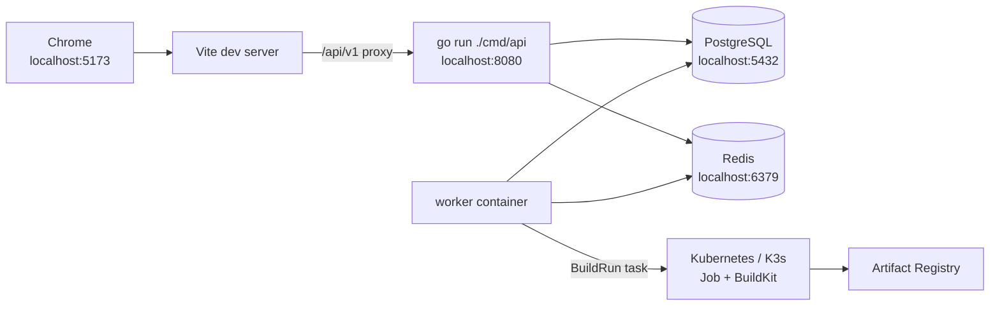

<p align="center">
  
</p>

<h1 align="center">Luna DevOps</h1>

<p align="center">
  面向个人开发者和小团队的应用交付平台。
</p>

<p align="center">
  
</p>

<p align="center">
  <a href="https://devops-docs.liteyuki.org">文档站</a>
  ·
  <a href="notes/01-产品与一体化方案.md">产品方案</a>
  ·
  <a href="notes/07-代码健康检查SOP.md">代码健康 SOP</a>
  ·
  <a href="TODO.md">开发计划</a>
  ·
  <a href="AGENTS.md">开发规范</a>
</p>

## 项目定位

Luna DevOps 将代码仓库、镜像站、构建、部署、网关和域名打通，让开发者只需要维护代码、`Dockerfile` 和少量配置，就能把应用交付成一个可访问的服务。

第一阶段聚焦一条稳定闭环：

```text
绑定仓库
  -> 平台构建镜像
  -> 推送制品库
  -> 部署到 Kubernetes / K3s
  -> 配置 Gateway API / HTTPRoute
  -> 分配域名
  -> 展示状态与发布记录
```

## 核心能力

| 模块 | 能力 |
| --- | --- |
| 项目与应用 | 项目空间、应用、成员和权限管理 |
| 认证准入 | 本地账号、OIDC、邀请/导入、准入策略 |
| 代码仓库 | Gitea / GitHub 账号授权、仓库绑定、Webhook |
| 平台构建 | Worker 调度部署集群 Kubernetes Job，使用 BuildKit 构建并推送镜像 |
| 镜像站 | Harbor / Gitea Registry / DockerHub / 通用 OCI Registry 接入 |
| 部署发布 | Kubernetes / K3s Deployment / StatefulSet 部署、Release 记录、回滚 |
| 网关域名 | Kubernetes Gateway API / HTTPRoute、自定义域名、HTTP Challenge 证书 |
| 站点配置 | title、logo、favicon、登录页副标题等公开配置 |
| 体验基础 | light / dark / system 主题、i18n、友好错误页 |

## 技术栈

| 领域 | 技术 |
| --- | --- |
| 后端 | Go, Gin, GORM, PostgreSQL, Redis, Asynq, client-go, OpenAPI |
| 前端 | Vite, React, TypeScript, Tailwind CSS, shadcn/ui, TanStack Query |
| 表单与体验 | React Hook Form, Zod, i18next, react-i18next, Sonner |
| 运维与构建 | Docker Compose, Kubernetes Job, BuildKit, Traefik Gateway API |
| Python 工具链 | uv |

## 快速开始

启动开发依赖：

```bash
docker compose -f docker-compose-dev.yaml up -d
```

开发依赖 compose 使用独立项目名 `luna-devops-dev`，并把 PostgreSQL / Redis 暴露到宿主机 `5432` / `6379`，供 `go run` 的 API、worker 和本地工具连接。

准备本地环境变量：

```bash
cp .env.example .env
cp .env.development.example .env.development
cp .env.worker.example .env.worker
```

启动 API：

```bash
go run ./cmd/api
```

启动 worker：

```bash
go run ./cmd/worker
```

启动前端：

```bash
pnpm --dir web install
pnpm --dir web dev
```

开发环境前端请求 `/api/v1`，由 Vite proxy 反代到 `http://localhost:8080`。

### 本地 minikube 部署联调

当 API / worker 运行在 Docker Compose 容器中时，集群 kubeconfig 不要使用宿主机专用的 `https://127.0.0.1:<port>` 和外链证书文件路径。默认 `docker-compose*.yaml` 不内置本地 minikube 域名映射；只有需要在容器内访问宿主机 minikube apiserver 时，再用本地 override 追加。

推荐为本地 minikube 预留统一域名：

- 宿主机 `/etc/hosts`：`127.0.0.1 dev.minikube.local`
- Docker Compose 容器：通过本地 override 将 `dev.minikube.local` 解析到宿主机网关
- minikube apiserver 证书：启动 profile 时需要把 `dev.minikube.local` 加入 apiserver SAN

示例：

```bash
minikube -p luna-devops start --apiserver-names=dev.minikube.local
kubectl config view --raw --minify --flatten > /tmp/luna-devops.kubeconfig
```

如果 worker 跑在 Compose 容器里，可以新建不提交的 `docker-compose-minikube.override.yaml`：

```yaml
services:
  worker:
    extra_hosts:
      - "dev.minikube.local:host-gateway"
```

再启动：

```bash
docker compose -f docker-compose-dev.yaml -f docker-compose-minikube.override.yaml up -d --build
```

然后将导出的 kubeconfig 中的 server 改为 `https://dev.minikube.local:<apiserver-port>`，再保存到平台运行集群配置。`--flatten` 必须保留，用于把 `certificate-authority-data`、`client-certificate-data` 和 `client-key-data` 内联到 kubeconfig，避免 worker 容器读取不到宿主机证书文件。

### 推荐开发拓扑

日常前后端开发最频繁，推荐宿主机运行 Vite 和 API，开发 compose 负责启动 PostgreSQL / Redis / worker：



启动开发依赖和异步组件：

```bash
docker compose -f docker-compose-dev.yaml up -d --build
```

构建任务由 API 写入 BuildRun / BuildJob 后投递到 worker；worker 根据部署配置所属环境解析运行集群，在对应项目命名空间内创建一次性 Kubernetes Job 执行 BuildKit 构建，并把日志、进度、镜像结果写回平台。API 和前端改动频繁时仍在宿主机运行，避免每次都重建完整容器栈。

开发 compose 不读取宿主机 `.env.development`；worker 使用 `.env.worker`。`.env.development` 只给宿主机 `go run` 进程使用，避免其中的 `localhost` 地址进入容器后指向错误位置。构建前需要先在平台配置可用的运行集群和镜像站推送凭据。

### Compose 场景

| 文件 | 用途 | 对外端口 | 适合场景 |
| --- | --- | --- | --- |
| `docker-compose-dev.yaml` | 启动 PostgreSQL / Redis / worker | `5432`, `6379` | 默认开发联调，Vite 和 API 在宿主机跑 |
| `docker-compose.yaml` | 使用 DockerHub 镜像启动完整平台部署栈 | `8088` | 完整部署验收 / RC 镜像验证 |
| `docker-compose-build.yaml` | 从当前源码构建并启动完整平台部署栈 | `8088` | 本地镜像构建验证 |
| `charts/luna-devops` | 使用 Helm 部署 API / worker / PostgreSQL / Redis | Service / Ingress | Kubernetes / K3s 集群内一键部署 |

常用命令：

```bash
# 开发联调：PG/Redis/worker
docker compose -f docker-compose-dev.yaml up -d --build

# 使用 DockerHub 镜像启动完整平台
cp .env.production.example .env
# 修改 .env 中的三个 replace-with-* 占位值
docker compose up -d

# 从当前源码构建完整平台
docker compose -f docker-compose-build.yaml up -d --build

# 使用 Helm 部署到 Kubernetes / K3s
helm install luna-devops ./charts/luna-devops \
  --namespace luna-devops \
  --create-namespace
```

开发 compose 使用独立项目名 `luna-devops-dev`，会占用宿主机 `5432` / `6379`。完整部署栈的 PostgreSQL / Redis 只在容器网络内访问，不占用宿主机数据库和缓存端口。

## 容器运行

使用 DockerHub 镜像启动完整平台：

```bash
cp .env.production.example .env
# 修改 .env 中的 SECRET_ENCRYPTION_KEY、BOOTSTRAP_TOKEN 和 REDIS_PASSWORD
docker compose up -d
```

完整平台默认使用 `APP_ENV=production`，不会创建或展示固定开发管理员。`SECRET_ENCRYPTION_KEY`、首次初始化使用的 `BOOTSTRAP_TOKEN` 和 Redis 密码必须在启动前设置；完成首个管理员初始化后，应轮换或移除一次性的 `BOOTSTRAP_TOKEN`。

默认使用 `liteyukistudio/devops-api:${DEVOPS_IMAGE_TAG:-nightly}` 和 `liteyukistudio/devops-worker:${DEVOPS_IMAGE_TAG:-nightly}`。需要验证指定版本时可以覆盖镜像 tag：

```bash
DEVOPS_IMAGE_TAG=v0.1.0-rc.1 docker compose up -d
```

如需从当前源码构建镜像并启动完整平台，使用：

```bash
docker compose -f docker-compose-build.yaml up -d --build
```

完整平台 compose 内置 PostgreSQL / Redis 只在容器网络内访问，不占用宿主机 `5432` / `6379`，避免和开发依赖冲突；部署者只需提供 URL-safe 的 `REDIS_PASSWORD`，Compose 会直接用它启动 Redis，并为 API 和 Worker 组装内部 `REDIS_ADDR`。API 完成数据库 migration 且 `/healthz` 通过后，Compose 才启动 Worker，避免空库初始化期间提前访问业务表。对外只暴露 API 的 `8088`。API 镜像内嵌前端 SPA 静态文件，根路径和前端路由由后端 fallback 到 `index.html`，`/api/*` 和 `/healthz` 继续走后端接口。

发布工作流只构建 `linux/amd64` 容器镜像，并发布到 DockerHub：`liteyukistudio/devops-api`、`liteyukistudio/devops-worker`。`devops-api` 使用 Go `embed` 内嵌前端构建产物，不再维护独立前端 Dockerfile 或 nginx 前端镜像，也不额外发布 GitHub Release 二进制产物。推送 `main` / `dev` 时发布 `nightly`；推送 `v*` tag 时发布版本 tag；只有稳定版本 tag（如 `v0.1.0`）额外发布 `latest`。

访问前端：

```text
http://localhost:8088
```

容器链路：

```text
browser
  -> api :8080
     -> embedded SPA fallback
     -> /api/* backend routes
  -> postgres / redis

worker
  -> postgres / redis
  -> deployment cluster Kubernetes API
  -> build job pod / BuildKit
```

完整 compose 已内联 API / worker 运行环境变量，生产部署时可以通过宿主机环境变量覆盖密钥、域名、镜像 tag 和构建参数。Worker 构建参数示例：

```env
BUILD_EXECUTOR_IMAGE=moby/buildkit:v0.24.0-rootless
BUILD_EGRESS_MODE=permissive
BUILD_JOB_TIMEOUT_SECONDS=1800
BUILD_JOB_TTL_SECONDS=3600
BUILD_CACHE_ENABLED=false
BUILD_CACHE_TAG=buildcache
BUILD_NPM_REGISTRY=
BUILD_PRIVATE_EGRESS_CIDRS=
BUILD_PRIVATE_EGRESS_PORTS=443
BUILD_BLOCKED_EGRESS_CIDRS=
```

构建 Job 不挂载宿主机 Docker socket，不默认 privileged，不持有平台 API token，并显式使用受限 ServiceAccount。Git token、Registry 凭据和构建密钥通过一次性 Kubernetes Secret 注入到 Job，Job 完成后 worker 会删除临时 Secret，Pod/Job 按 TTL 保留日志窗口。Worker 会为项目命名空间应用构建出站 NetworkPolicy；默认 `permissive` 模式放行构建出站，优先保证不同 CNI 和镜像站能正常构建。需要强隔离时可改为 `BUILD_EGRESS_MODE=restricted`，再用 `BUILD_PRIVATE_EGRESS_CIDRS`、`BUILD_PRIVATE_EGRESS_PORTS` 和 `BUILD_BLOCKED_EGRESS_CIDRS` 控制内网白名单。

## 运行模式

| 模式 | 行为 |
| --- | --- |
| `APP_ENV=development` | 启用开发默认管理员，并由后端下发登录页开发账号提示 |
| `APP_ENV=production` | 禁用开发默认管理员；没有平台管理员时需访问 `/bootstrap` 初始化 |
| 未设置 `APP_ENV` | 默认按生产模式处理 |

配置加载顺序为：先读取 `.env`，再根据 `APP_ENV` 读取 `.env.development` 或 `.env.production`，最后读取 `ENV_FILE` 指定的文件作为覆盖。`.env.development` 面向宿主机进程，`.env.worker` 面向 `docker-compose-dev.yaml` 中的 worker 容器；完整部署的 `docker-compose.yaml` 和 `docker-compose-build.yaml` 已内联 API / worker 环境变量。开发模式需要在 `.env` 或进程环境里显式设置 `APP_ENV=development`：

```bash
go run ./cmd/api
go run ./cmd/worker
```

需要临时覆盖时再使用：

```bash
ENV_FILE=.env.local go run ./cmd/api
```

生产环境必须配置稳定的 `SECRET_ENCRYPTION_KEY`，用于加密后台直接填写的 OIDC/Git Client Secret、Git Token、镜像站凭据等敏感值。未配置时 API/worker 会拒绝启动；本地开发需要在 `.env` 或进程环境里显式设置 `APP_ENV=development`。

## 目录地图

```text
cmd/api                 API 服务入口
cmd/worker              异步任务 worker 入口
internal/               后端领域模块、配置、模型和 API
migrations/             PostgreSQL 数据库迁移
openapi/                OpenAPI 定义
web/                    Vite + React 前端
web/public/             静态资源，包含 SVG logo / favicon
docs/                   Rspress 文档站源码
notes/                  产品方案、场景记录和代码健康 SOP
```

## 品牌资产

- 主 Logo / Favicon：[`web/public/luna-devops-logo.svg`](web/public/luna-devops-logo.svg)
- Mascot：[`web/public/brand/mascot-luna-devops.png`](web/public/brand/mascot-luna-devops.png)

前端默认公开配置、favicon 和 README 都引用同一个 SVG 源文件；后台仍可通过站点配置覆盖 `site.logoUrl` 和 `site.faviconUrl`。

## 文档

推荐阅读顺序：

1. [文档站](https://devops-docs.liteyuki.org)
2. [产品与一体化方案](notes/01-产品与一体化方案.md)
3. [代码健康检查 SOP](notes/07-代码健康检查SOP.md)
4. [TODO](TODO.md)
5. [AI 开发规范](AGENTS.md)

## 开发约定

- 前端必须使用 `pnpm`。
- Python 必须使用 `uv`。
- Go 后端使用 `Gin + GORM`。
- 平台构建主路径使用 Worker 调度 Kubernetes Job + BuildKit。
- Gitea/GitHub Actions 不作为当前构建主路径。
- 部署由平台统一执行和记录。
- 前端所有用户可见文本必须走 i18n，不在组件中硬编码文案。
