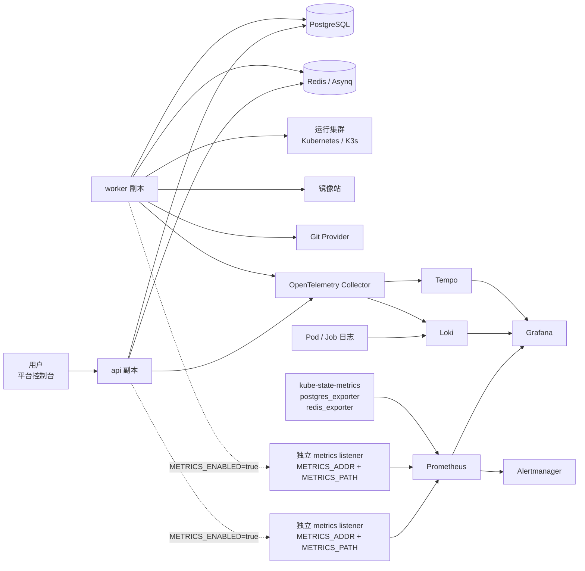

# 可观测方案

Liteyuki DevOps 的可观测能力应优先服务用户体验：用户不需要先理解 PromQL、Pod 名称或 trace span，就能知道“我的构建为什么慢了”“这次发布卡在哪里”“访问入口为什么打不开”。底层 Prometheus、Grafana、链路追踪和日志系统用于支撑这些判断，而不是把复杂度直接丢给用户。

## 目标体验

面向用户的第一层体验应该是平台内的状态视图：

- 看板页展示平台整体健康、近期构建/发布成功率、运行集群连通性和队列积压。
- 项目空间概览展示该项目下应用健康、最近失败、资源使用趋势和访问入口异常。
- 应用概览展示构建、部署、访问、运行时四条主链路的当前状态。
- 构建详情展示阶段耗时、失败原因、构建日志和相关 Kubernetes Job 事件。
- 发布详情展示镜像、部署配置、执行耗时、运行副本、滚动更新状态和运行日志入口。
- 访问入口详情展示域名解析、TLS、网关下发和后端服务可达性。

Grafana 面板作为管理员和高级用户的深度入口：平台内先给出摘要和跳转上下文，再允许跳到对应 dashboard、trace 或日志查询。

## 推荐技术栈

第一阶段推荐采用这一组：

| 领域 | 推荐组件 | 说明 |
| --- | --- | --- |
| 指标采集 | Prometheus | 采集 API、worker、PostgreSQL、Redis、Kubernetes 和业务指标。 |
| 指标展示 | Grafana | 管理员 dashboard、SLO 趋势、容量规划和告警看板。 |
| 告警 | Alertmanager | 处理 Prometheus 告警路由，先支持邮件、Webhook，再扩展 IM。 |
| 链路追踪 | OpenTelemetry SDK + Collector | API、worker、外部 provider 统一生成 trace；Collector 负责采样和转发。 |
| Trace 存储 | Grafana Tempo | 与 Grafana 生态契合，适合从指标、日志跳转 trace。 |
| 日志采集 | slog 结构化日志 + OpenTelemetry Collector 或 Promtail | Go 进程输出 JSON 日志，采集侧负责上报。 |
| 日志存储 | Grafana Loki | 适合按 label、trace_id、project_id、application_id 查询。 |
| Kubernetes 指标 | kube-state-metrics + node-exporter/cAdvisor | 展示 Pod、Job、Deployment、节点和容器资源状态。 |
| Redis/PG 指标 | redis_exporter + postgres_exporter | 展示队列依赖和数据库健康。 |

可选替代：

| 方案 | 适合场景 | 取舍 |
| --- | --- | --- |
| Jaeger | 只需要简单 trace 查询 | 部署简单，但与 Grafana 指标/日志联动弱于 Tempo。 |
| VictoriaMetrics | Prometheus 数据量增长明显 | 存储效率好，但早期会增加运维组件。 |
| Grafana Alloy | 希望用 Grafana 生态统一采集 | 可替代 Promtail/部分 Collector 场景，但第一阶段不必强依赖。 |
| Elastic / OpenSearch | 团队已有全文日志平台 | 日志检索强，但资源占用和维护复杂度更高。 |

## 总体架构



API 和 worker 的指标端点不挂在业务 API 端口。只有 `METRICS_ENABLED=true` 且 `METRICS_ADDR`、`METRICS_PATH` 均已配置时，进程才启动独立 metrics listener 并在该 listener 上注册 scrape path；任一配置缺失时不监听 metrics 端口。

## 平台侧暴露的指标

指标命名建议统一使用 `liteyuki_` 前缀。标签必须克制：可以使用稳定、低基数标签；不要把用户输入、完整 URL、完整镜像、错误原文放进 label。

通用标签：

| 标签 | 说明 |
| --- | --- |
| `service` | `api` 或 `worker`。 |
| `instance` | 进程实例或 Pod 名。 |
| `project_id` | 只用于项目维度业务指标；高流量指标可不带。 |
| `application_id` | 只用于应用维度业务指标；高流量指标可不带。 |
| `environment_id` | 部署环境。 |
| `deployment_target_id` | 部署配置。 |
| `status` | 稳定枚举，例如 `succeeded`、`failed`、`running`。 |
| `provider` | `github`、`gitea`、`harbor`、`kubernetes` 等。 |
| `operation` | 稳定操作名，例如 `create_release`、`sync_gateway`。 |

不要作为 label：

- 用户名、邮箱、Token 名称。
- 原始错误信息。
- 完整 Git commit message。
- 完整镜像 tag 或日志内容。
- 任意用户可控 path。HTTP path 应使用路由模板，例如 `/api/v1/projects/:projectId/applications`。

### API 指标

| 指标 | 类型 | 标签 | 用途 |
| --- | --- | --- | --- |
| `liteyuki_http_requests_total` | counter | `method`,`route`,`status_code` | 请求量、错误率。 |
| `liteyuki_http_request_duration_seconds` | histogram | `method`,`route` | P50/P95/P99 延迟。 |
| `liteyuki_http_request_inflight` | gauge | `route` | 当前并发请求。 |
| `liteyuki_auth_login_total` | counter | `provider`,`result`,`reason` | 登录成功率和失败原因分布。 |
| `liteyuki_api_rate_limited_total` | counter | `scope`,`reason` | 限流命中。 |
| `liteyuki_api_errors_total` | counter | `code`,`route` | 稳定业务错误码统计。 |
| `liteyuki_db_query_duration_seconds` | histogram | `operation`,`table` | 数据库慢查询趋势。 |
| `liteyuki_external_request_duration_seconds` | histogram | `provider`,`operation`,`result` | Git、Registry、Kubernetes 等外部调用耗时。 |

API dashboard 重点展示：

- 5xx 错误率。
- P95/P99 延迟。
- 热门慢接口。
- 登录失败率。
- 外部 provider 调用失败率。

### Worker 与队列指标

| 指标 | 类型 | 标签 | 用途 |
| --- | --- | --- | --- |
| `liteyuki_worker_task_started_total` | counter | `queue`,`task_type` | Worker 任务启动量。 |
| `liteyuki_worker_task_completed_total` | counter | `queue`,`task_type`,`result` | 任务成功/失败统计。 |
| `liteyuki_worker_task_duration_seconds` | histogram | `task_type`,`result` | 任务耗时。 |
| `liteyuki_worker_task_retries_total` | counter | `task_type`,`reason` | 重试趋势。 |
| `liteyuki_worker_task_inflight` | gauge | `task_type` | 正在执行的任务。 |
| `liteyuki_asynq_queue_depth` | gauge | `queue` | 队列积压。 |
| `liteyuki_asynq_queue_latency_seconds` | histogram | `queue`,`task_type` | 从投递到开始执行的等待时间。 |
| `liteyuki_worker_lease_conflicts_total` | counter | `task_type` | 多副本抢占或幂等保护冲突。 |

Worker dashboard 重点展示：

- 队列积压和等待时间。
- 构建、发布、网关同步任务成功率。
- 重试最多的任务类型。
- 多 worker 副本下是否有重复执行、锁冲突或幂等保护命中。

### 构建指标

| 指标 | 类型 | 标签 | 用途 |
| --- | --- | --- | --- |
| `liteyuki_build_runs_total` | counter | `project_id`,`application_id`,`event`,`status` | 构建结果统计。 |
| `liteyuki_build_run_duration_seconds` | histogram | `project_id`,`application_id`,`status` | 构建耗时。 |
| `liteyuki_build_stage_duration_seconds` | histogram | `stage`,`status` | checkout/build/push 等阶段耗时。 |
| `liteyuki_build_job_kubernetes_events_total` | counter | `reason`,`type` | OOMKilled、Evicted、BackOff 等事件趋势。 |
| `liteyuki_build_image_push_total` | counter | `registry_id`,`result` | 镜像推送成功率。 |
| `liteyuki_build_timeout_total` | counter | `stage` | 超时分布。 |

用户体验上，构建页不直接展示这些指标名，而是展示：

- 平均构建耗时和最近一次耗时。
- 当前阶段是否慢于历史平均。
- 失败原因是否来自 Dockerfile、依赖下载、资源不足、镜像推送或 Kubernetes Job。
- “查看日志”“查看 Kubernetes 事件”“跳转 Grafana”三个入口。

### 部署与运行指标

| 指标 | 类型 | 标签 | 用途 |
| --- | --- | --- | --- |
| `liteyuki_releases_total` | counter | `project_id`,`application_id`,`environment_id`,`status`,`type` | 发布成功率。 |
| `liteyuki_release_duration_seconds` | histogram | `environment_id`,`status`,`type` | 发布耗时。 |
| `liteyuki_deployment_ready_replicas` | gauge | `deployment_target_id` | 就绪副本数。 |
| `liteyuki_deployment_desired_replicas` | gauge | `deployment_target_id` | 期望副本数。 |
| `liteyuki_deployment_unavailable_replicas` | gauge | `deployment_target_id` | 不可用副本数。 |
| `liteyuki_deployment_restart_total` | counter | `deployment_target_id`,`reason` | 重启次数。 |
| `liteyuki_runtime_cpu_usage_cores` | gauge | `deployment_target_id` | 应用 CPU 使用。 |
| `liteyuki_runtime_memory_usage_bytes` | gauge | `deployment_target_id` | 应用内存使用。 |
| `liteyuki_runtime_network_receive_bytes_total` | counter | `deployment_target_id` | 入站流量。 |
| `liteyuki_runtime_network_transmit_bytes_total` | counter | `deployment_target_id` | 出站流量。 |

运行指标可以来自 Kubernetes metrics API、Prometheus 查询或 kubelet/cAdvisor。平台内建议先展示较少但关键的数据：

- 副本是否全部就绪。
- CPU/内存是否接近配置上限。
- 最近 1 小时是否频繁重启。
- 当前发布版本和实际运行镜像是否一致。

### 访问入口与网关指标

| 指标 | 类型 | 标签 | 用途 |
| --- | --- | --- | --- |
| `liteyuki_gateway_routes_total` | gauge | `project_id`,`status`,`tls_mode` | 访问入口状态分布。 |
| `liteyuki_gateway_sync_total` | counter | `operation`,`result` | Ingress/Traefik 下发结果。 |
| `liteyuki_gateway_sync_duration_seconds` | histogram | `operation`,`result` | 下发耗时。 |
| `liteyuki_gateway_dns_check_total` | counter | `result` | 域名校验结果。 |
| `liteyuki_gateway_certificate_status_total` | gauge | `status` | 证书状态分布。 |
| `liteyuki_gateway_request_total` | counter | `route_id`,`status_code` | 访问入口请求量。 |
| `liteyuki_gateway_request_duration_seconds` | histogram | `route_id` | 入口延迟。 |

入口流量指标可以优先从 Traefik/Ingress Controller 自身的 Prometheus 指标读取，再按平台 label 关联；不建议第一阶段在业务 API 里转发或二次采集所有入口流量。

### 依赖健康指标

| 指标 | 类型 | 标签 | 用途 |
| --- | --- | --- | --- |
| `liteyuki_dependency_up` | gauge | `dependency` | PostgreSQL、Redis、Kubernetes、Registry、Git Provider 是否可用。 |
| `liteyuki_dependency_check_duration_seconds` | histogram | `dependency`,`operation` | 健康检查耗时。 |
| `liteyuki_dependency_errors_total` | counter | `dependency`,`operation`,`code` | 外部依赖错误趋势。 |

这些指标用于看板顶部的“平台依赖健康”摘要。

### 计费与配额指标

如果启用内部计量，可以暴露：

| 指标 | 类型 | 标签 | 用途 |
| --- | --- | --- | --- |
| `liteyuki_billing_usage_records_total` | counter | `meter`,`status` | 用量记录写入情况。 |
| `liteyuki_billing_settlement_duration_seconds` | histogram | `meter`,`result` | 结算耗时。 |
| `liteyuki_billing_pending_credits` | gauge | `project_id` | 项目空间待结算额度。 |
| `liteyuki_quota_limit` | gauge | `project_id`,`resource` | 配额上限。 |
| `liteyuki_quota_used` | gauge | `project_id`,`resource` | 配额已用。 |

## 链路追踪方案

链路追踪建议使用 OpenTelemetry，并把 API 请求、异步任务和外部系统调用串起来。

### Trace 边界

每个用户操作应该形成一条 trace：

```text
用户点击“触发构建”
  -> API: POST /build-runs
  -> DB: 创建 BuildRun
  -> Redis/Asynq: 投递 build task
  -> Worker: 领取 build task
  -> Kubernetes: 创建 Job
  -> Worker: 监听 Job / 写入日志 / 更新状态
```

每个发布操作也类似：

```text
用户点击“发布”
  -> API: 创建 Release
  -> Redis/Asynq: 投递 deploy task
  -> Worker: 生成 Kubernetes 资源
  -> Kubernetes: apply Deployment/Service/Ingress
  -> Worker: 同步 rollout 状态
```

### Trace 上下文传递

需要传递的字段：

| 字段 | 用途 |
| --- | --- |
| `trace_id` | 一次用户操作的全链路关联 ID。 |
| `span_id` | 当前步骤 ID。 |
| `request_id` | HTTP 请求关联 ID，可与 trace_id 复用或映射。 |
| `task_id` | Asynq 任务 ID。 |
| `build_run_id` | 构建记录。 |
| `release_id` | 发布记录。 |
| `project_id` | 项目空间。 |
| `application_id` | 应用。 |

API 投递 Asynq 任务时，应把 W3C Trace Context 或内部 trace 字段写入任务 payload / metadata。Worker 领取任务后继续使用同一 trace，而不是重新创建孤立 trace。

### Span 命名

建议使用稳定命名：

| Span | 示例 |
| --- | --- |
| HTTP | `HTTP POST /api/v1/projects/:projectId/build-runs` |
| DB | `DB BuildRun.Create`、`DB Release.UpdateStatus` |
| Queue | `Asynq Enqueue build.run`、`Asynq Process deploy.release` |
| Provider | `GitHub ListBranches`、`Registry PushCheck`、`Kubernetes ApplyDeployment` |
| Worker Stage | `Build Checkout`、`Build ImageBuild`、`Build ImagePush`、`Deploy RolloutWait` |

### 采样策略

第一阶段建议：

- 错误 trace 100% 保留。
- 慢请求、慢任务 100% 保留。
- 普通 API 请求按 5% 到 10% 采样。
- 构建和发布任务默认 100% 保留，因为数量相对 HTTP 请求少，而且排障价值高。

采样在 OpenTelemetry Collector 侧配置，避免所有进程各自维护复杂策略。

## 日志上报方案

日志应该结构化，面向排障，而不是把所有内容都作为字符串拼接。

### 日志格式

Go 侧建议统一使用 `log/slog` JSON 输出：

```json
{
  "time": "2026-06-30T10:30:00Z",
  "level": "INFO",
  "service": "worker",
  "trace_id": "4bf92f3577b34da6a3ce929d0e0e4736",
  "request_id": "req_...",
  "project_id": "proj_...",
  "application_id": "app_...",
  "build_run_id": "build_...",
  "task_type": "build.run",
  "message": "build job created"
}
```

日志字段建议：

| 字段 | 说明 |
| --- | --- |
| `time` | 时间。 |
| `level` | `DEBUG`、`INFO`、`WARN`、`ERROR`。 |
| `service` | `api`、`worker`。 |
| `component` | `auth`、`build`、`deployment`、`gateway`、`registry` 等。 |
| `trace_id` | 和 trace 关联。 |
| `request_id` | 和 HTTP 请求关联。 |
| `task_id` | 和 Asynq 任务关联。 |
| `project_id` | 项目空间。 |
| `application_id` | 应用。 |
| `build_run_id` | 构建。 |
| `release_id` | 发布。 |
| `operation` | 稳定操作名。 |
| `error_code` | 稳定错误码。 |
| `message` | 给工程师看的短消息。 |

### 日志分类

平台日志分三类：

| 类型 | 来源 | 展示位置 |
| --- | --- | --- |
| 平台运行日志 | API、worker 自身 | Loki/Grafana，管理员排障。 |
| 任务过程日志 | 构建 Job、部署任务 | 平台构建/发布详情页直接展示。 |
| 应用运行日志 | 用户应用 Pod | 应用部署页日志入口，按权限查看。 |

平台内展示给普通用户的日志应做过滤：

- 只展示该项目空间、应用和部署配置相关日志。
- 默认不展示平台内部 secret、数据库错误栈、第三方 token。
- 构建日志和应用日志允许展示用户自己的输出，但要避免平台主动写入敏感值。
- 下载或复制日志需要权限控制和审计。

### 日志采集路径

Kubernetes 部署推荐：

```text
api / worker stdout JSON
  -> Collector / Promtail / Alloy DaemonSet
  -> Loki
  -> Grafana
```

Compose 部署推荐：

```text
api / worker stdout JSON
  -> Docker logging driver 或本机 Promtail
  -> Loki
```

构建 Job 日志：

```text
BuildKit / executor pod stdout
  -> worker stream 读取
  -> 写入平台 BuildJobLog 表
  -> 同时输出结构化任务日志到 Loki
```

这样平台 UI 可以继续从数据库/SSE 提供稳定的构建日志体验，Loki 则用于跨任务检索和长期分析。

## 告警建议

第一阶段告警不宜过多，先覆盖用户能明显感知的问题：

| 告警 | 条件示例 | 影响 |
| --- | --- | --- |
| API 5xx 异常 | 5 分钟错误率 > 2% | 控制台不可用或接口异常。 |
| API 延迟升高 | P95 > 2s 持续 10 分钟 | 用户操作变慢。 |
| Worker 队列积压 | 默认队列等待 > 5 分钟 | 构建/发布不执行。 |
| 构建失败率升高 | 30 分钟失败率 > 30% | 大量用户无法交付。 |
| 发布失败率升高 | 30 分钟失败率 > 20% | 应用无法上线。 |
| Redis 不可用 | `liteyuki_dependency_up{dependency="redis"} == 0` | 登录限流、队列和异步任务受影响。 |
| PostgreSQL 不可用 | `liteyuki_dependency_up{dependency="postgres"} == 0` | 平台核心不可用。 |
| 运行集群不可达 | `dependency="kubernetes"` 连续失败 | 构建/部署/网关同步受影响。 |
| 证书失败过多 | failed 证书数持续增加 | 访问入口 HTTPS 异常。 |

告警文案应包含：

- 影响范围。
- 用户可见症状。
- 第一排查入口。
- 对应 Grafana dashboard 链接。
- 最近相关 trace/log 查询链接。

## 平台 UI 如何接入

控制台不需要一开始内嵌完整 Grafana，而是先做轻量摘要：

| 页面 | 建议展示 |
| --- | --- |
| 看板 | 平台健康、队列积压、近期失败构建/发布、运行集群异常。 |
| 项目空间概览 | 项目内应用健康、最近失败、资源使用趋势、费用/配额摘要。 |
| 应用概览 | 构建成功率、最近发布状态、副本健康、访问入口状态。 |
| 构建详情 | 阶段耗时、日志、Kubernetes 事件、trace 链接。 |
| 发布详情 | rollout 时间线、运行副本、运行日志、trace 链接。 |
| 访问入口 | DNS/TLS/Ingress/后端服务连通性检查结果。 |
| 系统设置 | Prometheus scrape 地址、Grafana 外链、Collector 状态。 |

对普通用户：

- 默认看到简洁状态、原因和下一步操作。
- 不暴露 PromQL、原始 span、collector 配置。
- 深度链接只在有权限时显示。

对平台管理员：

- 可以看到全局 dashboard、告警、依赖健康和采集状态。
- 可以按项目空间或应用过滤。
- 可以跳到 Grafana、Tempo、Loki。

## API 与配置建议

所有可观测能力默认关闭。每个能力都必须同时满足两个条件才启用：

- 显式开关为 `true`。
- 该能力依赖的环境变量键完整，例如 endpoint、base URL 或 path 已配置。

metrics 是这一规则的基础实例：必须同时满足 `METRICS_ENABLED=true`、`METRICS_ADDR` 已配置、`METRICS_PATH` 已配置才启用。

如果开关为 `true` 但必需配置缺失，平台应强制禁用该能力，并在启动日志和系统设置里展示缺失项。未配置时不要注册外部导出器，不要展示 Grafana/Tempo/Loki/Alertmanager 跳转，也不要让前端直接拼底层系统 API。

| 配置 | 示例 | 说明 |
| --- | --- | --- |
| `METRICS_ENABLED` | `true` | 显式开启 API/worker metrics；默认 `false`，且必须与 `METRICS_ADDR`、`METRICS_PATH` 同时配置才生效。 |
| `METRICS_ADDR` | `:9090` | 独立 metrics listener 地址；缺失时即使开关为 `true` 也不启动 metrics server。 |
| `METRICS_PATH` | `/metrics` | Prometheus scrape path；缺失时即使开关为 `true` 也不启动 metrics server，只注册在独立 metrics listener 上。 |
| `PROMETHEUS_QUERY_ENABLED` | `true` | 显式开启平台后端查询 Prometheus 聚合趋势；默认 `false`。 |
| `PROMETHEUS_BASE_URL` | `http://prometheus:9090` | Prometheus 查询地址；缺失时强制关闭查询能力。 |
| `GRAFANA_LINKS_ENABLED` | `true` | 显式开启 Grafana/Tempo/Loki 深链；默认 `false`。 |
| `GRAFANA_BASE_URL` | `https://grafana.example.com` | 平台 UI 生成受控外链；缺失时不展示入口。 |
| `OTEL_TRACING_ENABLED` | `true` | 显式开启 OpenTelemetry trace 导出；默认 `false`。 |
| `OTEL_SERVICE_NAME` | `liteyuki-api` | 服务名，worker 使用 `liteyuki-worker`。 |
| `OTEL_EXPORTER_OTLP_ENDPOINT` | `http://otel-collector:4317` | OTLP gRPC endpoint；缺失时 trace 使用 no-op。 |
| `OTEL_TRACES_SAMPLER` | `parentbased_traceidratio` | 采样策略。 |
| `STRUCTURED_LOG_ENABLED` | `true` | 显式开启 JSON slog；默认 `false`，开发可继续使用文本日志。 |
| `LOG_LEVEL` | `info` | 日志级别。 |
| `LOG_EXPORT_ENABLED` | `true` | 显式开启日志远端导出；默认 `false`。 |
| `LOG_EXPORT_OTLP_ENDPOINT` | `http://otel-collector:4317` | 日志 OTLP endpoint；缺失且未配置 Loki 时不导出。 |
| `LOKI_LINKS_ENABLED` | `true` | 显式开启 Loki/Grafana Explore 日志跳转；默认 `false`。 |
| `LOKI_BASE_URL` | `https://loki.example.com` | Loki 地址或 Grafana Explore 基础地址；缺失时不展示日志外链。 |
| `ALERT_LINKS_ENABLED` | `true` | 显式开启告警入口；默认 `false`。 |
| `ALERTMANAGER_BASE_URL` | `https://alertmanager.example.com` | Alertmanager 地址；缺失时不展示告警入口。 |

安全建议：

- `/metrics` 不挂在业务 API 端口，API/worker 使用独立 metrics listener。
- 指标端点在生产环境不要直接暴露公网；Kubernetes 中推荐独立 ClusterIP metrics Service + ServiceMonitor，不配置 Ingress。
- Grafana 外链必须按用户权限控制，不要让普通用户看到其他项目空间数据。
- 日志查询 API 必须按项目成员权限过滤。
- trace/log 中不要记录 secret、token、完整 cookie、Authorization header。

## 实施阶段

### 第一阶段：平台自身可观测

目标：让管理员知道平台是否健康。

- API 在 `METRICS_ENABLED=true` 且 `METRICS_ADDR`、`METRICS_PATH` 均已配置时，通过独立 metrics listener 暴露 HTTP、错误、依赖健康指标。
- Worker 在 `METRICS_ENABLED=true` 且 `METRICS_ADDR`、`METRICS_PATH` 均已配置时，通过独立 metrics listener 暴露任务、队列、任务耗时指标。
- 接入 Prometheus scrape 和 Grafana 基础 dashboard。
- API/worker 输出 JSON 结构化日志。
- 建立 request_id / trace_id 字段，但 trace 可以先只在日志中透传。
- 增加 Redis、PostgreSQL、Kubernetes 依赖健康检查。

### 第二阶段：构建与部署可观测

目标：让用户知道构建/发布卡在哪里。

- 构建阶段耗时指标。
- 发布阶段耗时指标。
- Kubernetes Job/Deployment 事件归因。
- 构建、发布任务 100% trace。
- 构建/发布详情页展示 trace/log 深链。
- 队列积压和失败率告警。

### 第三阶段：应用运行态可观测

目标：让用户知道应用运行是否健康。

- 采集运行副本、重启、CPU、内存、网络。
- 应用部署页展示轻量资源趋势。
- 接入应用 Pod 日志查询。
- 访问入口请求量、错误率、延迟。
- 项目空间和应用维度 dashboard。

### 第四阶段：用户体验闭环

目标：从“有数据”变成“能解决问题”。

- 失败原因归类：配置错误、资源不足、依赖不可达、镜像不存在、权限不足、网关异常。
- 平台内给出下一步建议。
- 告警事件进入平台通知中心。
- 构建/发布失败自动关联最近日志、Kubernetes 事件和 trace。
- 管理员可以按项目空间查看 SLO 和容量趋势。

## 初始 Dashboard 建议

Grafana 可以先建这些 dashboard：

| Dashboard | 主要面板 |
| --- | --- |
| Liteyuki Overview | API 可用性、Worker 队列、构建/发布成功率、依赖健康。 |
| Liteyuki API | QPS、错误率、延迟、慢接口、外部 provider 调用。 |
| Liteyuki Worker | 队列深度、任务耗时、失败率、重试、锁冲突。 |
| Liteyuki Build | 构建量、成功率、阶段耗时、失败原因、资源不足事件。 |
| Liteyuki Release | 发布量、成功率、rollout 耗时、失败原因、回滚次数。 |
| Liteyuki Gateway | 入口状态、TLS 状态、网关同步、请求量、错误率。 |
| Liteyuki Runtime | 副本、CPU、内存、网络、重启、Pod 状态。 |
| Liteyuki Dependencies | PostgreSQL、Redis、Kubernetes、Registry、Git Provider。 |

## 需要避免的设计

- 不要把 Prometheus/Grafana 当成唯一用户入口；普通用户应优先在平台内看到结论。
- 不要把高基数字段放进 Prometheus label，例如完整 URL、镜像 tag、错误原文。
- 不要把 trace/log 当成业务状态源；业务状态仍以数据库记录为准。
- 不要把 worker 内存变量作为跨副本状态；多副本下状态必须来自 PostgreSQL、Redis、Kubernetes 或 Prometheus。
- 不要让前端直接访问 Kubernetes、Prometheus、Loki 或 Tempo 的底层 API 拼业务流程；需要由后端聚合或生成受控外链。
- 不要在日志、trace attribute、metric label 中记录 secret。

## 建议结论

推荐先确定这一条主线：

```text
Prometheus + Grafana 负责指标和告警
OpenTelemetry SDK + Collector 负责 trace 采集和关联
Tempo 负责 trace 存储
Loki 负责结构化日志查询
平台 UI 负责把状态、原因和下一步建议呈现给用户
```

这样既符合 Prometheus/Grafana 的成熟生态，也能保持 Liteyuki DevOps 面向个人开发者和小团队的核心体验：不用先成为运维专家，也能看懂应用交付链路哪里出了问题。
