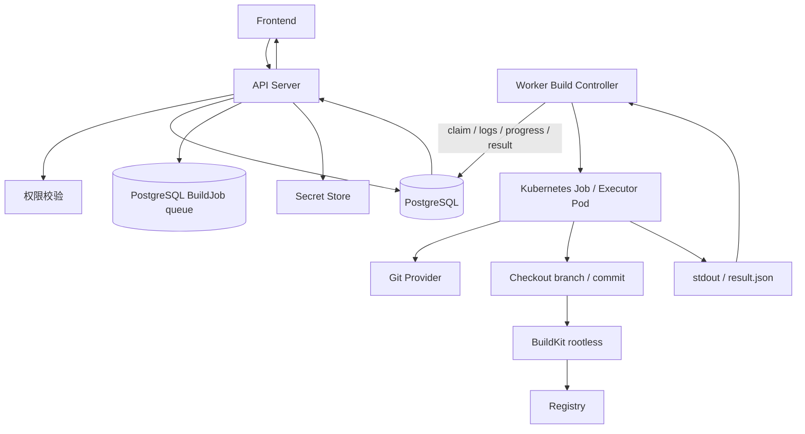

# Luna DevOps 产品与一体化方案

## 1. 产品概述

本产品是一个面向个人开发者和小团队的应用交付平台，目标是把代码仓库、CI、镜像仓库、运行环境、网关和域名打通，让开发者可以从代码仓库快速交付一个可访问的 Web 服务。

产品一句话：

```text
开发者只需要维护代码、Dockerfile 和少量配置，平台负责构建镜像、部署应用、配置网关并分配访问域名。
```

第一阶段产品不追求覆盖所有 DevOps 场景，而是优先完成一条稳定闭环：

```text
绑定仓库
  -> 创建平台部署配置
  -> Builder 构建镜像
  -> 推送制品库
  -> 部署到 K3s/Kubernetes
  -> 配置 Ingress/Traefik
  -> 分配域名
  -> 展示状态
```

## 2. 背景与问题

个人开发者和小团队经常会遇到以下问题：

- 项目已经写好了，但部署链路分散在多个工具里。
- CI、镜像仓库、Kubernetes、网关、域名配置需要重复操作。
- 每个项目都要反复配置构建参数、镜像 tag、部署 YAML、Ingress 配置。
- 构建状态、镜像版本、当前运行版本和访问地址缺少统一视图。
- 回滚、重启、重新部署等操作依赖命令行，容易出错。

本平台要解决的问题：

- 降低从代码到上线的操作成本。
- 将零散 DevOps 组件组合成一个统一控制台。
- 将常见部署流程模板化。
- 让开发者专注业务代码，不反复处理基础设施细节。

## 3. 目标用户

### 3.1 主要用户

个人开发者：

- 有自己的项目或副业应用。
- 能写 Dockerfile。
- 希望快速部署项目并拿到访问域名。
- 不想每个项目重复写 CI、部署和网关配置。

小团队开发者：

- 团队有多个服务。
- 希望统一应用、环境、镜像和发布记录。
- 不需要复杂审批，但需要清晰的部署状态和回滚能力。

### 3.2 暂不优先服务的用户

- 大型企业多租户平台团队。
- 强审批、强合规、复杂多云调度场景。
- 需要 Service Mesh、完整 GitOps、复杂灰度发布的团队。

## 4. 产品目标

MVP 目标：

- 用户可以登录平台。
- 用户可以创建项目和应用。
- 用户可以绑定 GitHub/Gitea 仓库。
- 用户可以从已有镜像创建应用，不强制绑定代码仓库。
- 平台可以读取 Dockerfile 并探测构建上下文。
- 用户可以配置平台构建模板。
- 平台可以通过 webhook 创建 BuildRun，并由 Worker 调度一次性 Kubernetes Build Job 执行构建。
- 用户可以触发构建并看到构建状态。
- 用户可以在部署配置中选择镜像推送目标。
- 平台可以读取镜像版本。
- 用户可以选择镜像版本部署到 K3s/Kubernetes。
- 平台可以创建 Deployment、Service、Ingress 或 Traefik 路由。
- 用户可以获得应用访问域名。
- 用户可以查看发布记录并回滚到上一版本。
- 用户可以选择亮色、暗色或跟随系统主题，刷新后保持选择。

非目标：

- 不自研 Git 服务。
- 不自研 CI Runner。
- 不自研镜像仓库。
- 不自研 Kubernetes。
- 不做完整模板市场。
- 不做复杂审批流。
- 不做多云调度。
- 不做 Service Mesh。

## 5. 产品原则

简单优先：

- 单个开发者也能理解和使用。
- 优先把主流程跑通，不做过度抽象。

显式可见：

- 平台生成的构建记录、镜像、部署资源和域名都要可查看。
- 关键操作要有状态、日志和结果反馈。

不隐藏底层事实：

- 平台可以简化操作，但不伪装底层组件不存在。
- 用户应该能看到仓库、BuildRun、镜像 tag、namespace、Ingress 等关键资源。

可回滚：

- 每次发布都必须形成 Release 记录。
- 至少支持回滚到上一个成功版本。

可扩展但不过度设计：

- Provider 抽象要保留，但第一阶段只实现少量主路径。
- 等第二个真实实现出现后再加强抽象。

## 6. MVP 范围

### 6.1 必做

认证：

- Casdoor OIDC 登录。
- 当前用户信息展示。
- 主题三态切换：亮色、暗色、跟随系统。
- 用户主题偏好本地持久化。
- 跟随系统时支持系统主题变化实时响应。

项目与应用：

- 创建项目。
- 管理项目成员。
- 平台用户系统和 Kubernetes 资源解耦。
- Project 是协作和资源归属边界。
- Project slug 是平台内全局唯一标识；Application slug 是同一 Project 内唯一标识，软删除资源不继续占用 slug。
- MVP 默认一个 Project 对应一个 Kubernetes Namespace。
- 创建应用。
- 应用来源支持代码仓库和已有镜像。
- 代码仓库应用可以绑定仓库。
- 镜像应用不强制绑定仓库。
- 应用是最小构建、部署、发布、访问和运行时配置归属单元；monorepo 通过创建多个应用并绑定同一仓库的不同 Dockerfile / 构建上下文支持。
- 应用信息只维护名称、标识和图标等基础展示字段；仓库绑定、Dockerfile 路径、构建上下文、目标镜像、构建策略、变量密钥、部署环境和访问入口由应用下的部署配置维护。

代码仓库：

- 支持 Gitea。
- 支持 GitHub。
- 后续支持 GitLab。
- 支持跳转授权连接代码账户。
- 支持同一用户连接多个 Git 账户。
- 读取仓库列表、分支、文件。
- 创建和维护 Git webhook。
- 仓库绑定时必须选择 Git provider、Git account、owner 和 repo。

CI：

- 支持平台构建模板。
- 支持 webhook 触发构建。
- 支持手动触发构建。
- 支持通过平台 Access Token 调用 API 触发构建。
- 支持 Worker 领取平台构建任务并启动一次性 Kubernetes executor Pod。
- 支持 BuildKit rootless 构建镜像。
- 支持构建 CPU、内存、超时、重试默认值，且允许用户按权限修改。
- 预留构建资源配额和内部货币计量。
- 支持构建状态同步。
- 不再支持 GitHub Actions、Gitea Actions 或 Kubernetes Job 作为构建执行 Provider；GitHub/Gitea 只作为代码源、Webhook 和授权来源。

制品库：

- 第一阶段优先支持 Harbor。
- 支持全局默认镜像站。
- 支持项目级镜像站。
- 支持用户自定义镜像站。
- 支持配置 Harbor endpoint 和凭据。
- 部署配置中支持选择镜像推送目标。
- 支持读取镜像 tag。
- 支持镜像版本和构建记录关联。

运行环境：

- 支持接入一个或多个 Kubernetes/K3s 集群。
- 支持设置默认集群。
- 支持测试 kubeconfig。
- 支持创建 namespace。
- 支持部署单容器应用。
- 支持 Deployment、Service、ConfigMap、Secret。

网关：

- 支持 Kubernetes Ingress。
- Traefik 作为推荐 Ingress Controller 或后续 GatewayProvider。
- 支持自动域名生成。
- 支持用户自定义域名。
- 支持 HTTP 和 HTTPS 两种访问方式。
- HTTPS 证书优先通过 HTTP Challenge 申请。
- 支持展示访问地址。

发布：

- 支持选择镜像版本发布。
- 支持查看当前运行版本。
- 支持发布状态。
- 支持发布记录。
- 支持回滚到上一成功版本。

### 6.2 暂不做

- 多租户计费。
- 复杂组织审批。
- 完整 YAML 反向可视化解析。
- 复杂 DAG 可视化编排。
- 完整模板市场。
- 模板评分、收藏、评论。
- 多容器复杂编排。
- Docker Compose Runtime。
- Vault 集成。
- Service Mesh。
- 多云调度。
- 自研 Runner。

## 7. 用户角色

MVP 可以简化为三个角色：

| 角色 | 说明 |
| --- | --- |
| Admin | 管理全局配置、集群、制品库、模板 |
| Developer | 创建应用、绑定仓库、构建、部署非生产环境 |
| Viewer | 查看项目、应用、构建、发布和访问地址 |

一个人开发和自用时，可以先默认当前用户为 Admin。

MVP 权限矩阵：

| 动作 | Owner | Admin | Developer | Viewer |
| --- | --- | --- | --- | --- |
| 查看项目 | 是 | 是 | 是 | 是 |
| 管理成员 | 是 | 是 | 否 | 否 |
| 删除项目 | 是 | 否 | 否 | 否 |
| 创建应用 | 是 | 是 | 是 | 否 |
| 删除应用 | 是 | 是 | 否 | 否 |
| 绑定仓库 | 是 | 是 | 是 | 否 |
| 管理项目镜像站 | 是 | 是 | 否 | 否 |
| 管理用户镜像站 | 是 | 是 | 是 | 否 |
| 触发构建 | 是 | 是 | 是 | 否 |
| 部署 dev/test/staging | 是 | 是 | 是 | 否 |
| 部署 prod | 是 | 是 | 否 | 否 |
| 回滚 dev/test/staging | 是 | 是 | 是 | 否 |
| 回滚 prod | 是 | 是 | 否 | 否 |
| 写入 Secret | 是 | 是 | 否 | 否 |
| 创建 Access Token | 是 | 是 | 是 | 否 |
| 查看审计日志 | 是 | 是 | 否 | 否 |

独立权限点：

```text
member.manage
project.delete
app.delete
registry.manage
build.trigger
deploy.non_prod
deploy.prod
rollback.non_prod
rollback.prod
secret.write
token.create
audit.read
```

项目协作模型：

```text
User
  -> ProjectMember
      -> Project
          -> Application
```

规则：

- User 不直接映射 Kubernetes Namespace。
- Project 才映射 Kubernetes Namespace。
- 多个用户可以属于同一个 Project 进行协作。
- 用户是否能构建、部署、回滚、改配置，由平台 ProjectMember 权限控制。
- 用户不需要直接持有 kubeconfig。
- 平台通过自己的 Kubernetes 凭据操作集群，并记录审计。
- 项目 Hook 页面只作为通用脚本库：Hook 本身不维护启停状态、执行阶段或执行顺序。部署配置负责把通用 Hook 绑定到本部署配置的 `prePull` / `postPull` / `preBuild` / `postBuild` / `prePush` / `postPush` / `preDeployment` / `postDeployment` 阶段，并在部署配置内按阶段保存拖拽排序；同一个 Hook 可以在不同阶段复用。
- Builder 内部通过 `::luna-devops-hook-*::` 控制行关联 HookRun 日志和状态，但普通构建日志不展示原始控制协议；平台会转换为 `[phase: name] message` 形式的可读日志，同时保留独立 HookRunLog 便于后续按 Hook 查看。
- 部署配置表单提供构建默认值联动：选择仓库绑定后由后端探测代码库结构并提供 Dockerfile、构建上下文和构建目录候选；选择 Dockerfile 后默认将构建上下文和构建目录设为 Dockerfile 所在目录；目标镜像引用模板在用户未手动编辑前按镜像站命名空间、应用标识和部署配置标识生成，用户手动修改后停止自动覆盖。
- 项目空间概览定位为项目级 dashboard，只展示项目下应用数量、最近构建、发布健康、访问入口、变量密钥和成员摘要；单应用的部署配置、构建、发布和访问明细仍在应用详情内维护，避免定位重复。

## 8. 核心用户故事

### 8.1 创建并部署应用

作为开发者，轻雪酱希望用户可以绑定一个仓库，选择模板，然后把项目部署成一个可访问域名。

流程：

```text
登录
  -> 创建项目
  -> 创建应用
  -> 绑定仓库
  -> 检测 Dockerfile
  -> 配置构建模板
  -> 触发构建
  -> 选择镜像部署
  -> 平台创建网关
  -> 获得访问域名
```

验收标准：

- 用户能在应用详情页看到仓库、构建状态、镜像版本、部署环境、访问地址。
- 构建成功后可以部署。
- 部署成功后可以访问域名。

### 8.1.1 从已有镜像创建应用

作为开发者，用户希望不绑定代码仓库，也可以把已有镜像部署到平台。

流程：

```text
创建应用
  -> 新增部署配置并选择“从已有镜像部署”
  -> 选择镜像站或直接填写镜像地址
  -> 填写 image:tag
  -> 在部署配置中配置服务端口
  -> 配置环境变量和网关
  -> 部署到环境
```

验收标准：

- 应用可以没有 RepositoryBinding。
- 用户可以选择有权限的镜像站。
- 用户可以填写完整镜像地址。
- 如果平台无法读取 tag/digest，仍允许保存应用配置。
- 镜像读取失败只标记校验失败，不阻止用户后续部署。
- 平台可以创建 Deployment、Service 和 Ingress/Route。

### 8.2 管理构建

作为开发者，用户希望不用手写 CI YAML，也能通过平台 Builder 完成镜像构建。

流程：

```text
进入应用构建页面
  -> 选择平台构建模板
  -> 选择应用和本次构建分支
  -> 填写部署配置中的 Dockerfile 和 context
  -> 选择镜像推送目标
  -> 保存部署配置
```

验收标准：

- 平台可以自动创建 Git webhook。
- push 后平台可以创建 BuildRun。
- 应用信息不保存默认构建入口；真正构建时以 BuildRun 选择的 `deploymentTargetId` 和 `sourceBranch` 为准。
- BuildRun 的 Dockerfile 和 context 必须继承选中的应用部署配置；如需修改，用户必须回到应用配置页的部署配置区域调整，后端也忽略构建触发请求中传入的 Dockerfile/context。
- 平台可以通过 Worker 启动一次性 Kubernetes executor Pod 构建镜像。
- 构建成功后可以生成 ContainerImage 记录。
- 不生成 Actions YAML；构建执行只走平台 Builder。

### 8.3 发布与回滚

作为开发者，用户希望可以把某个镜像版本发布到环境，并在失败时回滚。

流程：

```text
进入环境页面
  -> 选择构建记录 BuildRun
  -> 自动带出应用和镜像
  -> 选择目标环境
  -> 点击发布
  -> 查看 rollout 状态
  -> 如果失败，点击回滚
```

验收标准：

- 每次发布形成 Release 记录。
- Release 记录引用 BuildRun，部署分支以 BuildRun 的 `sourceBranch` 为准，不在应用编辑中维护 stage 到分支的强绑定。
- 当前环境展示正在运行的镜像版本。
- 回滚会把 Deployment 镜像恢复到上一个成功 Release。

### 8.4 管理网关访问

作为开发者，用户希望应用部署后自动获得域名，不需要手动写 Ingress。

流程：

```text
在部署配置中配置服务端口
  -> 开启网关
  -> 部署应用
  -> 平台生成域名
  -> 创建 Ingress/Route
```

验收标准：

- 平台能检查域名冲突。
- 用户能在应用详情页看到访问地址。
- 禁用网关后，访问地址标记为关闭。

## 9. 页面需求

### 9.1 登录页

功能：

- 跳转 Casdoor 登录。
- 登录回调处理。
- 登录失败提示。

### 9.2 看板页

路由：

- `/dashboard`。
- 登录后默认进入 `/dashboard`；项目空间列表继续使用 `/projects`。

展示：

- 项目数量。
- 应用数量。
- 最近构建。
- 构建器在线状态。
- 镜像站和集群可用性。
- 需要关注的失败构建和异常集群。
- 项目空间概览。
- 集群状态摘要。
- 最近构建区域固定约 4 条运行记录高度，最多聚合展示 20 条，超出后在区域内部滚动；每条记录标题按 `项目空间 · 应用` 展示。

交互：

- 侧边栏 DevOps 分组顶部展示看板入口。
- 看板只做跨项目信息总览和跳转，不承载项目空间内部应用、成员和配置 CRUD。
- 看板上可定位到具体页面的元素必须支持一键直达：项目空间指标进入项目空间列表，近期构建进入对应应用详情的构建 tab，镜像站/集群/构建器进入各自管理页或子 tab；可点击区域 hover 使用 primary 色。
- 看板常用项目空间区使用一行横向滚动布局，最多展示 16 个项目空间；固定项目空间优先，其余按当前用户 `project_members.use_count` 和 `last_used_at` 排序。未展示项目通过“查看全部项目空间”进入项目空间列表。
- MVP 阶段前端可用已有列表 API 做轻量聚合；数据量增加后再抽后端 summary API，避免前端跨大量项目扇出请求。

### 9.3 项目空间列表页

功能：

- 查看项目空间列表。
- 项目空间列表支持分页查询、页码切换和每页条数选择，默认每页条数可由页面或调用方传入。
- 项目空间列表支持按最近使用、使用频次、创建时间、更新时间和名称排序；默认按当前用户最近使用倒序展示。最近使用和使用频次是用户访问项目空间产生的成员级统计，不等同于项目自身 `updated_at`。
- 创建项目空间。
- 编辑项目空间基础信息。
- 进入项目空间详情。

字段：

- 项目空间名称。
- 项目空间标识，平台内全局唯一。
- 应用数量。
- 最近更新时间。

### 9.4 应用列表页

功能：

- 查看项目空间下的应用。
- 创建应用和编辑应用均使用同一个 Dialog 表单，不跳转到独立编辑页。
- 应用基础信息包含名称、标识和预设图标；图标只能从平台内置图标库中选择，创建弹窗和应用配置页都可修改。第一阶段预设 32 个常用图标，列表和概览需要展示该图标，后续再考虑自定义上传。
- 创建应用和编辑应用只维护基础展示字段，不在弹窗中选择来源类型、仓库、镜像或构建参数；代码仓库、Dockerfile、构建上下文、目标镜像、部署策略、Webhook 和访问由应用详情的部署配置维护。应用详情概览采用看板式摘要，展示部署配置状况、最近构建、部署健康和访问入口。
- 项目空间应用列表只展示应用基础摘要和操作入口，不展示来源类型、仓库来源或服务端口，避免和部署配置职责重复。
- 删除应用时必须输入“项目空间/应用”完整名称后才启用确认按钮，前端负责防误触校验。
- 按状态筛选。
- 进入应用运行详情或构建部署详情时才使用独立页面；基础配置编辑不作为单独页面入口。
- 应用列表必须提供明确的“进入详情”按钮，进入后通过应用详情页 `ContentTabs` 管理概览、仓库、构建、部署配置、发布和访问。

字段：

- 应用名称。
- 应用标识，同一项目空间内唯一。
- 应用图标，来自平台预设图标库。
- 仓库。
- 默认分支。
- 最近构建状态。
- 当前环境状态。
- 访问地址。

### 9.5 应用详情页

Tabs：

- 概览。
- 部署配置。
- 构建。
- 部署。
- 访问。

概览展示：

- 应用名称。
- 部署配置状况。
- 当前部署状态。
- 访问域名。
- 最近一次构建。
- 最近一次发布。

交互规则：

- 仓库、构建、部署和访问不再作为项目空间或 DevOps 顶层业务入口，统一收敛到具体应用详情页。
- 构建 tab 固定当前应用上下文，可查看 BuildRun/BuildJob，并从该应用仓库触发构建。
- 部署配置承载来源类型、仓库或镜像、Dockerfile、构建上下文、目标镜像、触发规则、并发策略、构建钩子、运行时 ConfigMap/Secret 覆盖、自动部署和审批策略。
- 构建 tab 固定当前应用上下文，触发构建时选择应用下的部署配置；`BuildRun` 直接记录 `deploymentTargetId`。
- 部署 tab 固定当前应用上下文，可基于当前应用 BuildRun 或镜像来源部署配置创建 Release；`Release` 直接记录 `deploymentTargetId`。部署配置行菜单提供“重启”入口，用于对当前 Kubernetes Deployment 执行 rollout restart；该操作不创建新 Release，只让现有 Pod 滚动重启读取集群中已生效的运行配置，并写入审计日志。
- 部署 tab 同时展示发布状态和 Kubernetes 运行状态：平台按部署配置读取对应 Deployment/Pod，映射 Running、Pending、CrashLoopBackOff、ImagePullBackOff、NotReady 等状态，并保留 Pod 摘要用于排查。
- 部署 tab 展示同一 Kubernetes namespace 内的服务访问地址；平台按部署配置读取真实 Service 资源并展示短服务名和完整 `service.namespace.svc.cluster.local`，用于应用之间内网互相调用。
- 访问 tab 固定当前应用上下文，可维护该应用 GatewayRoute；创建域名时直接选择部署配置，平台由 DeploymentTarget 推导应用、环境和目标 Service，不再让用户重复选择环境或阶段。

### 9.5.1 部署配置

部署配置是应用下的主交付配置，表达“这个应用如何从源码或镜像交付到某个环境”。平台不再暴露部署配置详情页。

配置内容：

- 来源：`repository` 表示平台从代码仓库构建镜像；`image` 表示直接部署已有镜像。
- 构建：维护仓库、Dockerfile、构建上下文、构建目录、目标镜像站、目标镜像引用模板和构建变量。
- 策略：维护 branch/tag 匹配、同配置并发策略、自动部署和审批。
- 钩子：按 `prePull` / `postPull` / `preBuild` / `postBuild` / `prePush` / `postPush` / `preDeployment` / `postDeployment` 绑定项目空间通用 Hook。
- 运行时：维护当前部署配置相对环境默认值的 ConfigMap/Secret 覆盖项。

### 9.6 仓库页

功能：

- 选择 Git provider。
- 跳转授权或选择已有 Git 账户。
- 支持同一用户绑定多个 Git 账户。
- 选择 owner/repo。
- 选择默认分支。
- 检测 Dockerfile。

Git 账户展示建议：

```text
GitHub
  - sfkm
  - company-bot

Gitea
  - sfkm@internal-gitea
  - deploy-bot@internal-gitea

GitLab
  - sfkm
```

规则：

- 普通主流程不要求用户手动复制 token。
- 优先通过 OAuth、GitHub App 或 GitLab/Gitea OAuth Application 跳转授权。
- PAT 手动录入仅作为高级兜底方式。
- 仓库绑定后，webhook 管理和代码拉取都使用该绑定账户。
- 支持断开授权和重新授权。

MVP 分步落地：

- 第一阶段提供 GitProvider、GitAccount、RepositoryBinding 的平台数据模型和 CRUD，用于把项目/应用与代码仓库账户、owner/repo、默认分支建立关系。
- GitHub OAuth 与 Gitea OAuth 先以 API 形式落地，GitHub App 和 GitLab OAuth 作为后续扩展。
- GitAccount 的 token 由后端加密保存为内部引用，API 和前端只展示 `accessTokenSet`、`refreshTokenSet`，不暴露 ref 字段或明文 token。
- 平台 API 支持仓库列表、分支列表、文件读取和后端 Dockerfile/构建目录探测。
- 平台 API 支持为 RepositoryBinding 创建 Git webhook；绑定保存时可默认自动配置 webhook，失败不阻塞绑定保存，并在 webhook 回调中校验签名、记录事件类型与 commit SHA。

前端联调约定：

- 仓库绑定页优先提供 OAuth 授权入口，用户也可以使用 PAT 兜底表单手动创建 Git 账号。
- 绑定应用仓库时先选择 Git 账号，再通过仓库搜索列表选择仓库；选择后自动回填 `owner`、`repo`、`cloneUrl` 和默认分支。
- 同一个应用下不允许重复绑定同一个代码仓库；后端按应用、Git Provider、`owner/repo` 归一化校验唯一性，前端在保存前提示并禁用重复提交。
- 仓库搜索优先返回当前 Git 凭据可访问仓库；当用户输入搜索词且无匹配时，平台后端 Git provider 继续搜索公开仓库并标记来源为 `public`。前端仍只调用平台 API，不直接编排 GitHub/Gitea API。
- 分支字段优先使用后端分支读取 API 生成选项，只有接口不可用时才保留当前默认值。
- RepositoryBinding 创建/更新表单提供“自动配置 Webhook”开关，默认开启；后端使用绑定 GitAccount 创建 push/create webhook，创建成功后状态更新为 `created`，失败时状态更新为 `failed`。
- 应用配置表单内展示当前 Webhook 配置和状态，包括状态 Badge、平台回调地址、Webhook ID、最近事件、最近提交和最近接收时间，并提供“重新配置 Webhook”操作；仓库绑定列表保留行级重试入口。回调地址如果为空、不是完整 URL，或使用 `localhost`、`127.0.0.1`、`::1` 等本机地址，前端必须提示用户配置可被 GitHub/Gitea 访问的 `PUBLIC_BASE_URL` 后重新配置 Webhook。
- Webhook 生命周期归属于应用的 RepositoryBinding：外部 Git 平台只负责把仓库事件推送到平台；平台收到事件并校验签名后，再按应用下的部署配置触发规则决定创建哪些 BuildRun、是否继续自动部署。部署配置不直接拥有外部 Git webhook。
- Git webhook 创建失败时，后端只向前端返回稳定错误码和友好文案，不透传上游原始响应体、documentation URL、token 或 secret。常见原因必须明确区分：回调地址无法公网访问、回调 URL 格式无效、凭据权限不足、仓库不存在或不可访问、重复 webhook、Git 平台 validation 失败和临时限流。

部署信息架构约定：

- 集群页只管理平台运行能力，例如 Kubernetes/K3s 接入、连通性测试、默认集群、作用域和后续的 ingress/cert-manager/storage/resource quota 等基础能力，不面向普通应用用户展示底层资源编排细节。
- 项目空间管理环境。环境是部署目标的业务抽象，绑定可用集群、副本数和资源规格；Kubernetes 层当前固定一个项目空间一个 namespace，环境只作为平台配置分组和构建/部署策略区分，不参与 namespace 拆分。
- 环境资源规格输入不要求用户手写完整 Kubernetes quantity。CPU 和内存使用“数值 + 单位”的一体化胶囊输入，数值区只允许输入数字；CPU 支持 `m` 和核，内存支持 `Mi` 和 `Gi`，提交时由前端组装为后端可保存的稳定规格值。
- 应用详情管理部署意图。应用部署页展示当前应用的 DeploymentTarget 配置、对应环境的最新发布状态，并允许从成功构建产物发布到环境、查看 rollout message 和回滚。
- 应用用户不直接理解或维护 Kubernetes PV/PVC/StorageClass。部署配置只暴露“运行数据”开关、数据卷标识、容器内数据目录、数据容量和导出数据操作；平台在后端按部署配置为每个数据卷创建并挂载托管 PVC。数据容量复用“数值 + 单位”的一体化胶囊输入，数值区只允许输入数字，单位由用户选择 `Mi` 或 `Gi`，输入宽度默认应能容纳四五位数字和单位。默认提供一个 `/data` 数据卷；如果应用需要独立容量，可以配置 `/data/app1`、`/data/app2` 等多个数据卷；如果应用只需要共用一块容量，则保留一个 `/data` 数据卷并在应用内使用子目录。关闭开关不自动删除已有数据，避免误删。
- 部署配置运行配置区的公共配置必须支持选择已有项目空间配置、就地新建配置和编辑已选配置；新建配置保存到项目空间公共配置区域并自动加入当前部署配置选择。公共配置编辑后，后端返回引用它的部署配置数量，前端提示相关资源需要重新部署或手动重新部署后才会生效，并在当前应用范围内对可复用上一条发布镜像的部署配置提供一键重新部署。
- 删除应用采用异步资源清理流程：应用先进入删除中状态并禁止新的构建、发布、访问入口和部署配置变更，Worker 按平台 labels 清理该应用在各环境中的 Deployment、Pod、Service、Ingress、ConfigMap 和 Secret 等托管运行资源，成功后软删除应用及其交付配置；托管数据卷默认保留，不随应用删除自动移除，清理失败时应用进入删除失败状态并保留失败原因用于重试。
- 删除项目空间、部署配置、访问入口和项目空间配置同样采用最终一致模型，不承诺数据库和 Kubernetes API 强原子。API 先把业务资源标记为删除中并投递 `resource:cleanup` 幂等任务；Worker 按资源族清理 namespace、Deployment/Service/ConfigMap/Secret/PVC 或 Ingress 等平台托管资源，成功后软删除业务记录，失败时保留 `delete_failed` 和错误摘要。`sync:status` 周期任务会重放删除中/删除失败的清理任务；集群孤儿资源自动发现作为后续增强，当前可通过集群资源页手动清理平台 managed labels 下的残留资源。
- 删除项目空间时必须输入项目空间名称后才启用确认按钮，前端负责防误触校验。
- 部署配置编辑区分“保存”和“保存并重新部署”。普通保存只更新配置草稿；当普通配置、ConfigMap/Secret 覆盖、直接镜像、目标环境、运行数据卷、运行数据目录或运行数据容量等运行态字段变化时，前端提示运行中副本需要重新部署后才会生效，并提供“保存并重新部署”入口复用上一条发布镜像或构建产物创建新的 deploy release。构建仓库、Dockerfile、分支/标签匹配、自动部署策略等纯构建/调度字段不触发该提示。
- Web Console 采用 `xterm.js + WebSocket + Kubernetes exec TTY`，默认连接最新运行 Pod 的目标容器，键盘输入、窗口尺寸和 ANSI 输出实时透传；前端只连接平台后端，不直接接触 Kubernetes API。
- 发布 Worker 继续由平台统一生成并 apply Kubernetes 资源，后端必须校验 Release 的应用、环境、构建产物都属于同一项目，且构建产物成功后才能作为默认发布来源。

### 9.7 应用构建 tab

功能：

- 查看当前应用构建记录。
- 由平台按 DeploymentTarget 配置和 Worker 构建队列调度一次性构建 Job。
- 配置构建参数。
- 触发构建。
- 查看 BuildRun 实时状态。
- 查看构建 Job 日志。
- 查看产出镜像。

构建参数：

- Dockerfile 路径。
- 构建上下文。
- 触发分支。
- 镜像推送目标。
- 目标镜像引用模板。
- 是否开启手动触发。
- 构建资源规格。
- 构建超时时间。

### 9.8 工作流模板页面

功能：

- 查看公开模板。
- 查看项目私有模板。
- 创建项目私有模板。
- 编辑草稿模板。
- 发布模板版本。
- 废弃模板版本。

MVP 可以先只做内置公开模板和项目私有模板。

### 9.9 构建记录页面

功能：

- 查看构建列表。
- 查看构建状态。
- 查看 commit。
- 查看 BuildRun 详情。
- 查看 BuildJob 列表和每个 job 的状态。
- 查看构建日志入口。
- 在平台内查看 SSE 构建日志。
- 查看产出镜像。

状态：

- pending
- running
- success
- failed
- canceled

### 9.10 镜像版本页面

功能：

- 选择镜像站。
- 查看镜像 tag。
- 查看 digest。
- 查看来源 commit。
- 查看构建记录。
- 选择镜像部署。

### 9.10.1 镜像站配置

功能：

- 查看全局镜像站。
- 查看项目镜像站。
- 查看用户自定义镜像站。
- 设置项目默认推送镜像站。
- 设置应用默认推送镜像站。
- 测试镜像站凭据。

前端交互：

- 镜像站页面在内容区内拆为 `镜像站`、`凭据`、`镜像` 三个子 tab。
- 构建执行不再作为用户可管理的外部构建器资源展示；Worker 根据部署配置、镜像站和项目变量在集群内创建一次性 Kubernetes Build Job。
- 创建/编辑镜像站、创建凭据、记录镜像均使用 Dialog 表单，不在页面常驻展示创建表单。
- 凭据 tab 默认展示全部可管理镜像站的凭据，筛选器默认值为“全部镜像站”；选择具体镜像站后才收窄到该镜像站凭据。
- 凭据列表每条记录必须展示所属镜像站名称，避免用户在全量视图里无法判断凭据归属。
- 创建凭据时默认带入当前选中的镜像站；如果处于“全部镜像站”视图，则由用户在弹窗中选择镜像站。

镜像站范围：

| 范围 | 说明 |
| --- | --- |
| 全局 | Admin 配置，所有项目可用，可设为系统默认 |
| 项目 | ProjectAdmin 配置，仅项目内应用可用 |
| 用户 | 用户自己配置，仅自己创建或有权限的应用可用 |

规则：

- 部署配置必须选择镜像推送目标，默认使用应用或项目默认镜像站。
- 已有镜像部署时可以选择镜像站，也可以填写完整镜像地址。
- 镜像站凭据不回显明文。
- 镜像站权限影响用户是否可以选择该推送目标。

### 9.11 应用部署 tab

功能：

- 查看项目空间环境。
- 默认使用系统默认集群。
- 高级选项中允许选择其他集群。
- 选择项目空间环境。
- 配置副本数。
- 配置资源规格。
- 发布镜像。
- 查看 Pod 状态。
- 查看 Service 状态。
- 查看 Ingress 状态。
- 基于当前应用的 BuildRun 创建 Release。
- “创建发布”是应用部署页的手动部署入口：用户选择成功构建产物后创建 pending Release，后端立即投递部署任务，由 Worker 执行 Kubernetes 下发和 rollout 追踪。
- 查看当前应用发布记录和回滚入口。
- 发布列表中的目标镜像和 rollout message 常规状态保持单行截断；hover 展示完整内容，点击文本复制完整值并提示复制成功。

MVP 环境：

- dev
- prod

多集群交互策略：

- MVP 支持多集群数据模型和集群配置。
- 默认按单集群体验使用。
- 如果系统只有一个集群，创建环境时不强制用户理解多集群。
- 如果系统存在多个集群，创建环境时默认选择默认集群，并允许在高级设置中切换。
- 集群配置使用独立“集群”页面管理，应用部署表单只选择可访问集群。

### 9.12 配置与密钥页面

功能：

- 编辑普通环境变量。
- 写入密钥。
- 查看配置版本。
- 发布时选择配置版本。

限制：

- 密钥不回显明文。
- 密钥修改要有确认。

Secret 作用域：

| 类型 | 作用域 |
| --- | --- |
| Git token | `GitAccount` |
| Registry credential | `global` / `project` / `user` |
| Kubernetes Secret | `application + environment` |
| Build secret | `BuildRun` 临时注入 |
| Access Token | `project` / `application` / `environment` |

规则：

- Kubernetes Secret 以应用和环境为边界。
- Registry credential 不直接写进业务表。
- Build secret 仅构建期间注入，构建结束后按清理策略清除。
- 修改 Kubernetes Secret 不自动重新部署，只提示需要重新发布。

### 9.13 发布记录页面

功能：

- 查看 Release 列表。
- 查看发布人。
- 查看镜像版本。
- 查看环境。
- 查看状态。
- 回滚到上一成功版本。

### 9.14 集成配置页面

Admin 功能：

- 配置 Gitea。
- 配置 GitHub。
- 配置 GitLab。
- 配置 Harbor。
- 配置一个或多个 Kubernetes/K3s 集群。
- 设置默认运行集群。
- 配置默认域名后缀。
- 配置 Ingress/Traefik 默认参数。

### 9.15 用户管理页面

用户管理页面用于 PlatformAdmin 管理平台本地账号。

MVP 功能：

- 查看用户列表。
- 创建本地账号。
- 编辑用户邮箱、名称、语言和全局角色。
- 重置本地账号密码。
- 禁用或启用账号。

约束：

- 只有 PlatformAdmin 可以访问。
- 生产环境不开放自由注册。
- MVP 阶段先实现管理员直接创建本地账号，邮件邀请后续扩展。
- OIDC 外部身份绑定在后续身份源模块中实现。
- 禁用当前登录账号必须被后端拒绝，避免管理员把自己锁出系统。
- 用户列表采用紧凑两行摘要：第一行展示用户名和状态、角色、来源 Badge；第二行展示邮箱，语言偏好不在列表中展示。
- 新用户创建成功后，后端自动创建一个默认项目空间并将该用户设为 owner。默认项目空间名称按用户语言生成：中文为 `{用户名} 的项目空间`，英文为 `{Username}'s Project Space`；slug 从用户名或邮箱本地部分生成并自动避让冲突。

危险操作：

- 删除项目、删除应用、禁用账号等操作必须使用统一 ConfirmDialog 二次确认。

### 9.16 项目成员页面

项目成员页面用于维护 ProjectMember 和项目角色。

MVP 功能：

- 查看项目成员、邮箱和项目角色。
- 按邮箱添加已有平台用户为项目成员。
- 修改成员项目角色：Owner、Admin、Developer、Viewer。
- 移除项目成员。

项目角色权限：

- Owner：管理项目、删除项目、管理应用、管理成员。
- Admin：更新项目、管理应用、管理成员。
- Developer：管理应用。
- Viewer：只读查看项目和应用。

约束：

- 后端必须执行项目角色校验。
- 前端隐藏入口只作为体验优化。
- 移除当前登录账号必须被后端拒绝，避免用户把自己移出项目。

### 9.17 用户偏好入口

功能：

- 用户信息展示在桌面侧边栏底部，包含头像占位、名称、邮箱和退出入口。
- 切换主题模式。
- 支持亮色、暗色、跟随系统三态。
- 显示当前实际生效主题。
- 桌面侧边栏使用三段式主题切换控件，便于用户直接选择亮色、暗色或跟随系统。
- 桌面侧边栏使用固定宽度，不默认提供折叠入口，优先保证导航信息架构可读。
- 侧边栏导航采用二级分组结构，按 DevOps、个人工作区、系统管理等栏目展示，并使用横线分隔栏目。
- 页面切换、列表加载、确认弹窗和主要交互控件使用轻量动效，动画时长以 150ms 到 240ms 为主。

规则：

- 前端所有用户可见文本必须通过 i18n 管理，不允许在组件、schema、toast、确认弹窗、空状态、错误页、aria-label、placeholder 或状态 Badge 中硬编码文案。
- 技术枚举、产品名、文件名、URL/slug 示例可以作为数据或示例值存在；一旦作为 UI 文案解释给用户，必须映射为 i18n label。
- `web/src` 下共享模块统一使用 `@/` 根目录导入；公共组件、API、app context、layout、lib、i18n 和跨页面引用都不得使用 `../` 跨目录相对导入。相对导入只保留给当前页面或组件目录内的私有文件。
- 登录用户态、登录、登出、初始化管理员和用户语言更新统一由 `SessionProvider` / `useSession` 管理；页面和布局不直接操作 `current-user` query 或认证 mutation。
- 前端首次加载时按 `localStorage` 中的上次语言偏好、浏览器语言和中文兜底顺序初始化 i18n；登录后以后端返回的用户语言偏好为准并写回本地缓存。
- 当前用户查询遇到未登录/会话失效不做重试；访问受保护路由时未登录应直接重定向到 `/login?redirect=...`，不再展示中间“需要登录”页面，登录成功后回跳原路径。
- 登录页可以在浏览器本地持久化最近登录账号展示信息，最多保存 3 个用户，只包含用户 ID、名称、邮箱、头像 URL 和最近登录时间；不得在 `localStorage` 保存密码、Access Token、session token 或任何可直接完成认证的密钥。真正用于直接恢复登录的凭据由后端签发为按用户隔离的 HttpOnly 持久 cookie，并在数据库中只保存哈希和过期时间。登出只清理普通 session cookie，本地最近账号列表和未过期 remember cookie 保留；点击最近账号时，前端调用恢复登录接口，后端校验对应用户的 remember cookie 未过期后签发新的普通 session，失败时只预填邮箱并要求重新输入密码或走 OIDC。
- 用户头像统一使用 `UserAvatar` 组件。头像来源优先级为平台用户上传头像、Gravatar 真实头像、字母头像；Gravatar 请求必须使用 `d=404`，没有用户上传头像时回退到字母，不展示 Gravatar 自动生成的几何默认图。
- 已有全局态按职责拆分：`ThemeProvider` 管理主题模式，`PublicConfigProvider` 管理公开站点配置，`SessionProvider` 管理认证会话。
- 站点配置 `AppConfig` 底层按字符串 KV 存储；更新接口兼容字符串、数字、布尔值和结构化 JSON 值，结构化值由后端序列化为 JSON 字符串后落库，避免前端组件提交对象时报反序列化错误。
- 开发模式显示 Debug 悬浮窗：入口为可拖动圆形图标，位置写入浏览器本地存储；点击后可切换前端角色视图、用户视图并恢复真实视图。Debug 覆盖只影响前端 `SessionProvider` 暴露的有效用户，不修改后端账号、角色或权限。
- 默认主题模式为跟随系统。
- 用户选择写入本地偏好，刷新后继续生效。
- 当选择跟随系统时，页面刷新后按当前系统主题生效。
- 当选择跟随系统时，系统主题在运行期间变化，页面实时切换。
- 主题切换不影响成功、警告、危险、运行中、失败等状态色语义。
- 尊重 `prefers-reduced-motion`，用户系统设置减少动态效果时，前端应禁用或极短化非必要动画。

## 10. 核心数据对象

```text
User
Project
ProjectMember
ProjectPin
Application
GitProvider
GitAccount
RepositoryBinding
RegistryCredential
RegistryBinding
PipelineTemplate
PipelineSpec
PipelineBinding
PipelineRun
ArtifactRegistry
ContainerImage
RuntimeCluster
Environment
ConfigSet
SecretSet
GatewayRoute
Release
AuditLog
```

关键关系：

```text
Project 1 -> N Application
Project 1 -> N ProjectMember
Application 1 -> 1 RepositoryBinding
Application 1 -> N PipelineBinding
PipelineBinding 1 -> N PipelineRun
PipelineRun 1 -> N ContainerImage
Application 1 -> N Environment
Environment 1 -> N Release
Environment 1 -> N GatewayRoute
```

## 12. 状态定义

### 12.1 构建状态

| 状态 | 说明 |
| --- | --- |
| pending | 已创建，等待执行 |
| running | 正在执行 |
| success | 成功 |
| failed | 失败 |
| canceled | 已取消 |
| unknown | 外部状态不可识别 |

### 12.2 发布状态

| 状态 | 说明 |
| --- | --- |
| pending | 等待发布 |
| running | 发布中 |
| success | 发布成功 |
| failed | 发布失败 |
| rollback_running | 回滚中 |
| rollback_success | 回滚成功 |
| rollback_failed | 回滚失败 |

### 12.3 应用运行状态

| 状态 | 说明 |
| --- | --- |
| not_deployed | 未部署 |
| deploying | 部署中 |
| running | 正常运行 |
| degraded | 部分副本异常 |
| failed | 部署失败或无可用副本 |
| unknown | 无法获取状态 |

## 13. MVP 里程碑

### 13.1 Milestone 1：基础控制台

目标：

- 能登录。
- 能创建项目和应用。
- 能配置全局集成。

交付：

- Casdoor 登录。
- 项目 CRUD。
- 应用 CRUD。
- Gitea/GitHub/Harbor/Kubernetes 集成配置页面。

### 13.2 Milestone 2：仓库与流水线

目标：

- 能绑定仓库。
- 能自动创建 webhook。
- 能触发构建。

交付：

- 仓库授权。
- 多 Git 账户连接。
- 仓库文件读取。
- Git webhook 创建。
- 平台构建模板。
- BuildRun 创建。
- Worker 调度 Kubernetes Build Job 构建。
- 构建日志查看。
- 构建状态同步。

### 13.3 Milestone 3：镜像与制品

目标：

- 能看到构建产物。
- 能选择镜像版本。

交付：

- Harbor 配置。
- 镜像 tag 同步。
- 构建记录与镜像关联。
- 镜像版本页面。

### 13.4 Milestone 4：部署与网关

目标：

- 能部署应用。
- 能获得访问域名。

交付：

- 集群接入。
- Namespace 创建。
- Deployment 创建。
- Service 创建。
- Ingress/Traefik 路由创建。
- 自动域名分配。
- 运行状态展示。

### 13.5 Milestone 5：发布记录与回滚

目标：

- 能追踪每次发布。
- 能回滚。

交付：

- Release 记录。
- 当前运行版本。
- 回滚到上一成功版本。
- 基础审计日志。

## 14. 验收标准

MVP 总体验收：

- 一个新应用可以从仓库接入到可访问域名完整跑通。
- 用户不需要手写 Kubernetes YAML。
- 用户不需要手写 CI YAML，平台通过 webhook、BuildRun 和 BuildJob 完成镜像构建。
- Git webhook 真实创建，并能触发平台 BuildRun。
- 平台能创建 BuildJob，并由 Worker 启动一次性 Kubernetes executor Pod 执行构建。
- 构建成功后，平台能读取镜像版本。
- 发布成功后，平台能展示访问域名。
- 发布失败时，平台能展示失败状态。
- 至少支持回滚到上一成功版本。
- 平台支持亮色、暗色、跟随系统三态主题。
- 主题偏好刷新后保持；跟随系统时能响应系统主题变化。
- MVP 控制台默认主色采用 Kubernetes 风格蓝，和 Logo 中的蓝色基础设施语义保持一致。

## 15. 风险与约束

外部系统 API 差异：

- GitHub 和 Gitea 只作为代码源、授权源和 webhook 来源，不作为构建执行器。
- 需要 provider renderer 分开处理。

Runner 安全：

- 平台不直接操作 runner。
- 构建环境需要隔离。
- 私有仓库凭据和镜像仓库凭据必须通过 secrets 管理。

Git 授权安全：

- 平台不在业务表中保存明文 token。
- token 使用加密凭据存储，并通过引用关联。
- 创建 Git webhook、断开授权等操作需要审计。
- token 过期或失效时需要提示重新授权。

Kubernetes 权限：

- kubeconfig 权限不宜过大。
- 后续应支持按 namespace 限制权限。

密钥安全：

- 密钥不回显。
- 审计只记录密钥名称和操作，不记录值。

出站访问安全：

- 平台所有由后端发起的外部 HTTP 请求必须经过统一 SSRF/出站访问控制组件。
- 普通用户触发的 Git、Registry、Webhook 测试、未来 AI 工具抓取等出口默认禁止访问私有网段、回环地址、链路本地地址、元数据地址和保留/特殊用途地址。
- 平台管理员维护的系统级集成可以访问受控内网地址，用于内部 OIDC、内部 Git 和内部镜像站等场景。
- 出站访问控制必须支持管理员在安全设置中配置域名黑名单、域名特许白名单、IP/CIDR 黑名单、IP/CIDR 白名单和端口规则，并在 DNS 解析阶段和真实连接阶段都执行校验，避免 DNS 重绑定和 `0.0.0.0` 等特殊地址绕过。
- 默认策略采用 IP 黑名单制度：系统内置拦截私网、回环、链路本地、元数据地址和保留/特殊用途地址；普通公网域名默认可访问，不需要进入域名白名单。
- 站点设置里的 SSRF IP 黑名单默认预置 IPv4/IPv6 私网、回环、链路本地、文档、多播和保留地址段；如果管理员保存了自定义内容，则以管理员编辑后的列表为准。
- 域名白名单是“特许白名单”而不是传统全量 allowlist：命中域名可以放行其解析到的内置保留/私网地址，但仍受显式 IP 黑名单约束。

错误响应安全：

- 生产环境 API 错误响应只暴露稳定错误码和业务化文案；开发环境可以返回调试细节。
- 前端 API client 收到后端 `code` 时优先使用 `errors.<code>` 本地 i18n 文案，缺失时再回退后端业务化 `error`；新增业务错误码时必须同步补充前端错误码翻译。
- 底层数据库、上游系统和运行时错误必须写入服务端日志，不直接回显给前端。
- 登录、首个管理员初始化等敏感认证入口优先使用 Redis 计数限流；Redis 不可用时回退进程内限流，保证单机开发可运行，多实例部署共享限流窗口。

个人开发节奏：

- 第一版不要同时支持太多 provider。
- 推荐先以 Gitea + 平台 Builder + Harbor + K3s + Traefik/Ingress 跑通。

## 16. 后续迭代

第二阶段：

- GitHub 仓库、Webhook 和授权深度适配。
- Traefik File Provider / HTTP Provider 动态反代外部服务。
- 可视化 DAG 流水线编辑。
- 更丰富的工作流模板库。
- 配置版本 diff。
- 发布前后健康检查。

第三阶段：

- Docker Compose Runtime。
- Vault / External Secrets。
- 灰度发布。
- 多集群部署。
- 模板市场。
- Webhook 事件通知。
- 更完整的权限模型。


---

## 17. 一体化集成方案

## 1. 目标定位

本平台定位为统一的 DevOps 应用交付控制平面，不替代 GitHub、Gitea、Harbor、DockerHub、Kubernetes、K3s、Ingress 等成熟组件，而是将它们抽象、编排、打通，并向用户提供一致的应用交付体验。

最终目标：

- 用户专注于业务开发。
- 用户只需要维护代码、`Dockerfile` 和少量应用配置。
- 平台自动完成代码关联、镜像构建、制品推送、环境部署、网关暴露和域名分配。
- 平台统一提供认证、权限、审计、状态观测和发布记录。
- 平台自身交付采用 API 内嵌前端 SPA 的单容器入口：API 负责 `/api/*` 和 `/healthz`，根路径和前端路由 fallback 到内嵌 `index.html`；前端不维护独立 Dockerfile 或 nginx 镜像。
- 平台自身只发布容器镜像到 DockerHub `liteyukistudio` 命名空间，仅构建 `linux/amd64`，镜像为 `devops-api`、`devops-worker`；分支构建发布 `nightly`，`v*` tag 发布版本 tag，稳定版本 tag 额外发布 `latest`，不额外构建或上传 GitHub Release 二进制产物。

典型交付体验：

```text
开发者提交代码
  -> CI 自动构建镜像
  -> 镜像推送到制品库
  -> 平台选择目标环境部署
  -> 自动创建运行时资源
  -> 自动配置网关和域名
  -> 应用通过域名访问
```

## 2. 资源类型盘点

### 2.1 身份认证资源

| 类型 | 当前候选 | 平台职责 |
| --- | --- | --- |
| 本地账号 | Platform Local User | 用于小团队、内网部署、无外部 IdP 场景 |
| 统一认证 | Casdoor / 通用 OIDC | 作为 SSO 和外部用户身份来源 |
| 用户 | Local User / OIDC User | 同步或懒加载到平台用户表 |
| 组织/团队 | OIDC Group / Casdoor Organization / Group | 映射为平台准入白名单、团队或项目成员来源 |
| 权限角色 | OIDC Claim / 平台 RBAC | 控制仓库绑定、构建、部署、回滚、配置修改等操作 |

认证建议：

- 平台支持本地账号和 OIDC/OAuth2 两类身份来源。
- OIDC 第一阶段以 Casdoor 为主要验证对象，同时保留通用 OIDC Provider 抽象。
- 内部平台不开放自由注册。
- 本地账号由 PlatformAdmin 创建、邀请或导入。
- OIDC 登录成功不代表可以进入平台，必须通过平台准入策略校验。
- OIDC 必须支持允许组白名单，只有命中允许组、允许邮箱域或显式邀请的用户才能进入平台。
- 平台内部保留轻量用户、团队、角色、授权关系，用于审计和细粒度权限控制。
- 身份提供方负责“你是谁”，平台负责“你是否允许进入”和“你能对哪个项目做什么”。

准入策略模型：

```text
AuthProvider
  - id
  - type: local | oidc
  - name
  - enabled
  - issuerUrl
  - clientId
  - clientSecret: write-only input
  - clientSecretSet
  - groupClaim
  - emailClaim
  - usernameClaim

AuthAdmissionPolicy
  - allowLocalLogin: boolean
  - allowOidcLogin: boolean
  - allowSelfRegistration: false
  - allowedEmailDomains: string[]
  - allowedOidcGroups: string[]
  - invitedEmails: string[]
  - defaultRole: viewer | none
```

准入规则：

- `allowSelfRegistration` 第一阶段固定为 `false`。
- 本地账号必须由管理员创建或邀请。
- MVP 阶段先实现 PlatformAdmin 在后台创建和维护本地账号，覆盖“管理员创建/导入账号”的基础能力；邮件邀请后续再扩展。
- 平台管理员初始化采用混合策略：开发模式自动创建开发管理员；生产模式如果没有 PlatformAdmin，进入一次性初始化页面创建首个管理员。
- 开发默认账号提示、开发账号预填、默认密码展示只允许在 development 模式出现，生产模式接口不得返回该提示字段。
- OIDC Provider 不通过环境变量配置，必须由平台后台添加、启停和维护。
- OIDC `Client Secret` 只支持在前端直接填写，并作为 write-only 字段处理；填写后的密钥不得再次返回给前端，接口只返回 `clientSecretSet` 状态。
- 平台支持多个 OIDC Provider，用户登录时可选择一个 Provider 发起跳转登录。
- OIDC 登录时如果外部身份尚未绑定，平台可以用非空且已验证的邮箱查找现有 User 作为绑定候选；空邮箱、未验证邮箱或重复邮箱不能自动绑定。
- 已登录用户可以在个人设置中绑定或解绑第三方登录，绑定前必须完成 OIDC 回调和 state 校验。
- OIDC 用户首次登录时，如果未命中 `allowedOidcGroups`、`allowedEmailDomains` 或 `invitedEmails`，平台拒绝登录并记录审计事件。
- `allowedEmailDomains`、`allowedOidcGroups`、`invitedEmails` 支持逗号或换行分隔；三者都为空时，不额外限制已通过 OIDC 邮箱校验的用户。
- 如果配置了 `allowedOidcGroups`，用户必须命中至少一个允许组；邮箱域和邀请邮箱不能绕过组校验。
- OIDC group claim 名称可配置，默认优先读取 `groups`。

前端交互：

- 身份源页面在内容区内拆为 `OIDC Provider` 和 `准入策略` 两个子 tab。
- `OIDC Provider` tab 负责创建、编辑、启停和设置默认身份源，Provider 表单使用 Dialog。
- `准入策略` tab 负责维护本地登录开关、OIDC 登录开关、允许邮箱域、允许 OIDC 组、邀请邮箱和默认全局角色。
- OIDC 用户通过准入后，平台懒加载创建 User，并将外部身份记录到 `ExternalIdentity`。
- 项目权限仍然通过 ProjectMember 管理，不直接等同于 OIDC 组。
- OIDC 组可以作为批量授权或默认项目成员同步来源，但同步结果必须落入平台权限模型。
- 运行模式需要区分开发和生产。显式 `APP_ENV` 优先；未配置时默认 production，开发模式必须显式设置 `APP_ENV=development`。开发模式支持开发账号快捷登录，也允许接入 OIDC、绑定 OIDC 和通过 OIDC 准入创建用户；生产模式不得暴露开发账号快捷登录。
- 后端必须先读取 `.env`，再根据 `APP_ENV` 读取 `.env.development` 或 `.env.production`，最后读取 `ENV_FILE` 指定文件作为覆盖。开发模式可以打印环境变量文件加载状态和文件路径，便于确认本地配置是否生效；生产模式不打印环境变量文件路径。
- 开发 Compose 不读取宿主机 `.env.development`；`.env.development` 只给宿主机 `go run` 进程使用，`.env.worker` 面向开发 compose 的 worker 容器。完整部署的 `docker-compose.yaml` 和 `docker-compose-build.yaml` 内联 API / worker 环境变量，生产密钥、域名和镜像 tag 通过宿主机环境变量覆盖。容器内数据库、Redis 和 API 地址使用容器语义配置，避免宿主机开发配置里的 `localhost` 地址在容器内失效。

### 2.2 代码库资源

| 类型 | 当前候选 | 平台职责 |
| --- | --- | --- |
| Git 托管 | GitHub | 读取仓库、分支、提交、Webhook，触发构建 |
| Git 托管 | Gitea | 读取仓库、分支、提交、Webhook |
| Git 托管 | GitLab | 后续适配，读取仓库、分支、提交和 CI 配置 |

代码平台接入采用跳转授权模式，优先通过 OAuth、GitHub App 或 GitLab/Gitea OAuth Application 完成授权。平台保存授权结果，不要求用户在主流程中手动复制 token。PAT 只作为高级兜底方式。

统一抽象：

```text
GitProvider
  - id
  - type: github | gitea | gitlab
  - name
  - baseUrl
  - authType: oauth | github-app | pat
  - clientId
  - clientSecret: write-only input
  - clientSecretSet
  - scope: global | project | user
  - ownerRef: user scope only
  - projectIds: project scope only, supports multiple project spaces
  - enabled

GitAccount
  - id
  - userId
  - providerId
  - externalUserId
  - username
  - avatarUrl
  - accessToken: write-only input
  - refreshToken: write-only input
  - accessTokenSet
  - refreshTokenSet
  - scopes
  - scope: global | project | user
  - ownerRef: user scope only
  - projectIds: project scope only, supports multiple project spaces
  - expiresAt
  - status
```

代码库表单交互：

- Git Provider 和 Git 凭据表单的作用域选择与镜像站保持一致。
- Git 凭据只保留一套平台内使用边界：`user` 仅创建者使用，`project` 供绑定项目空间成员使用，`global` 供全平台项目使用；不再额外维护 `accessScope`。
- Git 凭据的 `scopes` 仅记录上游 Git Token API 权限，不参与平台内资源归属和可见性判断。
- 当 `scope` 为 `global` 时，不展示具体作用域输入，提交时 `ownerRef` 和 `projectIds` 为空。
- 当 `scope` 为 `user` 时，不展示具体作用域输入，后端将 `ownerRef` 固定为当前用户 ID。
- 当 `scope` 为 `project` 时，必须展示项目空间多选，提交 `projectIds`；后端通过统一的 `scoped_resource_project_bindings` 保存资源与多个项目空间的绑定，不再把项目 ID 写入 `ownerRef`。
- 当 Git Provider 类型为 GitHub 时，只锁定服务地址为 `https://github.com` 且作用域为 `global`；类型下拉仍允许切换到 Gitea 或 GitLab。

统一抽象：

```text
CodeRepository
  - provider: github | gitea | gitlab
  - providerId
  - gitAccountId
  - owner
  - name
  - cloneUrl
  - defaultBranch
  - webhookStatus
```

MVP 实现中使用 `RepositoryBinding` 承载应用与仓库关系：每个 repository 来源应用可以绑定一个 GitProvider、一个可用 GitAccount、owner/repo、cloneUrl、defaultBranch、webhookStatus、webhookId、webhookSecret、lastEvent、lastCommitSha 和 lastWebhookAt。`webhookStatus` 初始为 `pending`，绑定保存时默认尝试自动创建 webhook，创建成功后更新为 `created`，创建失败后更新为 `failed` 但不阻塞绑定保存。项目仓库绑定不再维护任何 secret ref 字段。

平台职责：

- 管理 GitProvider。
- 支持用户连接多个 GitAccount。
- 绑定代码仓库。
- 绑定仓库时明确使用哪个 GitAccount。
- 自动配置 Webhook，并支持应用详情“仓库”tab 的仓库绑定列表重新配置。
- 读取分支、提交、标签。
- 生成或维护平台部署配置。
- 将仓库与应用建立关联。
- 支持断开授权、重新授权和 token 过期提醒。
- token 不进入业务表明文字段，也不向前端暴露 ref；后端仅返回是否已设置 token。

多账户策略：

- 同一个平台用户可以连接多个 GitHub/Gitea/GitLab 账户。
- 同一个 GitProvider 下也允许多个账户，例如个人账号和 bot 账号。
- GitAccount 由 global/user/project 作用域直接表达使用范围，不再维护第二套 personal/provider 开关；密钥始终不回显。
- 普通代码库页面只展示按 global/user/project 作用域对当前用户可用的 Git 凭据；平台管理员不在该业务入口混看或使用其他用户的 user-scope 凭据，后续如需审计管理必须单独建设管理视图。
- 应用的 RepositoryBinding 必须保存 `gitAccountId`。
- 应用自身也保存最近选择的 `gitAccountId`，用于编辑弹窗快速恢复 Git 凭据选择；RepositoryBinding 仍保存完整仓库绑定，编辑时优先使用 RepositoryBinding，绑定尚未加载或缺失时回退应用字段。
- webhook 管理和代码拉取必须使用 RepositoryBinding 绑定的 GitAccount。
- Dockerfile 和构建目录探测由后端 `build-options` 接口完成；GitHub/Gitea 优先使用 recursive tree API 一次拉取仓库树，返回 `dockerfiles`、`directories`、`strategy`、`truncated` 和 `durationMs`，不支持或结果截断时回退到受限 contents BFS。
- Dockerfile 路径和构建上下文在应用配置页的部署配置区域维护；构建触发时只读继承选中的部署配置，不再允许按 BuildRun 临时修改，避免同一部署配置在不同运行中漂移。
- GitHub 后续优先支持 GitHub App，以便限制到选定仓库和更细粒度权限。
- Gitea 和 GitLab 优先支持 OAuth2 Application。
- PAT 手动录入只作为管理员或高级用户兜底，不作为普通主流程。

### 2.3 CI/CD 资源

| 类型 | 当前候选 | 平台职责 |
| --- | --- | --- |
| 构建引擎 | Worker Build Controller | 唯一构建执行路径，Worker 领取 BuildJob 后启动一次性 Kubernetes executor Pod |
| 构建工具 | BuildKit rootless | 推荐主构建工具，用于容器镜像构建 |
| 触发来源 | Git Webhook / 手动 / API Token | GitHub/Gitea 只负责代码源、授权和 webhook，不负责执行构建 |
| Runner | Kubernetes Job executor | 由 Worker 在目标构建集群内按次创建和清理 |

第一阶段以平台 Worker 调度的 Kubernetes Build Job 为唯一主路径，不接入 GitHub Actions、Gitea Actions 或外部构建 Provider。

平台主路径负责：

- 管理 Git webhook。
- 接收 push/tag/manual build 事件。
- 创建 BuildRun。
- Worker 领取 BuildJob 并创建一次性 executor Pod。
- 在一次性 executor Pod 中拉取代码。
- 使用 BuildKit rootless 构建镜像。
- 推送镜像到用户选择的镜像站。
- 收集构建日志和状态。
- 将构建结果关联到应用版本。

平台构建核心模型：

```text
Git 平台
  -> Webhook
  -> Platform API
  -> Database Build Queue
  -> Worker
  -> Kubernetes Job / Executor Pod
      -> git clone
      -> build image
      -> push registry
  -> BuildRun / ContainerImage
```

### 2.4 制品库资源

| 类型 | 当前候选 | 平台职责 |
| --- | --- | --- |
| 公共镜像仓库 | DockerHub | 拉取基础镜像或推送公开镜像 |
| 内置制品库 | Gitea Registry | 小团队轻量使用 |
| 企业镜像仓库 | Harbor | 推荐作为主制品库，支持项目、权限、扫描、复制 |

统一抽象：

```text
ArtifactRegistry
  - id
  - name
  - provider: dockerhub | gitea-registry | harbor
  - endpoint
  - namespace
  - scope: global | project | user
  - ownerRef: user scope only
  - projectIds: project scope only, supports multiple project spaces
  - defaultProjectIds: project scope default bindings
  - isDefault
  - capabilities

RegistryCredential
  - id
  - registryRef
  - username
  - password: write-only input
  - token: write-only input
  - passwordSet
  - tokenSet
  - scope: pull | push | push-pull
  - accessScope: personal | registry

RegistryBinding
  - id
  - applicationId
  - registryRef
  - purpose: build-push | deploy-pull
  - imageRepository
  - isDefault
```

镜像版本抽象：

```text
ContainerImage
  - registryRef
  - repository
  - tag
  - digest
  - imageRef
  - sourceCommit
  - buildRunId
  - sourceType: build | manual-image
  - scanStatus
  - createdAt
```

平台职责：

- 为应用分配镜像命名规则。
- 管理推送凭据。
- 支持全局、项目、用户三个范围的镜像站。
- 支持设置全局默认镜像站、项目默认镜像站和应用默认镜像站；项目默认镜像站按项目空间绑定保存，一个项目空间同时只允许一个默认镜像站。
- 部署配置允许选择镜像推送目标。
- 部署已有镜像时允许选择镜像站或填写完整镜像地址。
- 读取镜像 tag 和 digest。
- 记录镜像与 commit、构建任务、发布记录的关系。
- 后续可接入 Harbor 漏洞扫描结果。

镜像站选择优先级：

```text
应用默认镜像站
  -> 项目默认镜像站
  -> 全局默认镜像站
```

权限规则：

- 全局镜像站由 PlatformAdmin 配置。
- 项目镜像站可绑定多个项目空间，由这些项目空间的 Owner/Admin 或 PlatformAdmin 配置；维护者必须具备全部绑定项目空间的维护权限。
- 用户镜像站由用户自己配置。
- 用户只能在部署配置中选择自己有权限使用的镜像站。
- 镜像站凭据不明文展示，业务对象只引用凭据 ID，不向前端回显 secret 引用字段。
- 镜像站凭据拆分两个维度：`scope` 表示 pull/push 用途，`accessScope` 表示凭据可被谁使用。
- 全局镜像站面向全平台可见，凭据只能设为 `personal`，只能由创建者自己的构建或部署任务使用。
- 普通用户列表只展示可用镜像站摘要，不展示管理员维护的 endpoint、capabilities 等配置字段；资源维护者和平台管理员可以看到完整配置。
- 项目镜像站和用户镜像站的凭据可以设为 `personal` 或 `registry`；`registry` 表示跟随镜像站权限，能使用该镜像站的人可以通过平台任务使用该凭据，但不能查看密文。
- MVP 已实现 ArtifactRegistry、RegistryCredential 和 ContainerImage 三类对象；凭据密码/Token 作为 write-only 字段提交，后端加密为内部 secret 引用。
- Registry 凭据测试通过受控 `/v2/` ping 完成，主要验证 endpoint 连通和 Basic Auth 可用性；测试动作按镜像站使用权限开放，连接失败以结构化 `success=false` 结果返回，不作为 API 调用失败；Harbor 项目、机器人账号和漏洞扫描 API 后续再接入适配器。
- 镜像记录表单支持像代码仓库一样搜索可用镜像仓库，并按所选镜像读取 tag 建议；DockerHub 使用官方搜索与 tag API，Harbor 优先使用 `/api/v2.0` 搜索与 artifact tag API，Gitea Registry 和通用 Registry 使用 `/v2/_catalog` 与 `/tags/list` 兜底。
- 镜像站“镜像”列表使用后端分页、排序和搜索，默认按创建时间倒序展示，避免镜像记录增长后一次性加载过多数据。
- 镜像搜索必须通过后端 provider 代理和聚合，不允许前端直接访问 DockerHub、Harbor 或 Registry API；后端按用户做请求限流、短缓存和返回数量上限，避免仓库或 tag 过多导致页面卡顿。
- 默认镜像站选择优先级按项目默认、用户默认、全局默认计算；应用级默认镜像站字段留到构建/部署联调阶段补充。

### 2.5 运行时资源

| 类型 | 当前候选 | 平台职责 |
| --- | --- | --- |
| 容器编排 | Kubernetes / K3s | 主推荐运行时，K3s 通过 Kubernetes API 兼容接入 |
| 单机运行 | Docker Compose | 后续作为轻量适配，不作为第一阶段主路径 |

第一阶段建议优先支持 Kubernetes/K3s，因为二者 API 操作链路一致；产品上合并为一个“Kubernetes / K3s”选项，不再让用户区分两套接入类型。平台数据模型和接口从第一天支持多集群，但产品交互默认按单集群体验设计：首次接入的集群自动成为默认集群，创建环境时默认选择该集群。

统一抽象：

```text
RuntimeCluster
  - id
  - name
  - provider: kubernetes | docker
  - scope: global | project | user
  - ownerRef: user scope only
  - projectIds: project scope only, supports multiple project spaces
  - kubeconfig: YAML input, replace-only after save; never echoed by list or edit responses
  - credentialSet
  - defaultNamespace
  - defaultIngressClass
  - defaultDomainSuffix
  - isDefault
  - status
  - capabilities
```

多集群策略：

- 平台允许配置多个 Kubernetes/K3s 集群。
- 集群支持 global、project、user 三种作用域；project 作用域支持绑定多个项目空间，列表只返回当前用户可访问的集群。
- 只有 global 集群允许设为默认集群，任意时刻最多一个 global 默认集群。
- 创建环境时默认绑定默认集群。
- 项目和个人集群可用于具备权限的部署面，但不能抢占全局默认集群。
- 普通用户列表只展示可用集群的名称、类型、作用域、默认状态和健康状态，不展示无权查看的 endpoint 或 kubeconfig 配置；kubeconfig 明文不通过常规列表或编辑接口回显，仅允许创建者本人和平台管理员提交新 kubeconfig 替换原凭据。
- 运行集群测试必须使用保存的 kubeconfig 真实连接 Kubernetes API Server 并读取版本信息；不得只根据配置是否存在返回成功。测试失败要更新健康状态并返回用户友好的失败提示。
- 本地 minikube 联调推荐统一使用 `dev.minikube.local` 作为 API Server 域名：宿主机 hosts 指向 `127.0.0.1`，Docker Compose 容器通过 `extra_hosts` 指向宿主机网关，minikube apiserver 证书通过 `--apiserver-names=dev.minikube.local` 加入 SAN；保存到平台的 kubeconfig 必须使用 `--flatten` 内联证书。
- 如果只有一个集群，UI 不强调多集群概念。
- Environment 必须显式保存 `runtimeClusterRef`，避免后续从单集群迁移困难。
- 不同集群可以配置不同的 `IngressClass`、域名后缀和默认 namespace 规则。
- Docker 运行时不复用 kubeconfig 表单，后续需要单独的 Docker connection model，支持 Docker host、Unix socket、TCP TLS CA/cert/key 等连接方式和权限限制。

Kubernetes/K3s 下的平台职责：

- 创建 Namespace。
- 创建 Deployment。
- 创建 Service。
- 创建 ConfigMap。
- 创建 Secret。
- 配置 Ingress。
- 读取 Pod、Deployment、Service、Ingress 状态。
- 支持发布、回滚、重启、扩缩容。

集群资源管理边界：

- 集群页的“集群资源”只作为平台自有运行资源的只读观测与有限运维入口，不作为通用 Kubernetes 控制台。
- 对接已有集群时，平台不接管集群中原有 Deployment、Service、Ingress、ConfigMap、Secret、PVC 等资源，避免误操作用户或第三方系统资源。
- 第一版只展示和管理由 Luna DevOps 创建或显式打上平台标签的资源，识别依据优先使用 Kubernetes labels/annotations，例如 `app.kubernetes.io/managed-by=luna-devops`、`luna.devops/project-id`、`luna.devops/application-id`、`luna.devops/environment-id`、`luna.devops/release-id`。
- Kubernetes 原生对象不额外落业务表；列表、详情、事件和状态从 Kubernetes API 实时读取，平台数据库只保存业务抽象对象，例如 RuntimeCluster、Environment、Release、GatewayRoute。
- 平台写入 Kubernetes 资源时必须补齐稳定 labels/annotations，后续集群资源页依赖这些标识反向关联项目空间、应用、环境和发布。
- 集群资源列表的归属列展示可读业务名称，应用级资源格式为“项目空间 / 应用”，项目级资源只展示“项目空间”，不直接展示底层原始 ID。
- 集群资源各 tab 按资源特性裁剪列：命名空间页不重复展示命名空间列，但必须展示归属；工作负载、服务与入口、配置与密钥、存储页都展示命名空间和归属，并将归属列放在状态与摘要前，确保平台资源能先看清业务归属。
- 集群资源页各资源类型的名称列、命名空间、摘要和归属等长文本默认单行截断，hover tooltip 展示完整值并提供复制入口，避免 Kubernetes 长资源名反撑列宽；移动端表格由 `DataList` 容器统一提供横向滚动。
- 集群资源页各资源类型支持批量选择可删除资源，批量删除入口统一放在 `ContentTabs.tools` 当前页签工具区，并通过二次确认执行；不可删除或当前用户无权维护的资源禁用选择，每个资源删除仍逐条经过后端 labels 归属和项目空间权限校验。
- 默认提供查看、刷新、Kubernetes Events 和资源 YAML 只读排查；YAML 通过 Kubernetes API 实时读取平台 managed 资源对象并去除 managedFields，Secret 的 data/stringData 值必须脱敏，只保留 key 和元信息。删除等会改变集群状态的操作必须先校验资源平台标签和归属项目空间权限，并写入审计。重启、扩缩容等运维动作后续必须通过平台业务动作和审计流转，不直接裸操作任意 K8s 对象。
- 如果平台标签缺失但资源名符合旧版本生成规则，可以作为“疑似平台资源”只读展示，用户确认后再补标签；MVP 可先不实现认领流程。

Docker Compose 适配建议放在第二阶段：

- 只支持单机应用部署。
- 网关通过 Traefik/Nginx/Caddy 独立适配。
- 能力模型不要强行对齐 Kubernetes，避免抽象过度。

### 2.6 网关资源

| 类型 | 当前候选 | 平台职责 |
| --- | --- | --- |
| K8s 网关 | Ingress | 第一阶段主路径 |
| Ingress Controller | Nginx Ingress / Traefik / APISIX Ingress | 由集群安装，平台只生成 Ingress |
| 非 K8s 网关 | Traefik / Nginx / Caddy | Docker Compose 场景后续支持 |

统一抽象：

```text
GatewayRoute
  - host
  - path
  - port
  - tlsEnabled
  - certificateRef
  - targetService
  - runtimeClusterRef
```

平台职责：

- 根据应用和环境自动分配域名。
- 根据用户配置生成 Ingress。
- 管理 TLS 配置入口。
- 检查域名冲突。
- 展示最终访问地址。

域名建议：

```text
{app}.{env}.apps.example.com
```

示例：

```text
api.dev.apps.example.com
api.staging.apps.example.com
api.apps.example.com
```

### 2.7 配置与密钥资源

| 类型 | 第一阶段方案 | 后续扩展 |
| --- | --- | --- |
| 普通配置 | Kubernetes ConfigMap | 配置版本管理 |
| 密钥配置 | Kubernetes Secret | Vault / External Secrets |
| 应用声明 | 仓库内简单 YAML | 平台 UI 可视化编辑 |

平台应区分配置和密钥：

- 普通配置可以展示和审计。
- 密钥只允许写入、轮换和引用，不应明文回显。

## 3. 核心应用抽象

平台核心不是资源本身，而是“应用”。

```text
Project
  -> Application
      -> Source
          -> RepositoryBinding
          -> ImageSource
      -> BuildPipeline?
      -> Artifact?
      -> Environment
          -> RuntimeDeployment
          -> GatewayRoute
          -> ConfigSet
          -> Release
```

### 3.1 Project

项目空间，用于承载团队、权限和应用集合。

字段建议：

- `id`
- `name`
- `slug`
- `ownerTeamId`
- `description`
- `namespace`
- `namespaceStrategy`

Project 与 Kubernetes 的关系：

- 平台用户系统和 Kubernetes 资源解耦。
- Project 是协作边界，也是默认资源归属边界。
- MVP 默认一个 Project 对应一个 Kubernetes Namespace。
- Namespace 默认命名为 `project-{projectSlug}`。
- 应用部署资源当前在项目 Namespace 内按内部 ID 稳定命名：Namespace 使用 `ns-{projectIdShort}`，Deployment 和 Service 使用 `dplt-{deploymentTargetIdShort}`，ConfigMap 使用 `dplt-{deploymentTargetIdShort}-config`，Secret 使用 `dplt-{deploymentTargetIdShort}-secret`，Pod 内主容器名固定为 `app`。项目、应用、环境和部署配置的名称或 slug 变更不触发 Kubernetes 资源改名；平台识别和同步只依赖稳定 ID labels。
- 为避免 Kubernetes 资源名过长，Kubernetes Namespace、Deployment、Service、ConfigMap、Secret 等运行态资源统一由平台内部 ID 派生，不再由用户可读名称生成。Project slug、Application slug、Environment slug 仍保留长度防呆，用于平台路径、默认域名和未来可读场景；Environment stage 固定从开发、测试、预发、生产中选择，Environment slug 是对应短英文标识，建议使用 `dev`、`test`、`staging`、`prod`；DeploymentTarget `name` 仅作为平台展示名，允许中文、空格和符号。
- 多个 ProjectMember 可以协作管理同一个 Project。
- 用户权限在平台层判断，不直接暴露 Kubernetes 用户权限。
- 平台使用自身 kubeconfig/service account 操作 Kubernetes，并记录审计。

Namespace 策略：

```text
namespaceStrategy:
  project       # MVP 默认，一个 Project 一个 Namespace
  project-env   # 后续，一个 Project + Environment 一个 Namespace
  app-env       # 后续，一个 Application + Environment 一个 Namespace
  custom        # 后续，自定义 Namespace
```

### 3.2 Application

应用是平台的主视角。

字段建议：

- `id`
- `projectId`
- `name`
- `slug`
- `sourceType`: `repository` / `image`
- `repositoryRef`
- `imageSourceRef`
- `defaultBranch`
- `dockerfilePath`
- `buildContext`
- `defaultRegistryRef`
- `createdBy`

来源规则：

- `repository` 来源应用可以使用平台 Builder 构建镜像。
- `image` 来源应用不需要绑定代码仓库，直接使用已有镜像部署。
- 构建是可选能力，部署是平台核心能力。
- Git webhook 可以触发构建和自动部署判断，但最终部署仍由平台执行和记录。

### 3.3 Environment

环境表示应用的一个部署目标。

字段建议：

- `id`
- `applicationId`
- `name`: 用户可读环境名称，例如“开发环境”“生产环境”
- `slug`: 环境短标识，例如 `dev` / `test` / `staging` / `prod`
- `stage`: 固定阶段枚举，开发 / 测试 / 预发 / 生产
- `runtimeClusterRef`
- `namespace`
- `domain`
- `replicas`
- `resourceProfile`

MVP 下 `Environment.namespace` 默认继承 Project 的 namespace。不同环境通过资源命名和 labels 区分。

运行配置归属：

- `Environment` 保存项目空间在该环境下的默认运行参数，例如副本数、资源规格和通用配置。
- `ProjectRuntimeConfigSet` 保存项目空间内可复用的配置，用于多个应用共享普通配置、配置文件、密钥配置和密钥文件。
- `DeploymentTarget` 作为应用面向某个环境的交付配置，可引用项目空间配置，并保存该应用在该环境下的普通配置、配置文件和 Secret 覆盖项。
- 发布时 Worker 按“项目空间配置 + 环境默认配置 + 部署配置覆盖项”合并，生成当前 `DeploymentTarget` 对应的 ConfigMap、Secret 和只读文件挂载；同名键和同路径文件以部署配置为准。
- Secret 配置和密钥文件只作为写入型输入，不在前端回显明文；列表仅展示是否已配置覆盖项。

资源命名规则：

```text
Deployment: {appSlug}-{env}
Service:    {appSlug}-{env}
Ingress:    {appSlug}-{env}
ConfigMap:  {appSlug}-{env}-config
Secret:     {appSlug}-{env}-secret
```

资源标签规则：

```yaml
labels:
  luna.devops/project: "{projectSlug}"
  luna.devops/app: "{appSlug}"
  luna.devops/env: "{env}"
  luna.devops/managed-by: "luna-devops"
```

不要放在同一个 Project Namespace 的资源：

- 不同客户的资源。
- 权限边界完全不同的资源。
- 需要强网络隔离的资源。
- 高风险实验资源和稳定生产资源。

### 3.4 Release

发布记录用于串联镜像、配置和运行时状态。

字段建议：

- `id`
- `applicationId`
- `environmentId`
- `imageRef`
- `configVersion`
- `status`
- `triggeredBy`
- `startedAt`
- `finishedAt`
- `rollbackFromReleaseId`

## 5. 一体化交付流程

### 5.1 应用接入流程

```text
1. 用户通过 Casdoor 登录平台
2. 创建 Project
3. 创建 Application
4. 绑定 GitHub/Gitea 仓库
5. 平台探测 Dockerfile 和构建上下文
6. 用户选择目标制品库和运行环境
7. 平台创建或更新 Git webhook
8. 平台保存部署配置
9. 应用进入可构建状态
```

### 5.2 构建流程

```text
1. 用户提交代码
2. Git 服务触发平台 Webhook
3. 平台校验 webhook 签名和仓库绑定
4. 平台按 webhook ref 或手动选择的分支创建 BuildRun
5. 平台创建 queued 状态的 BuildRun / BuildJob，作为数据库构建队列
6. Worker 从数据库队列领取 BuildJob，并创建一次性 Kubernetes executor Pod
7. Worker 为本次构建注入仓库、镜像站、变量和密钥快照
8. executor 拉取代码并 checkout 到目标 ref
9. executor 使用 BuildKit rootless 执行镜像构建
10. executor 将镜像推送到 Harbor/Gitea Registry/DockerHub
11. Worker 实时采集 Pod 日志，并在结束时回写状态、镜像 tag 和 digest
12. 镜像进入可发布状态
```

构建通信架构：



通信边界：

- API Server 只负责权限校验、BuildRun/BuildJob 创建、任务投递和状态查询，不直接执行构建。
- Worker 负责从队列领取构建任务、创建 Kubernetes Job、采集日志、回写状态和清理资源。
- 构建执行依赖一次性 Kubernetes executor Pod，不再依赖独立外部构建代理或构建 token。
- executor Pod 只负责单次构建执行，不持有平台 API 权限，不直接回调 API。
- executor 默认只访问 Git、Registry、包管理源和平台允许的构建出口。
- 构建日志由 Worker 从 executor Pod stdout/stderr 实时采集并追加落库；构建结果由 Worker 读取约定输出并写回 BuildRun / BuildJob。

一次性 executor 容器职责：

- 使用短期 Git 凭据拉取代码。
- 使用短期或引用式 registry 凭据登录镜像站。
- 根据 BuildRun 记录的分支 checkout 代码。
- Dockerfile 和 context 使用 `DeploymentTarget` 写入 BuildRun 的值；构建触发请求中即使传入对应字段，API 也会用选中的部署配置覆盖。
- 使用 BuildKit rootless 构建镜像。
- 推送镜像到部署配置选择的镜像站。
- 输出构建元数据，包括 image、tag、digest、commit。
- 完成后按保留策略自动清理。

构建隔离要求：

- 每个 BuildRun 对应一个独立 executor Pod。
- executor 必须配置 CPU、memory、超时时间和重试次数。
- executor 不持有平台 API token。
- 不挂载宿主机 Docker socket，不默认使用 privileged。
- executor 使用 BuildKit rootless；如因 BuildKit 兼容性需要放宽 seccomp/AppArmor 或允许提权，必须在风险说明中标记为构建隔离例外。
- 推荐主安全方向是 rootless BuildKit executor，并逐步补齐 Kubernetes NetworkPolicy 出站控制。
- 构建日志由 Worker 收集，executor 完成后清理临时 workspace 和 Kubernetes Job。

构建网络出口与 SSRF 防护：

- 构建虽然运行在容器/Pod 中，但仍然必须限制网络出口。
- 默认使用 restricted 网络模式，不给构建 Job 无限制访问内网和集群内服务的能力。
- 构建出口策略由平台生成，优先使用 Kubernetes NetworkPolicy 或 CNI 的 egress policy 能力。
- Kubernetes 原生 NetworkPolicy 主要支持 CIDR 和端口控制；域名白名单需要 CNI、出口网关或代理能力支持，因此平台需要保留 NetworkPolicyProvider 抽象。
- 默认允许访问公开 Git 平台、公开镜像站、公开包管理源和平台配置的全局镜像加速源。
- 内网镜像站和内网包镜像源允许使用，但必须通过白名单域名或明确的私有网段 443 规则放行。
- 私有网段默认只允许 TCP 443，主要用于访问内网镜像站和内网 HTTPS 加速源。
- 私有网段的非 443 端口默认禁止，避免构建任务进行内网端口探测。
- 默认禁止访问云厂商元数据地址，例如 `169.254.169.254`。
- 默认禁止访问 Kubernetes API Server、Service CIDR 和集群内部敏感服务，除非平台明确为某个受控能力授权。
- DNS 只允许访问平台指定的可信 DNS 解析器。
- 所有被拒绝的网络访问需要记录审计事件，但不记录敏感请求内容。

构建网络策略配置模型：

```text
BuildNetworkPolicy
  - mode: restricted | open
  - allowedDomains: string[]
  - allowedCIDRs: string[]
  - deniedCIDRs: string[]
  - allowedPorts: number[]
  - allowPrivateCIDRHttps: boolean
```

MVP 推荐默认值：

```text
mode: restricted
allowedPorts: [443]
allowPrivateCIDRHttps: true
deniedCIDRs:
  - 169.254.169.254/32
  - 127.0.0.0/8
  - Kubernetes Service CIDR
```

私有网段 HTTPS 放行范围：

```text
10.0.0.0/8:443
172.16.0.0/12:443
192.168.0.0/16:443
```

如果平台管理员关闭 `allowPrivateCIDRHttps`，私有网段也必须进入明确白名单后才能访问。`open` 模式只允许管理员在可信项目中开启，并需要记录审计日志。

MVP 默认构建参数：

| 参数 | 默认值 | 是否允许用户修改 |
| --- | --- | --- |
| CPU request | `2` | 是 |
| CPU limit | `2` | 是 |
| Memory request | `4Gi` | 是 |
| Memory limit | `4Gi` | 是 |
| Timeout | `20m` | 是 |
| Retry | `0` | 是 |
| 成功 Job 保留 | `10m` | 管理员可改 |
| 失败 Job 保留 | `24h` | 管理员可改 |
| 失败日志摘要 | 最后 `200` 行 | 管理员可改 |

构建资源配额：

- 平台给 Project 分配构建资源配额。
- 配额按 CPU 核/月和内存 GiB/月计量。
- MVP 不实现完整计费系统，但必须保留计量字段和接口。
- 内部使用平台货币单位 `credit` 记录资源消耗。
- BuildRun 结束时记录本次构建消耗的 CPU 时间、内存时间和 credit。

计量示例：

```text
cpuCoreSeconds = cpuLimitCore * buildDurationSeconds
memoryGiBSeconds = memoryLimitGiB * buildDurationSeconds
credits = cpuCoreSeconds * cpuCreditRate + memoryGiBSeconds * memoryCreditRate
```

构建缓存：

- MVP 不做持久化构建缓存。
- BuildProvider 接口预留 cache 配置。
- 后续支持 registry cache、PVC cache 或远程 cache。

触发器规则：

```text
BuildTrigger
  - push
  - tag
  - manual
  - api
```

- `push`: Git webhook 触发，支持分支匹配。
- `tag`: Git webhook 触发，支持 tag 匹配。
- `manual`: 用户在平台点击触发。
- `api`: 外部系统使用平台 Access Token 调用 API 触发。

平台 Access Token：

- Access Token 不是 JWT。
- Token 只在创建时展示一次。
- Token 存储时只保存 hash。
- Token 可以绑定 Project、Application、Environment 和权限范围。
- Token 可以设置过期时间。
- Token 可以撤销。
- API 触发构建或部署时必须校验 token scope。
- Access Token 管理归属于账号页，作为“个人令牌”子 tab，不在全局导航中单独暴露入口。

Webhook 安全：

- 每个 RepositoryBinding 生成独立 webhook secret。
- 平台必须校验 webhook 签名。
- 平台只接受已绑定仓库的事件。
- Webhook 只作为应用仓库事件入口；DeploymentTarget 只保存事件、分支、tag、手动/API 等触发匹配规则和后续动作配置。
- MVP 只处理 push、tag 和手动/API 触发构建。

镜像命名规则：

```text
namespace/app:${{ github.ref_name }}-{short_sha}
snowykami/demo-blog:latest
team/api:${{ github.ref_name }}
```

第一阶段推荐：

- 用户填写完整目标镜像引用模板，格式为 `namespace/image:tag`；这里的 tag 不是单指冒号后面的部分，而是完整 repository + tag 模板。
- 应用目标镜像引用的默认生成策略为 `{镜像站用户名}/{project 标识}-{app 标识}:latest`，其中镜像站用户名来自 `ArtifactRegistry.namespace`；namespace 为空时使用当前项目空间 slug 兜底，生成 `{project 标识}/{project 标识}-{app 标识}:latest`。
- 目标镜像引用模板保存到 `DeploymentTarget`，后续构建和部署默认复用本次选择的部署配置。
- 镜像站只维护 endpoint、类型、作用域和能力；`team/app` 这类 repository 路径属于部署配置，不放在镜像站配置里，也不作为一次性 BuildRun 配置漂移。
- 前端选择非 DockerHub 镜像站时，目标镜像输入框左侧固定展示不可编辑的 registry domain 前缀，例如 `reg.luna-devops.example.com/`；输入框内只填写 `namespace/image:tag` 模板。DockerHub 不展示该前缀。
- DockerHub 官方镜像站生成的目标镜像不带域名前缀，例如 `snowykami/blog:main-a1b2c3d`。
- Harbor、Gitea Registry 和通用 Registry 生成的目标镜像会按所选镜像站补上 registry domain，例如用户填写 `team/blog:main-a1b2c3d`，最终预览为 `harbor.example.com/team/blog:main-a1b2c3d`。如果用户显式填写了带 registry host 的完整镜像地址，平台尊重用户填写值。
- 模板变量遵循“同一个值只保留一个变量名”：支持 `${{ github.sha }}`、`{short_sha}`、`${{ github.ref_name }}`、`${{ github.ref_type }}`、`${{ github.ref }}`；分支名和 Tag 名统一使用 `${{ github.ref_name }}`，不再额外提供 `{branch}`、`{tag}` 等别名。应用配置页需要在配置表单右侧或窄屏下方展示支持变量表，列出变量、含义和示例用法，避免用户离开当前编辑上下文查文档。
- Builder 在 checkout 后使用真实 commit 渲染 Tag 模板；创建 BuildRun 时只能生成预览值。

构建/部署变量渲染规则：

- 构建和部署阶段的用户配置字符串默认支持 GitHub Actions 风格变量，包括镜像引用、部署镜像、环境变量值、命令参数、网关路径/host 模板等后续开放字段。
- 变量渲染只在最终执行阶段进行，使用真实 checkout commit、ref、tag、环境和项目上下文，避免创建配置时写死临时预览值。
- 后端必须通过统一变量渲染组件处理这些字段，业务 handler、worker、builder 不得各自手写字符串替换，避免有些字段漏渲染或规则不一致。

### 5.3 平台 Builder 模板库

平台支持 Builder 模板，供团队复用常见构建参数和触发策略。模板只生成平台内部 BuildRun/BuildJob 参数，不写入 GitHub Actions 或 Gitea Actions YAML。

模板可见性：

| 类型 | 可见范围 | 典型用途 |
| --- | --- | --- |
| 公开模板 | 全平台用户可见 | 通用容器构建、Go 构建、Node 构建、Docker build/push |
| 项目私有模板 | 指定 Project 内可见 | 团队内部统一构建规范 |
| 组织私有模板 | 指定组织/团队可见 | 企业内部标准流水线 |
| 个人草稿模板 | 仅创建者可见 | 模板调试和未发布版本 |

模板生命周期：

```text
draft
  -> published
  -> deprecated
  -> archived
```

模板使用流程：

```text
1. 用户在构建页面选择模板
2. 平台根据模板 schema 渲染参数表单
3. 用户填写 Dockerfile、context、runner labels、触发分支等参数
4. 平台生成 BuildRun 输入参数
5. 用户确认后创建 BuildRun / BuildJob
6. Worker 领取任务并执行构建
```

模板版本规则：

- 模板采用语义化版本，如 `1.0.0`、`1.1.0`。
- 已发布模板不可原地修改，只能发布新版本。
- 已绑定应用继续使用原模板版本，避免无意升级影响构建。
- 平台可提示存在新版本，由用户手动升级。
- 升级前展示参数变化。

模板权限规则：

- 只有 PlatformAdmin 可以发布公开模板。
- ProjectAdmin 可以发布项目私有模板。
- 模板作者可以维护草稿模板。
- 使用私有模板时，用户必须具备模板读取权限和目标项目构建权限。

模板内容建议包含：

```text
PipelineTemplate
  - metadata
  - visibility
  - parameterSchema
  - defaultSpec
  - examples
  - changelog
```

第一阶段内置模板：

- `container-build-push`: 容器构建并推送镜像。
- `go-test-build-push`: Go 测试、容器构建并推送镜像。
- `node-test-build-push`: Node 安装依赖、测试、容器构建并推送镜像。
- `manual-container-build`: 仅手动触发的容器构建。

模板不是直接复用最终 YAML，而是复用平台内部 BuildSpec 和参数 schema。

### 5.4 可视化构建编辑流程

可视化编辑不要直接编辑任意 YAML，而是编辑平台内部 BuildSpec。

```text
表单/可视化编辑
  -> BuildSpec
  -> BuildRun 输入参数
  -> Worker 执行
```

第一阶段编辑模式：

| 模式 | 用户 | 能力 |
| --- | --- | --- |
| 模板表单模式 | 普通开发者 | 选择容器构建模板，填写 Dockerfile、context、镜像 tag、触发分支 |
| 参数预览模式 | 普通开发者/运维 | 查看平台即将创建的 BuildRun 参数 |
| 高级参数模式 | 高级用户 | 直接编辑平台 BuildSpec JSON |

第二阶段增加：

| 模式 | 用户 | 能力 |
| --- | --- | --- |
| 可视化 DAG 模式 | 进阶用户 | 配置 jobs、steps、依赖关系、运行条件和基础节点参数 |

可视化节点第一阶段先支持：

- Checkout
- Run Command
- Setup Go
- Setup Node
- Docker Login
- Docker Build
- Docker Push
- Upload Artifact
- Deploy Trigger

内部 PipelineSpec 示例：

```yaml
name: container-build
trigger:
  push:
    branches:
      - main
  manual: true
runner:
  labels:
    - ubuntu-latest
jobs:
  build:
    steps:
      - type: checkout
      - type: docker-login
        registryRef: harbor-main
      - type: docker-build
        dockerfile: Dockerfile
        context: .
        image: demo-api
        tag: "${{ github.ref_name }}-{short_sha}"
      - type: docker-push
```

Builder executor 输入示例：

```json
{
  "repository": {
    "cloneUrl": "https://gitea.example.com/team/demo-api.git",
    "sourceBranch": "main"
  },
  "build": {
    "dockerfilePath": "Dockerfile",
    "buildContext": "."
  },
  "registry": {
    "endpoint": "harbor.example.com",
    "imageRef": "harbor.example.com/demo/demo-api:main-a1b2c3d"
  }
}
```

### 5.6 发布流程

```text
1. 用户选择环境和镜像版本
2. 平台校验权限
3. 平台读取应用配置
4. 平台生成运行时资源
5. Kubernetes/K3s 创建或更新 Deployment、Service、Ingress
6. 平台等待 rollout 完成
7. 平台展示访问域名和运行状态
8. 平台记录 Release
```

### 5.7 域名分配流程

```text
1. 用户选择要暴露的 DeploymentTarget
2. 平台根据项目空间、应用和 DeploymentTarget 所属环境生成候选域名
3. 检查域名是否已被占用
4. 创建绑定 DeploymentTarget 的 GatewayRoute
5. 在 Kubernetes/K3s 中创建指向该部署 Service 的 Ingress
6. 返回访问地址
```

默认规则：

```text
dev:     {projectSlug}-{appSlug}-dev.{rootDomain}
test:    {projectSlug}-{appSlug}-test.{rootDomain}
staging: {projectSlug}-{appSlug}-staging.{rootDomain}
prod:    {projectSlug}-{appSlug}-prod.{rootDomain}
```

如果出现冲突：

```text
{projectSlug}-{appSlug}-{stage}-2.{rootDomain}
{projectSlug}-{appSlug}-{stage}-3.{rootDomain}
```

自定义域名：

- MVP 必须支持用户在后台添加自定义域名。
- 用户添加自定义域名后，平台生成 CNAME 目标。
- 用户自行到 DNS 服务商配置 CNAME。
- 平台通过 HTTP Challenge 申请证书。
- 平台不在 MVP 中做 DNS Challenge，因为无法默认操作用户 DNS。
- 用户可以选择只启用 HTTP，不申请证书。
- 后续可扩展 DNS Challenge，并按 DNS 服务商接入。

自定义域名状态：

```text
pending_dns
dns_verified
certificate_pending
active
failed
disabled
```

## 6. 平台内部模块设计

### 6.0 应用进程架构

第一阶段采用模块化单体 + 多进程部署，不直接拆成多个微服务。

```text
Web Console
  -> API Server
  -> PostgreSQL
  -> Redis / Asynq
  -> Worker
  -> Git / Registry / Kubernetes / Gateway
```

进程划分：

```text
cmd/api
  - HTTP API
  - Webhook 接收
  - OAuth 回调
  - CRUD 管理
  - 权限校验
  - 审计入口
  - 任务投递

cmd/worker
  - 部署发布
  - 构建任务调度
  - 一次性 Kubernetes executor Pod 创建和清理
  - 构建日志实时采集
  - 构建结果回写
  - 状态同步
  - 证书申请
  - Webhook 异步处理
  - 定时任务
```

协作方式：

- API Server 负责同步请求和用户操作入口。
- Worker 负责耗时任务、重试任务、外部系统同步和集群操作。
- API Server 与 Worker 不直接互相调用业务方法。
- API Server 通过数据库记录领域状态，通过 Redis/Asynq 投递异步任务。
- Worker 执行任务后回写数据库状态，并记录 AuditLog/Event。
- 前端只访问 API Server，不直接访问 Worker。
- 外部 Git webhook 进入 API Server，校验签名后投递异步任务。
- 构建、部署、网关、证书申请等长任务统一由 Worker 执行或调度。

实现节奏：

- 构建、部署、网关域名先完成 API/CRUD 和前端联调，确保数据模型、权限、表单和列表可以稳定使用。
- Builder 阶段接入构建队列、executor 容器和实时日志；Worker 阶段接入 Deployment apply、Ingress 创建、DNS 校验和证书申请。
- API CRUD 阶段允许创建 `queued`、`pending`、`rollback` 等记录型状态，但不直接执行耗时外部操作。
- 前端 CRUD 页面先展示配置、状态字段和操作入口；实时日志、rollout 进度、证书续期状态归入 Worker 执行态联调。
- Release 创建和回滚请求会投递 `deploy:run` 任务；Worker 固定按 `ns-{projectIdShort}` 幂等创建和使用 Project namespace。
- 部署 Worker 以 `dplt-{deploymentTargetIdShort}` 作为应用资源名，按 Release.imageRef 下发 ConfigMap、Secret、Deployment 和 Service，并轮询 Deployment rollout 状态；rollout 成功会把 Release 标记为 `succeeded`，失败或超时会标记为 `failed` 并记录原因。Deployment selector 只使用项目、应用、环境、部署配置等稳定 ID 标签，不包含每次发布都会变化的 release-id，避免二次部署触发 Kubernetes immutable selector 错误。
- Release 必须能解析到有效 DeploymentTarget 后才允许执行运行态资源下发或 rollout 检查；缺失部署配置属于平台数据异常，发布执行应明确失败为部署配置缺失，周期状态同步只记录跳过，不得退化为 `dplt` 资源名并误报 Kubernetes Deployment 丢失。
- 部署 Worker 会为每次 Release 追加 ReleaseLog，记录开始部署、命名空间准备、资源下发、rollout 进度和失败原因；前端发布列表和应用部署页提供部署日志入口，便于排查失败。
- `sync:status` 周期任务会对最近的 pending/running/succeeded Release 反查 Kubernetes Deployment 运行态；Deployment 或项目 namespace 被外部删除时，平台将对应 Release 标记为 `failed`，并在 ReleaseLog 追加运行态漂移记录，使前端轮询到的发布状态和集群实际状态保持一致。
- 创建 Release 选择构建产物时只展示成功且存在镜像引用的 BuildRun，并按最终 imageRef 去重；当多个构建都推送同一个 tag（例如 `latest`）时，只保留最新构建，同时在选项中展示镜像 digest 摘要。
- 应用支持多个 `DeploymentTarget`。每个配置独立维护构建名称、稳定标识、仓库绑定、Dockerfile、构建上下文、目标镜像、目标镜像站、构建变量和密钥、Builder 标签和同配置并行策略；`BuildRun.deploymentTargetId` 记录本次构建使用的配置。默认同一部署配置排队，不同部署配置可并行；当配置为并行时，同一部署配置也允许多个任务同时被 Builder 领取。应用配置页不再维护服务端口和单一仓库，服务端口随部署配置内的部署/访问入口配置。
- BuildKit registry 镜像层缓存由 Worker 构建运行配置统一控制。启用缓存后，executor 默认把缓存推送到目标镜像同仓库的 `:buildcache` tag；executor 在 `buildctl` 中追加 `--import-cache type=registry` 和 `--export-cache type=registry,mode=max`，用于跨一次性 executor 复用镜像层缓存。
- 部署配置选择应用下已绑定的 RepositoryBinding，并支持在部署配置表单内就地绑定新仓库，保存后自动选中到当前部署配置；Dockerfile、构建上下文和构建路径按所选仓库自动探测，构建提供者不再作为用户可选项展示，由 Worker 构建队列统一调度。应用详情“仓库”tab 保留当前应用仓库绑定列表、Webhook 重试和编辑维护，应用详情页围绕概览、仓库、构建、部署和访问工作流维护交付配置，避免重新引入独立的部署配置详情层级。
- 应用配置页采用左主右辅布局：左侧维护应用基础信息和部署配置，右侧仅展示目标镜像模板变量参考。项目空间级变量和密钥在项目工作台集中维护，并默认注入该项目空间内所有构建容器；普通变量可被有权限的构建任务使用，但只有平台管理员、个人所有者或项目空间 Owner/Admin 可查看明文和编辑，普通可见成员只看到摘要数量；密钥只保存后端引用且不会再次回显，编辑时只能输入新值覆盖。
- 应用部署链路由 `DeploymentTarget` 表达，部署配置自身持有 `environmentId`，并配置自动部署和是否需要人工确认；branch/tag 匹配归属于 `DeploymentTarget`，因为它决定这条构建到部署链路响应哪些 Git 事件。构建成功落库后，API 按 DeploymentTarget 的 branch/tag pattern 判断，并为启用且无需人工确认的部署配置自动创建 Release、投递 `deploy:run`，使构建和部署链路化，同时保留 Release 审计、回滚和环境隔离。
- 回滚请求以当前 Release 为锚点，查找同应用、同环境、revision 更小的最近 `succeeded` Release 作为目标镜像；没有上一成功版本时拒绝创建 rollback Release。
- GatewayRoute 创建和更新会投递 `gateway:apply` 任务；GatewayRoute 持有 DeploymentTarget 引用，后端由 DeploymentTarget 推导 Application、Environment 和目标 Service；Worker 根据 GatewayRoute、Application 和 Environment 生成 Kubernetes Ingress，后端状态回写为 `active` 或 `failed`，同时通过 DNS CNAME 解析把 `dnsStatus` 回写为 `verified` 或 `failed`。
- 当 GatewayRoute.tlsMode 为 `http-challenge` 时，Worker 会通过 cert-manager `Certificate` CRD 申请证书，ClusterIssuer 默认使用 `CERT_MANAGER_CLUSTER_ISSUER=letsencrypt-http01`；Worker 读取 Certificate.status.conditions 和 notAfter，将证书状态回写为 `pending`、`issued`、`failed` 或 `expired`。
- GitAccount 刷新由 `git:accounts:refresh` Worker 任务执行：扫描 5 分钟内过期且具备 refresh token 的 connected 凭据，刷新成功后更新 access/refresh token 和 expiresAt，失败时标记 `expired` 并记录 AuditLog。
- Worker 启动时同时启动 Asynq Scheduler，当前注册 Git 凭据刷新和轻量状态同步周期任务；后续集群同步、资源清理和失败补偿可以继续挂载到同一周期任务注册表。
- Worker 任务 payload 统一包含 `envelope`，字段包括 `taskId`、`taskType`、`dedupeKey`、`actorId`、`resourceRef`、`traceId`、`attempt` 和 `createdAt`；当前 dedupeKey 对同一资源保持稳定，以兼容 Asynq Unique 去重。
- Worker 幂等规则：Kubernetes 资源使用 create-or-update apply；重复的同资源任务共享稳定 dedupeKey；Git token 刷新成功后通过 expiresAt 退出刷新窗口，失败后标记 expired，避免同一坏凭据反复刷新。
- 任务投递策略集中在 `PolicyForType`：构建进入 build 队列并保留 60 分钟超时，部署进入 deploy 队列并保留 30 分钟超时，网关和 Git 刷新使用 deploy/light 队列的短超时策略，所有任务默认保留失败结果 24 小时。
- Worker 通过 `worker_task_events` 记录任务事件，事件包含 envelope、状态、消息和 attempt；当前 worker wrapper 会为任务处理记录 `running`、`succeeded` 和 `failed`，后续取消能力接入后补充 `canceled`。
- 后台命令 `cmd/tasks` 基于 Asynq Inspector 提供死信队列处理能力：`list-archived` 查看失败上下文，`run` 重放任务，`delete` 忽略/删除任务。

第一阶段不拆微服务的原因：

- 项目目标是个人开发者和小团队优先，过早拆服务会增加部署、观测、鉴权和数据一致性成本。
- 当前领域模型强相关，Project、Application、BuildRun、Release、GatewayRoute 需要共享事务边界和权限模型。
- 使用模块化单体可以先把领域边界、Provider 抽象和任务边界打清楚。
- 当单个模块出现独立扩缩容或独立发布需求时，再拆成独立服务。

允许独立扩展的进程：

- `api`: 可水平扩展，处理用户请求和 webhook。
- `worker-build`: 可选拆分，专门消费构建队列。
- `worker-deploy`: 可选拆分，专门消费部署和集群同步队列。
- `worker-sync`: 可选拆分，专门处理状态同步和轮询。

服务拆分触发条件：

- 构建任务吞吐明显高于其它任务，需要独立扩容。
- 集群同步或日志采集对 API 延迟产生影响。
- 某个模块需要独立发布、独立权限边界或独立资源隔离。
- 多租户规模扩大，需要按租户或集群隔离 Worker。

### 6.1 Web Console

面向用户的控制台。

主要页面：

- 项目列表
- 应用列表
- 应用详情
- 构建记录
- 镜像版本
- 环境部署
- 发布记录
- 配置与密钥
- 网关访问地址

### 6.2 API Server

平台核心业务 API。

职责：

- 应用、项目、环境、发布等领域模型管理。
- 权限校验。
- 审计记录。
- 调用底层适配器。

### 6.3 Adapter Layer

适配不同外部系统，避免业务逻辑直接依赖具体组件。

建议接口：

```text
AuthProvider
CodeProvider
BuildProvider
CiProvider
PipelineProvider
RegistryProvider
RuntimeProvider
GatewayProvider
SecretProvider
```

第一阶段实现：

```text
AuthProvider: Casdoor
CodeProvider: Gitea, GitHub
BuildProvider: Platform Builder
BuilderProvider: Worker Build Controller + Kubernetes executor Pod
RegistryProvider: Harbor
RuntimeProvider: Kubernetes/K3s
GatewayProvider: Kubernetes Ingress
SecretProvider: Kubernetes Secret
```

### 6.4 Sync Controller

负责同步外部系统状态。

同步对象：

- Git 仓库状态
- Platform BuildRun 状态
- Platform BuildJob 日志
- Platform BuildRun 状态
- Platform BuildJob 状态
- 平台构建日志元数据和日志入口
- 镜像版本
- Kubernetes Deployment 状态
- Pod 状态
- Ingress 状态

建议机制：

- Webhook 优先。
- 定时轮询兜底。
- 平台数据库保存最终状态快照。
- BuildRun 运行中时提高同步频率，结束后降低同步频率。
- 平台保存 run/job 摘要和日志入口，不强制长期保存完整日志正文。

### 6.5 Build Manager

负责平台主路径的构建队列、一次性 Job 创建、日志收集和镜像产物登记。

组件分工：

```text
api-server
  - 受理手动构建、Webhook 构建和 API Token 构建请求
  - 校验项目、应用、仓库绑定、镜像站和凭据权限
  - 创建 BuildRun / BuildJob
  - 投递构建任务并提供状态查询

worker
  - 主动从队列领取构建任务
  - 从任务 payload 读取 BuildRun、Application、RepositoryBinding、RegistryCredential 快照
  - 执行并发控制、超时回收和周期性补偿
  - 每次构建启动独立 Kubernetes executor Pod
  - 收集日志、状态、digest 和镜像引用
  - 回写 BuildRun、BuildJob、ContainerImage
  - 清理临时 workspace 和 Kubernetes Job

executor pod
  - 拉取代码并 checkout BuildRun.sourceBranch/sourceCommit
  - 使用传入 DockerfilePath 和 BuildContext 执行 BuildKit rootless 构建
  - 推送镜像到目标 Registry
  - 输出构建结果，不直接访问平台 API
```

核心职责：

- 接收 Git webhook 或手动构建请求。
- 校验 webhook 签名和 RepositoryBinding。
- 创建 BuildRun。
- 将 BuildRun / BuildJob 保存在队列中，由 Worker 领取。
- Worker 创建一次性 Kubernetes executor Pod。
- 注入 Git 凭据和 registry 凭据。
- 生成 BuildKit 构建命令。
- 实时收集 executor 日志和状态。
- 读取镜像 tag 和 digest。
- 记录 ContainerImage。
- 按策略清理临时 workspace 和 Kubernetes Job。

核心领域对象：

```text
BuildRun
  - id
  - applicationId
  - repositoryRef
  - provider: platform-builder
  - event
  - branch
  - commitSha
  - dockerfilePath
  - buildContext
  - registryRef
  - imageRepository
  - imageTag
  - imageDigest
  - status
  - startedAt
  - finishedAt

BuildJob
  - id
  - buildRunId
  - executorName
  - lastHeartbeatAt
  - status
  - logRef
  - startedAt
  - finishedAt
```

BuildProvider 需要提供的能力：

```text
createBuildRun(applicationId, ref, inputs)
startBuild(buildRunId)
cancelBuild(buildRunId)
getBuildStatus(buildRunId)
getBuildLogs(buildRunId)
cleanupBuild(buildRunId)
```

Worker Build Controller 实现要点：

- API 创建 queued 状态的 BuildRun / BuildJob。
- Worker 从队列领取 queued BuildJob，并创建一次性 Kubernetes executor Pod。同一 `DeploymentTarget` 默认只允许一个 running BuildRun，配置为 `parallel` 时允许并行。
- Worker 为 BuildJob 维护 `lastHeartbeatAt`，超时后将 BuildRun/BuildJob 标记为 `lost` 或 `failed`，避免同一个构建被重复执行。
- BuildRun 支持从历史运行重试，重试会复制原运行的分支、Tag、commit、镜像目标、变量和密钥，创建新的 queued BuildRun / BuildJob。
- queued/running 状态的 BuildRun 支持用户主动终止；平台将 BuildRun/BuildJob 标记为 `canceled`，Worker 发现取消后删除已经启动的 Kubernetes Job，后续迟到的完成/失败结果不得覆盖取消状态。
- 应用构建列表每条运行提供操作菜单，支持重试和在右侧日志侧栏查看实时刷新日志；running 阶段会展示当前步骤，例如克隆仓库、读取 Dockerfile、拉取镜像元数据、运行构建命令、导出和推送镜像。
- 日志侧栏标题展示构建任务短 ID 和状态 Badge，便于用户在查看日志时确认当前任务状态。
- 构建运行时间在 10 小时内显示相对时间，例如中文 `9时13分前`、英文 `9h13m ago`；超过 10 小时显示带年份的绝对时间 `YYYY/MM/DD HH:mm`。已开始的构建同时展示耗时，中文使用 `时 / 分 / 秒`，英文使用 `h / m / s`。
- 构建运行创建时间以及后续任务类更新时间复用统一时间格式化工具：10 小时内显示相对时间，超过后显示 `YYYY/MM/DD HH:mm`；任务耗时统一通过公共耗时格式化函数展示。
- 应用构建运行列表必须使用后端分页，支持搜索以及 Event、Status、Branch、Actor 筛选；分页组件采用统一的 GitHub 风格页码、Previous 和 Next 交互。
- 构建运行行采用紧凑元数据：标题展示触发方式和部署配置名称，例如 `手动触发构建：前端`；代码来源 badge 展示 `branch owner/repo #buildId 由 platformUser 触发 · gitAuthor 提交 commit`；第二个 badge 在未成功时展示实时状态或当前步骤，构建成功且存在镜像时才展示镜像图标和 `imageRef`。构建 ID 保留 `#` 前缀，提交 hash 不加 `#`。平台触发人与 Git 提交者必须分开展示，不能用平台用户冒充 Git 作者。
- 构建运行 badge 是可操作信息密度组件：仓库名和提交 hash 在存在 commit 时跳转到 Git 平台 commit 页面，Git 提交者跳转到 Git 平台用户主页，成功构建的镜像标签点击后复制完整 `imageRef` 并显示 toast；这些可点击文本 hover 时使用 primary 色。
- 构建页的全局操作统一放在 ContentTabs 工具区；触发构建使用 Dialog 表单，提交后加入 Worker 构建队列。构建记录行菜单支持删除已结束的构建记录，删除时清理关联 BuildJob、BuildLog、HookRun 和 HookRunLog；已推送镜像和已有发布不随构建记录删除。
- Build progress 由后端写入原始枚举 key，例如 `clone_repository`、`load_dockerfile`、`run_command`、`push_image_layers`，前端按 key 做 i18n 展示；后端不返回面向用户的本地化文案。构建行右侧时间区域只展示时间、耗时和任务摘要，不展示当前阶段。BuildKit build 阶段使用 `--progress=plain` 保留可读实时日志，Worker 从 plain 日志中解析阶段并写入构建进度，不能用 rawjson 替代普通日志展示。
- 构建列表和部署列表状态刷新使用统一短轮询策略；后台轮询刷新期间前端保留上一轮稳定数据，不因 refetch 临时回退到检查中、加载中或空态。构建日志使用 SSE `logs/stream` 实时推送，发布日志在发布运行中按同一短轮询间隔刷新。日志 stream 以已落库 `BuildLog.content` 的字节 offset 作为 event id，前端可通过 `after` 或 `Last-Event-ID` 在刷新/重连后从指定 offset 继续读取；普通 GET 日志接口保留为历史查看兜底。构建日志、发布日志和运行日志打开后默认滚动到底部；当用户停留在底部时新内容自动跟随，用户向上查看历史时不强制回到底部。
- 项目空间级 Hook 配置是通用脚本资产，不包含执行阶段。部署配置通过绑定记录把 Hook 关联到 `prePull`、`postPull`、`preBuild`、`postBuild`、`prePush`、`postPush`、`preDeployment`、`postDeployment` 八个阶段，并用绑定上的 `runOrder` 表达同阶段顺序；同一个 Hook 可以绑定到同一部署配置的不同阶段。构建阶段 Hook 是否执行由部署配置的“启用构建钩子”开关决定。Hook 脚本不做模板渲染，统一通过环境变量读取平台上下文和项目变量/密钥；平台保留镜像 tag 等配置字段的模板渲染能力。构建阶段 Hook 随 BuildJob 下发给 executor，分别在仓库拉取前后、镜像构建前后、镜像推送前后执行，并注入 `LITEYUKI_BUILD_RUN_ID`、`LITEYUKI_GIT_SHA`、`LITEYUKI_GIT_SHORT_SHA`、`LITEYUKI_IMAGE_REF` 等变量；当前 BuildKit 构建仍使用 `--output type=image,push=true`，因此构建和推送由同一条命令完成，`prePush` 与 `preBuild` 都发生在 buildctl 前，`postPush` 与 `postBuild` 都发生在 buildctl 成功后。`preDeployment` 和 `postDeployment` 由 Worker 按部署配置绑定在目标项目 namespace 中创建临时 Kubernetes Job 执行，使用本次发布镜像、同一套 ConfigMap/Secret 和 `LITEYUKI_RELEASE_ID`、`LITEYUKI_DEPLOYMENT_TARGET_ID` 等上下文环境变量。每次运行创建 `HookRun` 脚本快照和 `HookRunLog`，支持超时和 `fail/ignore` 失败策略；`preDeployment` 失败默认阻断发布，避免数据库迁移失败后继续 rollout。
- 构建触发入口必须选择应用部署配置；应用创建和应用信息配置不再自动生成或填写部署配置，部署配置本身不再维护默认属性。`DeploymentTarget` 自身绑定环境并配置自动部署策略，当前统一在应用部署 tab 新增和编辑；新建部署配置默认启用自动部署，用户可在表单中改为禁用。手动发布 Release 时会从选中 BuildRun 继承 `deploymentTargetId`；应用部署页以 DeploymentTarget 为主列表展示部署配置、最新发布状态、部署日志、回滚和手动发布入口，让配置归属和运行态结果能互相对齐。
- 应用详情页围绕概览、仓库、构建、部署和访问工作区展示交付配置：仓库页维护当前应用的 RepositoryBinding 和 Webhook，概览展示部署配置健康，构建页触发构建并查看构建产物和部署配置钩子，部署页维护环境绑定和发布，访问页维护域名入口。部署配置钩子不全量铺开所有阶段和脚本，用户先按需添加阶段，再在阶段内选择 Hook，并对该阶段已选 Hook 拖拽排序。
- executor 镜像需包含 git、buildctl、shell 和基础诊断工具。
- executor 使用 BuildKit rootless 的 `buildctl-daemonless.sh` 构建并推送镜像。
- executor Pod 默认不挂载宿主机 Docker socket，不默认 privileged；如 BuildKit rootless 需要放宽 `allowPrivilegeEscalation`、seccomp 或 AppArmor，需要在安全说明中明确边界。
- executor 在 Worker 启用缓存时使用 BuildKit registry cache；缓存不存在或首次构建时按 cache miss 继续构建，不阻塞主流程。
- executor Job 名称统一包含 BuildJob ID，便于本地排查、日志关联和残留资源清理。执行结束后由 Worker 主动清理 Kubernetes Job；若运行中的 executor Pod 被外部删除，Worker 将任务收敛为 `lost` 或 `failed`。
- executor 不持有平台 API token，不直接回调 API。
- Git token 和 registry token 只由 Worker 注入到本次 executor 环境，构建结束后清理 workspace。
- Registry 凭据选择优先级为镜像站默认凭据、触发人的 `personal` push/push-pull 凭据、非全局镜像站的 `registry` push/push-pull 共享凭据。
- Worker 实时采集 executor stdout/stderr，追加写入 `BuildLog`，同时保留 `BuildJob.logRef` 指向构建 job。
- Worker 读取构建结果，回写 imageRef、imageDigest、sourceCommit、Git commit author 和最终状态；平台触发人由 API 创建 BuildRun 时保存。
- 后续为 executor Pod 增加独立出站访问控制，限制 Git、Registry、包管理源和允许的镜像站访问。
- Worker apply 构建网络策略时写入 `AuditLog`，记录策略名称、namespace、私网 443 白名单和 blocked CIDR；具体 CNI deny event 后续可由对应 NetworkPolicyProvider 扩展采集。

### 6.6 Workflow Generator

### 6.6 Builder Template Manager

用于管理平台 Builder 模板、BuildSpec 和构建参数预设，不生成或写入 GitHub/Gitea Actions workflow。

职责：

- 注入 registry endpoint。
- 注入 image name。
- 注入 tag 规则。
- 注入登录凭据。
- 标准化 Docker build/push 步骤。
- 生成 BuildRun 输入参数。
- 记录模板版本和参数变更。

### 6.7 BuildSpec Manager

负责 Builder 构建模板、可视化编辑、BuildRun 创建和状态同步。

核心职责：

- 管理 BuildTemplate。
- 管理 BuildSpec。
- 管理应用部署配置。
- 将 BuildSpec 转换为 BuildRun 输入参数。
- 创建 BuildRun / BuildJob。
- 同步 Worker 回写的 job、log 和 image artifact 状态。

核心领域对象：

```text
BuildTemplate
  - id
  - name
  - version
  - visibility
  - ownerScope
  - status
  - parameterSchema
  - defaultSpec
  - changelog
  - createdBy
  - publishedAt

BuildSpec
  - id
  - applicationId
  - templateId
  - trigger
  - branch
  - dockerfilePath
  - buildContext
  - targetRegistry
  - targetImagePrefix
  - targetTagTemplate
```

BuildTemplate 字段说明：

| 字段 | 说明 |
| --- | --- |
| `visibility` | `public` / `organization` / `project` / `private` |
| `ownerScope` | 模板归属范围，如平台、组织、项目或个人 |
| `status` | `draft` / `published` / `deprecated` / `archived` |
| `parameterSchema` | 用于渲染模板配置表单 |
| `defaultSpec` | 模板默认 BuildSpec |
| `changelog` | 模板版本变更说明 |

构建状态展示策略：

- 用户可以在平台查看 BuildRun / BuildJob 列表和实时状态。
- 用户可以在平台查看 executor、开始时间、结束时间、结果和失败原因摘要。
- 平台实时展示 Worker 采集的构建日志。
- 构建成功后，平台将 BuildRun、BuildJob、commit、镜像 tag、digest 关联到同一条构建记录。

构建边界：

- 平台不直接向 Gitea Runner 或 GitHub Runner 下发任务。
- GitHub/Gitea 不执行构建，只触发 webhook。
- Worker 由平台部署和管理。
- executor Pod 不持有平台 API token。

## 7. 第一阶段 MVP 范围

建议第一阶段只做一条完整主链路：

```text
Casdoor 登录
  -> Gitea/GitHub 仓库绑定
  -> Git Webhook
  -> 平台 Builder 构建
  -> Harbor 镜像仓库
  -> K3s/Kubernetes 部署
  -> Ingress 暴露
  -> 自动域名
```

MVP 必做：

- Casdoor OIDC 登录。
- Project/Application 管理。
- 绑定 GitHub/Gitea 仓库。
- 探测 Dockerfile 和构建上下文。
- 自动创建 Git webhook。
- 支持平台 Builder 构建。
- 支持 BuildKit rootless 构建镜像。
- 支持构建队列和 BuildRun 状态同步。
- 支持构建日志查看。
- 支持一个应用多个部署配置，并在部署配置中通过部署配置把部署配置绑定到环境；部署配置表单可选维护该应用在对应环境的访问入口。
- 支持 Builder executor 资源限制、超时和清理策略。
- 支持构建状态同步。
- Harbor 镜像推送配置。
- Kubernetes/K3s 集群接入。
- 单容器 Deployment 部署。
- Service 创建。
- Ingress 创建。
- 自动域名分配。
- 发布记录和回滚到上一版本。

MVP 暂不做：

- 多容器复杂编排。
- 服务网格。
- 多云调度。
- 自研 CI Runner。
- 直接操作 runner 下发构建任务。
- GitHub Actions / Gitea Actions 构建 Provider。
- 完整 Actions YAML 反向可视化解析。
- 复杂 DAG 可视化编排。
- 复杂模板市场。
- 模板评分、收藏和评论。
- 自研镜像仓库。
- 复杂灰度发布。
- 插件市场。
- Docker Compose 运行时。
- 完整密钥托管系统。

## 8. 推荐默认技术路线

默认集成组合：

| 能力 | 推荐组件 |
| --- | --- |
| 统一认证 | Casdoor |
| 代码库 | Gitea + GitHub |
| 构建 | Worker Build Controller + Kubernetes executor Pod + BuildKit rootless |
| 镜像仓库 | Harbor |
| 运行时 | K3s / Kubernetes |
| 网关 | Ingress |
| 数据库 | PostgreSQL |
| 缓存/任务 | Redis |
| 后端 | Go 或 TypeScript |
| 前端 | React 或 Vue |

如果团队偏平台工程和 Kubernetes 生态，后端优先 Go。

如果团队偏 Web 管理系统研发，后端可以选择 TypeScript/NestJS。

## 9. 关键边界

平台应该做：

- 统一入口。
- 统一资源抽象。
- 统一权限。
- 统一发布流程。
- 统一状态展示。
- 统一审计。
- 自动生成底层资源。

平台不应该做：

- 替代 Git 服务。
- 替代 CI Runner。
- 替代镜像仓库。
- 替代 Kubernetes。
- 替代 Ingress Controller。
- 直接保存明文密钥。

表单体验边界：

- 控制台表单必须面向 DevOps 新人解释平台概念，复杂字段在 label 旁提供问询图标。
- Tooltip 文案需要说明为空含义、分隔方式、安全边界和字段后续用途。
- 表单 label、hint、placeholder、校验错误、提交按钮、toast 和错误状态必须走 i18n；不得在前端代码中硬编码可见文案。
- 能在前端本地化的内容必须由前端按稳定 `code`、枚举值或状态 key 映射 i18n 文案；后端只返回稳定 key、原始枚举和必要的原始 message/remark 备注，不返回面向用户的本地化文案。日志正文、第三方原始文本和用户输入内容作为数据展示时例外，但不能冒充 UI 文案。
- 前端 API client 必须作为统一请求/响应错误封装层：请求失败、非 JSON 错误、后端稳定错误码和本地网络失败都转换为统一 `ApiError`，页面层只消费 `error.message` 展示 toast 或错误状态，不在各页面重复解析响应体。
- GitHub/Gitea/GitLab 等外部平台由后端发起的请求如果发生网络、代理、VPN、DNS 或 FakeIP 解析问题，后端必须返回稳定错误码，前端按 i18n 提示用户检查服务端网络和代理配置。
- 能搜索和选择的资源不要让用户手填；项目空间、应用、成员、仓库、镜像站、集群、命名空间、身份源等已有资源优先提供选择器或搜索选择器。
- 管理台列表统一使用 `DataList` + `PaginationController`：高基数列表 API 支持 `page/pageSize/sortBy/sortOrder/search`，前端列表可选开启搜索栏和批量选择列；批量操作只在业务已定义明确动作时通过 `bulkActions` 插槽提供。桌面端和移动端都保留表格结构，移动端通过横向滚动查看完整列，保留操作区、选择框和分页。
- 涉及 GitHub、Gitea、GitLab、Harbor、DockerHub、OIDC、Kubernetes、Traefik、AI Provider 等第三方/外部平台的读取、探测、搜索、状态同步和写操作，必须由后端 provider/service/API 适配、聚合或反代；前端只调用平台后端 API，不允许在前端编排第三方平台 API 或用多个底层代理接口拼装业务流程。
- 高基数字段必须优先使用搜索选择器，不直接渲染超长原生下拉列表；前端设置最大展示数量，后端接口支持 `search`/`limit`，必要时后端可以短时间缓存上游全量结果再做筛选和部分返回。
- 手填只用于自由文本、外部未知值或 MVP 暂未接入搜索的临时字段；临时字段需要进入后续优化清单。
- 密钥字段是 write-only；直接填写可用，但前端再次编辑时只能展示“已设置，留空不修改”。
- 生产环境必须配置稳定的密钥加密材料，避免重启或迁移后无法解析内部密钥记录。

列表体验边界：

- 所有列表类数据展示必须优先使用统一列表组件，不允许每个页面临时手写卡片流或等宽网格列表。
- 管理台列表默认采用表格/行列表布局，内容按行向上对齐，便于扫描、比较和批量操作。
- 列表项的编辑、删除、测试、绑定等操作必须使用明确按钮或菜单入口；列表行或展示卡片本身不作为编辑入口，避免误触。
- 列表行内操作按钮统一使用无边框 ghost 风格，包含进入详情、进入工作台、编辑、删除、测试、刷新凭据和创建 Webhook 等行级动作；页面级主操作和表单内部工具按钮可以保留强调样式。
- 后端列表 API 只要未来数据量可能超过 100，就必须支持分页查询和排序参数，至少包含 `page`、`pageSize`、`sortBy`、`sortOrder`、`total`、`totalPages` 和 `items`。当前高基数管理类列表包括 Git Provider/Git Account、应用、仓库绑定、项目成员、镜像站/单镜像站凭据、构建变量集、运行配置集、部署配置和访问入口；OIDC Provider、配置定义等明确小规模配置列表可以保留数组返回。
- 排序字段必须由后端白名单映射，排序方向只允许 `asc` 或 `desc`，不能把前端传入值直接拼进 SQL。
- 统一分页组件必须支持选择每页显示条数，切换 `pageSize` 时回到第一页重新查询。
- 统一列表组件的滚动必须限制在列表内容区域内，分页条固定在列表底部，避免整个内容区随表格滚动。
- OIDC Provider、少量系统配置定义等明确不太可能超过 10 条的小规模配置列表可以例外，不强制分页排序。
- MVP 可以先不做搜索和批量选择，但潜在大列表的分页与排序结构必须先有。

组件库边界：

- 前端基础组件优先使用 shadcn/ui，包含 Button、Card、Field、Input、Select、Table、Data Table、Pagination、Alert Dialog、Empty、Alert、Sidebar、Navigation Menu、Tooltip 等。
- 有 shadcn/ui 现成组件时，不允许手写同类基础组件；自定义组件只允许作为业务组合层或必要薄封装。
- shadcn/ui 组件清单和替换优先级维护在 `web/SHADCN_COMPONENTS.md`。
- 公共组件被页面或其他模块引用时必须使用 `@/components/...`；同目录内组合的小组件可以继续使用 `./...`。

控制台布局约定：

- 右侧内容区顶部固定展示当前页面标题和一行说明，标题来源于当前路由或导航项，不再展示站点名称；项目空间详情页展示为 `项目：{项目名称}`，应用详情页展示为 `应用：{项目名称} / {应用名称}`。
- 浏览器标签页标题统一使用 `{page title} - {site title}`，其中 `page title` 与内容区 topbar 标题保持一致；当页面标题与站点标题相同或页面标题为空时，只展示站点标题，避免重复。
- 页面正文区域不重复渲染当前页面标题；`PageHeader` 仅保留页面级操作入口，例如返回链接、快捷操作按钮。
- 内容区内需要二级切换时，统一使用 `ContentTabs`：tab 在左，当前 tab 的工具按钮在右；桌面端水平对齐并使用胶囊 tab，移动端改为“当前 tab + 下拉选择”，工具按钮自然换行。
- 移动端继续沿用侧边栏信息架构，通过顶部菜单按钮打开带滑入滑出动画的可折叠侧边抽屉；桌面端继续使用固定左侧导航。配置密集页面在移动端表单字段默认单列堆叠，资源列表保留表格并支持左右滑动，详情页指标和摘要卡按页面内容自然下落。
- 嵌入 `ContentTabs` 的子页面不再渲染自己的 `PageHeader` 主操作；新增应用、添加成员等当前 tab 主动作统一放入 `ContentTabs.tools`，避免按钮在内容区重复或漂移。
- `ContentTabs` 内的列表如果没有独立标题/搜索/分页栏，使用 `DataList` 的无外框模式，避免 tab 内容区和列表组件形成双层卡片边框。
- 构建页的 BuildRun / BuildJob 列表样式作为管理台资源列表默认形态：表头固定、行内垂直居中、操作按钮明确、底部使用统一分页栏。后续其他列表优先复用 `DataList` + `PaginationController`，不要再散落自定义表格样式。
- 所有状态展示必须使用有语义颜色的状态 Badge，不直接显示纯文本状态。覆盖范围包括集群健康状态、镜像站/外部连接健康状态、构建/部署/网关任务状态、Webhook/DNS/证书/镜像扫描状态、启用/禁用和校验状态；分类标签、scope、角色、分支名可以继续使用普通 Badge。
- kubeconfig、JSON 配置、YAML 清单、脚本片段等长文本代码输入统一使用公共 `CodeEditor` 组件，提供等宽字体、语言标签、行号、语法高亮和内部滚动；超长行必须限制在代码框内横向滚动，不得撑大 Dialog 或表单布局，普通描述和备注才使用 `Textarea`。
- `ContentTabs` 必须同步当前子 tab 到 URL hash（默认 `#tab=<value>`），刷新页面或复制链接后保持当前子 tab，不回落到初始 tab。
- 横向单选切换统一使用 `SegmentedControl` 视觉样式；主题模式切换和内容区 `ContentTabs` 的 tab trigger 共用同一套圆角胶囊按钮、活动态滑块和动效。侧边栏主题切换空间较窄，只展示图标，文案保留为无障碍标签。
- 侧边栏导航横条、项目空间子项和内嵌图标按钮优先使用完全圆角 `rounded-full`，保持和主题切换、内容区 segmented tab 一致。
- 个人工作区导航项命名为“账号”，不再叫“账号安全”；账号页统一使用 `ContentTabs` 拆分为个人资料、安全设置、个人令牌。
- 个人资料 tab 维护头像 URL、昵称和界面语言；布局底栏不再提供语言切换，语言偏好统一在个人资料里编辑并同步前后端。

验证策略约定：

- 快速迭代的小功能改动只做针对性检查，不强制全量 lint/build/浏览器验收。
- 当一次改动修改文件数超过 8 个、同时跨 3 个及以上业务域、涉及认证/权限/Secret/SSRF/数据库迁移/构建部署运行时，或用户明确要求验收时，必须执行完整验证；前端交互优先使用浏览器验收。
- 安全设置 tab 维护第三方登录绑定源；个人令牌 tab 复用 Access Token 管理面板。
- DevOps 导航新增“代码库”页，位于镜像站上方，使用 Git 图标；页面使用 `ContentTabs` 拆分 Git Provider 和 Git 凭据。
- DevOps 导航顶部提供看板入口，路由为 `/dashboard`；登录后的默认落点也是 `/dashboard`，用于跨项目查看项目空间、应用、近期构建、构建器、镜像站和集群状态。
- DevOps 导航不再提供独立“构建”“部署”“访问”菜单；这些能力进入应用详情页后通过 `ContentTabs` 使用，减少跨页面选择项目和应用的重复操作。
- DevOps 导航新增“集群”页，用于管理 global、project、user scope 的运行集群；只有 global 集群可标记为默认集群。
- 项目空间详情页不再展示独立“仓库”一级 tab；仓库挂靠在具体应用下面，部署配置表单负责就地绑定和选用仓库，应用详情的“仓库”tab 负责列表、Webhook 重试和编辑维护。
- 应用仓库必须通过已配置 Git 凭据调用平台 API 搜索并选择当前用户有权限的仓库；选中仓库后自动填充 `owner`、`repo`、`cloneUrl` 和默认分支，不再允许手动填写仓库 owner/repo/cloneUrl。
- 同一应用下同一 Git Provider 的同一 `owner/repo` 只能保留一条 RepositoryBinding；如果需要更换凭据，应编辑已有绑定，不新增重复绑定。
- 分支选择使用统一搜索选择器；分支接口支持 `search` 和 `limit`，后端对同一 Git 凭据、仓库和 ref 的上游分支列表做短缓存，再按搜索词和数量限制返回，避免仓库分支过多时一次性塞满前端下拉。
- 统一搜索选择器在 Dialog 内必须通过 portal 浮层展示，下拉列表允许悬浮在 Dialog 内容之上并超出 Dialog 可滚动区域，不得撑高 Dialog 表单高度。Git 分支缓存前必须分页拉取上游分支，避免只缓存第一页导致搜索不到后续分支。
- 选择仓库和分支后，前端通过目录内容 API 探测仓库中的 `Dockerfile`、`Dockerfile.*` 和 `*.Dockerfile`，并探测可用目录作为构建上下文；Dockerfile 和构建上下文只能从候选项中选择。选择 Dockerfile 时，构建上下文默认使用该 Dockerfile 所在目录，用户可以改选其他探测到的目录。
- MVP 后端保存 RepositoryBinding 仍需要选择一个 Git 凭据，用于后续分支读取、webhook 和构建拉取；完全无凭据公共仓库作为后续扩展。
- Git Provider 配置页需要按平台类型提供 OAuth App 创建指引。GitHub 使用 OAuth App；Gitea 使用实例内 OAuth2 Application，并根据实例 URL 动态生成创建入口 `/user/settings/applications`。指引必须展示应用名称、Homepage URL、Callback URL 和所需 scopes。
- Git Provider 类型选择和列表展示需要带平台图标。优先根据用户填写的实例 URL 加载该实例的 favicon；加载失败或未配置实例 URL 时回退到内置 GitHub、Gitea、GitLab 图标。
- Git 凭据页只有在 Provider 已启用、授权方式为 OAuth、且 Client ID 与 Client Secret 都已配置时，才展示可点击的跳转授权入口；未配置时只允许手动填写用户名和 PAT/access token。
- 普通用户列表只展示可用 Git Provider 摘要，不展示管理员维护的 baseUrl、clientId 等配置字段；OAuth 发起由后端按 providerId 使用内部配置完成。
- Git API 调用前必须检查 Git 凭据过期时间；当 access token 已过期或 5 分钟内即将过期时，API 同步执行一次 refresh token 兜底刷新，刷新失败时标记凭据为 `expired` 并返回业务化错误。周期性批量刷新仍归入后期 Worker。
- 项目空间入口在侧边栏支持展开，展开后最多展示 10 个项目空间；固定项目优先展示，剩余项目暂按创建时间倒序作为使用排名兜底。
- 侧边栏项目空间展开后展示项目；具体项目默认收起，点击项目右侧展开按钮后再展示该项目最多 6 个应用快捷入口，点击进入 `/projects/:projectId/apps/:applicationId` 应用详情页。
- 项目空间固定是用户偏好，不属于项目自身属性；后端使用独立 `ProjectPin` 表记录 `userId`、`projectId` 和 `pinnedAt`，新固定项目排在前面。
- 点击侧边栏父级“项目空间”直接进入 `/projects` 项目空间列表；展开/收起由右侧独立按钮控制，避免父级入口和展开动作互相抢占。
- 侧边栏展开后的项目空间列表只展示具体项目空间快捷入口，不再额外展示“全部项目”；子层级需要向右缩进，高度限制为同时展示 6 个项目空间，其余项目在子列表内滚动，并在展开/收起时使用轻量高度和透明度动画。
- 项目空间固定图钉作为项目条目内部右侧动作展示，未固定时 hover 显示，已固定时常驻高亮，避免形成独立操作列。
- 点击侧边栏具体项目空间直接进入 `/projects/:projectId` 工作台页；工作台页顶部标题显示项目空间名称，顶部说明显示项目空间描述。
- 项目空间内部应用、环境、构建变量和成员必须整合到工作台 `ContentTabs` 中；未上线阶段不保留旧列表入口的兼容重定向。
- 构建变量是项目空间级资源，由项目工作台集中创建、编辑和删除；应用配置页不再提供构建变量选择入口，构建时默认注入项目空间启用的构建变量。
- 项目工作台 tab 切换只做内容区轻量切换动画，不触发整页重新进入动画；在不同项目详情页之间切换时也复用同一个详情页动画容器，只更新项目标题、描述和 tab 内容。
- 概览页不再提供应用、仓库、成员快捷入口，避免入口重复。
- CRUD 页面默认不常驻展示创建/编辑表单；创建和编辑通过 shadcn Dialog 打开，列表或详情区域保持为主内容。
- 仓库等多表单页面同样使用 Dialog 承载创建/编辑表单，列表区域只保留资源行、明确编辑按钮、删除确认和 webhook 等行级动作。
- 危险操作统一使用可配置二次确认组件，确认弹窗内容、取消按钮、确认按钮文案和确认按钮颜色都可按场景定制；用户确认后才触发请求。

Access Token 交互约定：

- 列表默认只展示未撤销 Token；撤销后的 Token 不再出现在列表里。
- 时间字段必须单行展示，避免同一列中部分时间换行导致列表扫描困难。
- 创建 Token 的有效期使用固定选项：7 天、15 天、30 天、90 天、无限有效；其中 `0` 表示无限有效。

镜像站凭据隔离约定：

- 镜像站和凭据解耦，凭据仍绑定到某个镜像站，但不等于所有能看到镜像站的人都能使用该凭据。
- 凭据拆分两个维度：`scope` 表示用途，取值为 `pull`、`push`、`push-pull`；`accessScope` 表示可使用范围，取值为 `personal`、`registry`。
- 全局镜像站的凭据强制为 `personal`，只能由凭据创建者自己的构建或部署任务使用，避免把个人或团队密钥扩散给全平台。
- 项目镜像站和用户镜像站允许选择 `personal` 或 `registry`；`personal` 只允许创建者使用，`registry` 跟随镜像站权限，能使用该镜像站的人都可以通过平台任务引用。
- 凭据密文永不回显。普通使用者只能引用和使用凭据，不能查看用户名以外的敏感字段、密码或 Token。
- `personal` 凭据只能由创建者删除或维护；`registry` 凭据的维护权限和镜像站管理权限一致。
- 普通镜像站凭据列表只展示当前用户自己的 `personal` 凭据和该镜像站的 `registry` 共享凭据；平台管理员不在该业务入口混看其他用户的 `personal` 凭据，后续如需审计管理必须单独建设管理视图。
- 凭据选择优先级为显式凭据 ID、当前用户的 `personal` 凭据、非全局镜像站的 `registry` 凭据。

安全审计后的权限与密钥约定：

- Debug 角色预览只允许检查前端 UI 显隐，不改变真实后端 session。处于角色预览时，Git OAuth 这类会写入用户归属、Secret 或 Token 的操作必须禁用，并提示用户使用真实账号登录后再授权。
- Git/OIDC OAuth state 属于短期握手态，必须使用 Redis TTL 存储并在回调时原子消费，禁止作为长期业务模型落库；Redis 是平台强依赖，不提供内存兜底。
- RepositoryBinding 列表必须排除软删除的 GitProvider、GitAccount 和 Application；展示 Git 凭据时需要展示凭据 owner 信息，避免同名 Git 账号混淆。
- GitAccount 如果仍被 RepositoryBinding 引用，不允许删除；需要先解除绑定。
- Access Token scope 采用默认拒绝策略，未映射 API 不允许 bearer token 访问；创建 Token 时后端必须做 scope 白名单，普通用户只能创建读类 scope。
- 项目 owner 是治理边界：只有 owner 可以授予、修改或移除 owner；禁止删除或降级最后一个 owner。
- Developer 不允许删除应用，也不允许管理项目级镜像站；这类操作限定为 Owner/Admin。
- 新写入的 OIDC/Git/Registry/Webhook 密钥必须写入独立 `secret_values` 表，业务表只保存 `secret-id` 引用；不再支持 `literal:` 明文 secret ref 或未知前缀裸值。
- 生产模式必须配置 `SECRET_ENCRYPTION_KEY`，并设置 session cookie `Secure=true`。未配置密钥时 API/worker 必须拒绝启动，避免保存 OIDC Client Secret、Git Token、镜像站凭据等敏感值时在请求链路 panic 或落入不安全默认值。
- 危险操作必须记录 AuditLog，至少覆盖项目删除、应用删除、成员变更、Access Token、Git Provider/GitAccount、Git Webhook、Registry/RegistryCredential 和 Secret 写入。
- 外部 Git API 错误不得直接透传上游响应体给前端；前端只展示脱敏错误，服务端日志保留详细上下文。
- Git、OIDC 和 Registry 等后端出站请求必须统一使用 SSRF/egress 组件；策略保持低复杂度：端口限制先执行，域名黑名单直接拒绝，域名白名单直接允许，非白名单域名再解析 IP 并检查 IP 白名单、IP 黑名单和私网/保留地址。平台管理员可在安全设置中维护域名/IP 黑名单、特许白名单和端口规则；配置更新后必须刷新 SSRF 配置缓存。
- API 错误响应必须统一包含稳定 `code` 字段；生产环境不得直接返回 `err.Error()`、数据库约束名、上游响应体或运行时堆栈。

## 10. 后续设计拆分建议

后续可以继续拆成以下文档：

- `domain-model.md`：领域模型和数据库表设计。
- `adapter-design.md`：各类 Provider 接口设计。
- `deployment-flow.md`：构建、发布、回滚状态机。
- `security-and-rbac.md`：权限、密钥、审计设计。
- `mvp-roadmap.md`：MVP 迭代计划。
