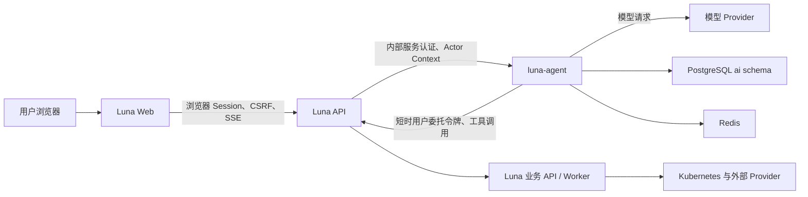

# Luna DevOps 内嵌 AI 助手规格

## 1. 文档状态

- 状态：方案已确定，待分阶段实施
- 目标版本：首个稳定版之后按 P0-P3 渐进开放
- 适用范围：Luna DevOps Web 控制台、API、独立 Agent 服务
- 不替代内容：Luna CLI、Luna DevOps Skill、平台现有权限系统
- 核心原则：助手代表当前用户工作，不拥有超出当前用户的权限

本方案重新定义平台内嵌 AI 助手，但不恢复此前被移除的旧 MCP
内嵌方案。内部平台能力以 OpenAPI 和既有 API 为唯一业务入口，
MCP 仅保留为未来连接外部工具或向外部 Agent 暴露能力的可选协议。

### 1.1 已确定的关键决策

| 决策 | 结论 |
| --- | --- |
| 浏览器入口 | 浏览器只访问 Luna API，不直连 `luna-agent` |
| 会话数据所有权 | `luna-agent` 是 `ai` schema 与 Graph 状态的唯一写入者 |
| 业务数据所有权 | 继续由现有 Go API、Service、Repository 和 Worker 负责 |
| API 到 Agent | 使用仅供内部网络的 HTTP JSON API，并进行服务身份认证 |
| Agent 到业务 API | 使用 Run Actor Grant 换取短时、按 operation 绑定的用户委托令牌 |
| Agent 运行方式 | 独立 Deployment，多副本，不为每个会话创建进程 |
| 编排框架 | LangGraph.js，PostgreSQL Checkpointer |
| 实时协议 | 浏览器到 Luna API 使用可恢复 SSE |
| Run 生命周期 | 后端持久任务；浏览器关闭、刷新或断线不取消执行 |
| 会话恢复 | 前端重新进入时先全量读取持久 Timeline，再从高水位接收增量 |
| 会话删除 | 成功即数据库物理级联删除，不使用 ORM 软删除或删除宽限期 |
| 工具来源 | 从 OpenAPI 白名单生成，未声明元数据的 operation 默认不可用 |
| 权限结论 | Go API 在每次工具调用时重新计算，模型和 Agent 无最终决定权 |
| 高风险操作 | 参数绑定批准与平台现有 Step-up MFA 分开执行 |
| 功能入口 | 全局关闭或不可用时完全不渲染悬浮球 |
| 首版记忆 | 只有会话记忆，不创建也不写入长期记忆表 |

本节是后续实现的约束。如果其他章节、原型或旧代码与本节冲突，以本节为准。

## 2. 产品定位

Luna DevOps AI 助手不是一个悬浮在控制台上的通用聊天机器人。它应该
理解用户当前所在页面、项目空间、应用和部署配置，并帮助用户完成以下工作：

- 解释构建、发布、Pod、Gateway、证书和通知问题。
- 汇总分散在多个页面中的状态、事件和日志。
- 把用户带到正确页面、Tab 或资源详情。
- 为表单预填安全的非密钥参数，由用户确认后保存。
- 在用户明确批准后执行受控的平台操作。
- 在需要 Step-up MFA 时暂停任务，引导用户完成验证后继续。
- 保留可恢复的会话和执行记录，避免刷新页面后丢失诊断进度。

助手不能：

- 绕过项目角色、OAuth Scope、MFA 或平台管理员权限。
- 直接读写 Luna DevOps 业务数据库。
- 直接执行任意 SQL、Shell、HTTP 请求或浏览器 JavaScript。
- 把 Secret、Token、Cookie、Authorization Header 写入会话、记忆或模型上下文。
- 因为用户在提示词中声称自己是管理员就提升权限。
- 在没有明确确认时执行破坏性或高风险操作。

## 3. 设计目标

### 3.1 用户体验目标

- 用户无需离开当前业务页面即可提问和执行操作。
- 助手自动获得必要的页面上下文，不要求用户重复粘贴资源 ID。
- 每一步工具调用都有可读状态，长任务可以取消、恢复和重试。
- Tool Call 折叠标题由前端按稳定 operation ID 本地化；原始工具标识只在展开详情中展示，
  后端和 Agent 不返回面向用户的本地化工具名称。展开区按标识、参数、返回分组；终态平台
  工具把真实执行耗时和当前 OTel Trace ID 写入权威 Timeline Item，刷新后仍可关联排障。
- 高风险操作清楚展示目标、影响和参数，不用模糊的“是否继续”代替。
- 桌面端使用可拖动小窗，移动端使用全屏 Sheet。
- 会话可以创建、切换、搜索、重命名和删除。
- 助手关闭后在同一页面生命周期内重新打开时保留当前会话；浏览器刷新后的首次打开使用未持久化的新会话，并在消息区顶部限时提供返回刷新前最近会话的入口。用户主动新建会话时不显示该提示。
- 会话目录的展开状态独立于当前会话，切换会话不会自动收起目录；目录只保留搜索、选择和管理能力，新建会话与目录显隐统一由助手主顶栏控制。

### 3.2 工程目标

- Agent 与 API、Worker 独立部署，支持分别扩缩容。
- 会话和执行状态不依赖单个进程内存。
- 工具定义从 OpenAPI 契约生成或校验，避免平台 API 与助手能力漂移。
- 权限、MFA、审计和幂等继续由 Go API 最终裁决。
- 模型和编排框架可替换，业务工具不依赖具体模型厂商。
- 首版保持单 Agent 主图，不引入难以诊断的多 Agent 自主协作。

### 3.3 安全目标

- 用户、项目空间、平台三个边界同时生效。
- 每次工具调用重新鉴权，不复用会话创建时的权限结论。
- 中高风险操作支持参数绑定的批准记录。
- 模型输入、工具输出、日志和追踪默认脱敏。
- 配额、并发和成本可按用户、项目空间和平台限制。

## 4. 总体架构



### 4.1 服务职责

#### Luna Web

- 根据能力接口决定是否展示全局 AI 助手悬浮球。
- 点击悬浮球后展示助手窗口、消息、工具进度、批准和 MFA 交互。
- 提供结构化页面上下文。
- 执行白名单内的声明式 UI Action。
- 不直接调用模型和第三方平台。
- 不自行判断用户最终权限。

#### Luna API

- 验证浏览器 Session 和 CSRF。
- 对外提供所有 `/api/v1/ai/*` BFF 接口，但不直接写入 `ai` schema。
- 从当前 Session 推导用户、OAuth Grant、Locale 和项目边界，生成签名的
  Actor Context 后调用 Agent 内部 API。
- 为 Agent 调用业务 API 签发短时用户委托令牌。
- 代理可恢复 SSE，断线后根据事件游标补发持久事件。
- 接收批准、拒绝、取消、补充输入和 MFA 后继续请求，并转发给 Agent。
- 对每个业务工具调用执行现有 Scope、RBAC、MFA 和资源归属检查。
- 写入 AuditLog 和 PlatformEvent。

#### `luna-agent`

- 独立 TypeScript 服务，使用 Node.js LTS 运行。
- 负责模型调用、上下文裁剪、工具发现、计划、执行编排和结果验证。
- 使用 LangGraph.js 保存和恢复执行图状态。
- 通过生成的 Luna OpenAPI Client 调用 Luna API。
- 独占写入 `ai` schema，是会话、消息、Run、事件、工具调用、批准和检查点的
  唯一事实源。
- 暴露只在集群内部可访问的版本化 HTTP JSON API。
- 不直接访问业务数据库、Kubernetes、Redis 业务队列或第三方 Provider。

#### PostgreSQL

- 使用独立 `ai` schema 保存会话、消息、运行、工具调用、批准和检查点。
- Agent 使用独立数据库角色，只能访问 `ai` schema。
- Luna API 不直接查询 `ai` schema，避免形成第二套数据访问和授权逻辑。
- 平台数据库管理员仍可执行迁移和保留期清理，但不作为产品读取路径。

#### Redis

- 保存取消信号、短时状态、SSE fan-out 和限流计数。
- 不作为会话和检查点的唯一持久化来源。
- 不负责 Run 排他执行；Run 调度与接管以 PostgreSQL 租约为准。
- Key 必须包含不可猜测的运行 ID，但运行 ID 本身不能作为授权凭据。

### 4.2 请求链路与信任边界

#### 浏览器到 Luna API

- 使用平台现有浏览器 Session、CSRF、CORS 和 SameSite Cookie 策略。
- 浏览器不能提交 `userId`、角色或 Scope 作为可信身份字段。
- API 对每个会话、Run、事件流和批准请求先校验当前用户所有权。

#### Luna API 到 `luna-agent`

- Agent Service 只暴露 ClusterIP，不创建 GatewayRoute。
- 首选双向 TLS；首版若部署体系暂不具备 mTLS，则使用轮换的内部服务 JWT。
- 内部 JWT 的 `aud` 固定为 `luna-agent`，有效期不超过 60 秒，且只能调用
  `/internal/v1/*`。
- 创建 Run 时由 Luna API 预分配 `runId`，Agent 仍是 Run 数据的唯一写入者。
- 每个请求另带签名 Actor Context，至少包含：

```json
{
  "userId": "usr_xxx",
  "sessionId": "sess_xxx",
  "oauthGrantId": "optional_grant_id",
  "runId": "optional_preallocated_run_id",
  "projectId": "optional_project_id",
  "locale": "zh-CN",
  "issuedAt": 1785230000,
  "expiresAt": 1785230060,
  "requestId": "req_xxx"
}
```

- Agent 必须验证签名、`aud`、过期时间和请求 ID，不能信任普通 Header 中的用户信息。
- 服务 JWT 与 Actor Context 只能证明请求来自 Luna API，不能用于调用业务 API。
- 创建 Run 时 API 另签发 Run Actor Grant。Grant 绑定 `runId`、用户、Session、
  OAuth Grant、项目空间和绝对过期时间，只能与有效 Agent 服务身份一起用于委托
  令牌兑换，不能直接作为业务 API Bearer Token。
- Run Actor Grant 的有效期取 Session 剩余时间、Run 最大生命周期和 24 小时中的
  最小值。Agent 加密持久化 Grant，日志、消息、事件和 Tool Call 不记录原文。

#### `luna-agent` 到 Luna API

- Agent 每次执行工具前，使用 Agent 服务身份和 Run Actor Grant 向 Luna API 换取
  短时用户委托令牌。
- 委托令牌的 `aud` 固定为 `luna-api`，不得被 Agent 内部接口接受。
- Agent 只能调用 OpenAPI 工具白名单中的业务 operation，不能调用内部管理路由。
- NetworkPolicy 只允许 Agent 访问 Luna API、配置的模型 Provider、PostgreSQL 和
  Redis；禁止访问 Kubernetes API、云元数据地址和任意集群 Service。

API 服务 JWT、Agent 服务 JWT、Actor Context、Run Actor Grant 和用户委托令牌
属于五类不同的信任材料，不得复用签名用途、Audience 或验证中间件，避免两个
服务身份、请求上下文、运行身份和用户授权相互替代。

#### 后端执行与浏览器生命周期

- 浏览器连接只是控制与观察通道，不是 Run 的所有者、执行器或存活条件。
- 创建 Turn 时，Agent 必须在同一数据库事务中持久化 Turn、用户输入 Item、首个
  Run 和可靠调度记录；事务提交后才能向浏览器返回 `turnId` 与 `runId`。
- Agent 从 PostgreSQL 领取 Run 并在后端持续执行。关闭助手、刷新页面、切换路由、
  浏览器休眠和 SSE 断线都只能移除当前订阅者，不得隐式取消 Run。
- 只有通过已鉴权的取消接口、管理员策略、预算或运行上限才能终止 Run。前端组件
  卸载时禁止自动调用取消接口。
- Agent 每次产生可恢复的状态变化时，必须先提交 Item、Event、Tool Call 或
  Checkpoint，再发送实时事件；不能让仅存在于进程内存或 SSE 中的内容成为事实源。
- Agent 进程重启后从 PostgreSQL 租约和 Checkpoint 接管；Redis 故障只影响短时
  fan-out，不得丢失会话、Run 或已完成的语义内容。
- Luna API 和 Agent 的请求超时只表示当前 HTTP 调用结束，不表示已持久化 Run
  失败或被取消。客户端应凭 `runId` 查询最终状态。

### 4.3 密钥管理与轮换

内部签名使用 Ed25519，并在受管 Secret 中保存版本化 Keyring。Keyring 至少包含：

```json
{
  "api_service_jwt": {"activeKid": "api-svc-2026-01", "previousKids": []},
  "agent_service_jwt": {"activeKid": "agent-svc-2026-01", "previousKids": []},
  "actor_context": {"activeKid": "ctx-2026-01", "previousKids": []},
  "run_grant": {"activeKid": "grant-2026-01", "previousKids": []},
  "delegation_token": {"activeKid": "deleg-2026-01", "previousKids": []}
}
```

- 每类材料使用独立密钥对，JWT 或签名 Envelope 必须携带 `kid`。
- Luna API 持有 API 服务 JWT、Actor Context、Run Actor Grant 和委托令牌的签名
  私钥，以及 Agent 服务 JWT 的验证公钥。
- Agent 持有 Agent 服务 JWT 的签名私钥，以及 API 服务 JWT、Actor Context 的
  验证公钥。Run Actor Grant 对 Agent 保持不透明，由 Agent 加密保存后原样提交
  兑换。
- Luna API 验证自己签发的 Run Actor Grant 和用户委托令牌，不把对应私钥下发给
  Agent。
- Agent 持久化 Run Actor Grant 使用独立的 AES-256-GCM 数据加密密钥，密文携带
  `keyVersion`、随机 Nonce 和认证标签；数据库泄漏不能直接恢复 Grant。
- 轮换时先发布新公钥，再切换 `activeKid`，旧公钥至少保留到该类材料最长有效期
  结束。数据加密密钥保留到使用该版本的所有 Grant 终止并完成清理。
- Keyring、数据加密密钥缺失、权限宽于只读或格式错误时，Agent Readiness 失败；
  核心平台继续运行，但能力接口返回 `ai.agent_unavailable`。
- 密钥只通过只读 Secret Volume 挂载，不写普通环境变量、日志、Trace、错误响应
  或 Release Manifest。

启用 mTLS 时，证书身份仍用于建立传输层双向身份，短时服务 JWT 用于请求级
Audience、重放窗口和审计关联；不因启用 mTLS 而省略请求级身份。首版暂时无法
部署 mTLS 时，必须同时配置两个方向的独立 Ed25519 服务 JWT，不能使用一枚共享
Secret 让双方互相冒充。

## 5. 技术选型

### 5.1 编排框架

首选 **LangGraph.js**。

这里的选择目标不是寻找功能最多的 Agent 框架，而是选择最适合 Luna 控制面场景的
执行内核。Luna 的核心问题是：工具调用必须受权限、审批、MFA、租约、幂等和审计
约束，并且运行可以跨进程重启、跨副本接管和长时间暂停。多 Agent 自主讨论不是
首版重点。

选择原因：

- 检查点适合会话连续性、故障恢复和暂停后继续。
- Interrupt 适合批准、补充输入和 MFA 等 Human-in-the-loop 流程。
- 支持流式输出和工具执行状态。
- 图节点和状态边界明确，便于测试、审计和控制循环次数。
- TypeScript 技术栈与 Web、共享 API Client 和未来独立 Agent 服务一致。
- 框架只承担图编排和检查点，不强制接管 Luna 已有的认证、数据库、HTTP、可观测
  和部署体系，接入边界清晰。

约束：

- 生产环境必须使用 PostgreSQL 持久化检查点，不能使用内存 Saver。
- Graph、State、Node 和 Tool Schema 必须有版本号。
- LangGraph 默认会用当前部署的 Graph 代码恢复历史检查点，不会自动保留旧代码；
  Luna 必须实现 `GraphVersionRegistry`，根据 Run 创建时记录的 `graphVersion`
  选择对应 Graph。旧版本退出服务前，必须终止、迁移或排空引用它的 Run。
- 删除或重命名节点前必须提供旧运行终止或迁移策略。
- Interrupt 前发生的副作用必须幂等，恢复后节点可能从头执行。
- 定期清理过期检查点，避免会话增长失控。
- 不在 LangGraph 节点中再嵌套其他框架的完整 Agent Loop，避免出现两套循环、
  检查点、工具审批和取消语义。

### 5.2 主流框架对比

#### 5.2.1 比较口径

主流方案并不都属于同一层：

- **工作流编排内核**：LangGraph.js、Mastra Workflows、CrewAI Flows。
- **Agent Loop / 多 Agent SDK**：OpenAI Agents SDK、Google ADK、AutoGen。
- **模型与前端流式工具包**：Vercel AI SDK。
- **企业 Agent Kernel**：Semantic Kernel。

因此不能只比较“是否支持 Tool Calling”。本项目按以下优先级评估：

| 维度 | 权重 | Luna 的要求 |
| --- | ---: | --- |
| 可恢复执行 | 25% | 进程重启、跨副本接管、长时间暂停后能继续 |
| 安全与控制 | 20% | 审批、MFA、工具策略、幂等、取消和审计可插入 |
| TypeScript 适配 | 15% | 与 Web、共享 Client、构建和团队能力一致 |
| Provider 中立 | 10% | 支持 OpenAI-compatible，并可替换模型供应商 |
| 多用户持久化 | 10% | 状态可落 PostgreSQL，并能绑定用户、项目和 Run |
| 可观测与测试 | 10% | 节点、工具、Token、延迟和失败原因可追踪 |
| 接入成本 | 10% | 不重复接管 Luna 已有的 BFF、RLS、OTel 和部署体系 |

表中的“适配等级”是针对 Luna DevOps 的项目评分，不代表框架的通用排名。

#### 5.2.2 结论矩阵

| 方案 | TypeScript | 可恢复执行 / HITL | Provider 倾向 | 主要优势 | 对 Luna 的主要代价 | 适配等级 |
| --- | --- | --- | --- | --- | --- | --- |
| **LangGraph.js** | 原生 | 强；Checkpoint、Interrupt、故障恢复 | 较中立 | 显式状态图，控制边界和恢复语义清楚 | Graph 版本仍需平台自行保留和路由 | **A，首选** |
| **OpenAI Agents SDK TS** | 原生 | 中强；Session、可序列化 RunState、审批恢复 | OpenAI 优先 | Agent Loop、Handoff、Guardrail、Tracing 体验完整 | 平台仍要补运行租约、持久调度和 Graph 版本治理 | **B，可作 OpenAI 专用适配参考** |
| **Mastra** | 原生 | 强；Workflow Snapshot、Suspend / Resume | 较中立 | TypeScript 一体化程度高，Agent、Memory、Workflow、Observability 齐全 | 与 Luna 自有存储、BFF、OTel、运行生命周期重叠较多 | **B，绿色项目更合适** |
| **Google ADK TS** | 原生 | 中；Session、State、Memory 完整 | Gemini / Google Cloud 优先 | 多 Agent、工具、评测和 Google Cloud 部署链路完整 | 长任务恢复、版本化审批流仍需按 Luna 场景额外验证 | **B-，Gemini 优先时复评** |
| **Vercel AI SDK** | 原生 | 弱；Agent Loop 有，持久 Checkpoint 需自建 | 中立 | 模型适配、流式 UI、React 集成优秀 | 不是持久工作流引擎，核心运行状态机仍需自研 | **C+，仅考虑 UI / Model 层** |
| **CrewAI** | Python | 中强；Flows 支持状态、持久化和恢复 | 较中立 | 角色化 Crew 和业务 Flow 易于表达 | 引入 Python 服务；自主多 Agent 不是首版目标 | **C** |
| **AutoGen** | Python / .NET | 中；支持 Agent / Team 状态保存和分布式 Runtime | 较中立 | 事件驱动和多 Agent 研究、协作能力强 | 技术栈不一致，持久化与租户隔离仍需平台编排 | **C** |
| **Semantic Kernel** | C# / Python / Java | 中；Process / Plugin 能力丰富 | Azure 生态较强 | 企业连接器、插件和治理经验成熟 | 无 TypeScript；Process Framework 稳定性和接入成本不匹配 | **C** |

#### 5.2.3 各方案取舍

**OpenAI Agents SDK TypeScript**

- 适合以 OpenAI 模型、Agent Handoff、Guardrail 和内置 Tracing 为核心的产品。
- Human-in-the-loop 可以序列化 `RunState`，服务无需一直在线等待人工审批。
- 对 Luna 而言，它解决了 Agent Loop，但没有替代 Run 租约、RLS、Outbox、
  用量预留、Graph 版本路由和两副本接管。
- 首版不把它作为 LangGraph 节点内部的第二套 Agent Loop。未来若需要 OpenAI
  特有能力，应在 `ModelProvider` 或独立专用 Node 中做薄适配。

**Mastra**

- 它是最接近 LangGraph.js 的 TypeScript 备选，Workflow Snapshot 和
  Suspend / Resume 能覆盖长时间审批。
- 它还提供 Agent、Memory、Storage、Observability 和部署能力，绿色项目可以较快
  获得完整体验。
- Luna 已经明确采用 Gin BFF、PostgreSQL RLS、独立 Agent 服务、OpenTelemetry
  和自有 Run 状态机；整体引入 Mastra 会产生职责重叠。首版不为减少少量编排代码
  而替换整套运行边界。

**Google ADK TypeScript**

- Google ADK 已正式提供 TypeScript 版本，不能再以“需要额外 Python 运行时”作为
  排除理由。
- Session、State、Memory、多 Agent、评测和 Cloud Run / GKE 部署链路适合
  Gemini 或 Google Cloud 为主的平台。
- Luna 当前更看重显式、可审计、可版本化的 DevOps 操作图。ADK 的状态能力可以
  支撑会话，但长时间 Interrupt、旧版本 Run 恢复和跨副本租约仍需单独做 POC。

**Vercel AI SDK**

- `ToolLoopAgent`、统一模型 Provider 和 React 流式消息协议很适合聊天类 Web
  产品。
- 它不负责生产级持久 Checkpoint、Run Lease、Graph Migration 或审批超时。
- 若未来复用其 UI Message Protocol，只允许放在展示或模型适配层；不能让浏览器
  绕过 Luna API 直连模型，也不能形成第二套 SSE 事实源。

**AutoGen、CrewAI 和 Semantic Kernel**

- 三者在多 Agent、企业插件或流程自动化方面各有优势，但都与首版 TypeScript
  服务边界不匹配。
- Luna 首版不需要角色扮演式 Crew、跨语言 Actor Runtime 或 Azure Kernel。
- 它们的设计经验可用于工具分层、Agent Handoff 和可观测性，不作为运行依赖。

#### 5.2.4 决策与复评条件

当前决策：

1. LangGraph.js 只负责 Graph、Interrupt、Checkpoint 和恢复执行。
2. Luna 自己负责身份、授权、RLS、租约、审批记录、MFA、幂等、用量和审计。
3. 模型调用只经过 `ModelProvider`，编排框架不能直接绑定某一家模型密钥。
4. Web 只消费 Luna API 的 SSE 契约，不直接依赖任何 Agent 框架的前端协议。
5. P0 不混用两套 Agent Loop，不同时引入 LangGraph 和 Mastra Workflows。

满足下列任一条件时重新评估：

- 平台模型流量长期以 OpenAI 独占能力为主，且 OpenAI Agents SDK 能明显减少
  Guardrail、Tracing 或 Handoff 的维护成本。
- 平台模型流量长期以 Gemini / Vertex AI 为主，并需要 ADK 的评测和部署链路。
- Mastra 的持久工作流、Temporal 和 PostgreSQL 集成经过生产验证，且可以复用
  Luna 已有的 RLS、OTel、Run 和审批事实源而不形成双写。
- LangGraph.js 无法满足两副本恢复、Graph 版本兼容或长期维护要求。

#### 5.2.5 编码前 POC

在正式实现 Agent 工具前，用同一组测试验证 LangGraph.js；任一关键项失败都要
回到本节复评候选方案：

1. 启动一个 Run，在写操作批准点 Interrupt，停止 Agent 进程，24 小时后由另一
   副本恢复。
2. 两副本同时竞争同一 Run，只允许一个副本持有租约并执行工具。
3. 工具成功但节点提交 Checkpoint 前进程退出，恢复后通过幂等键避免重复写入。
4. 发布 Graph v2 后，未完成的 v1 Run 仍由 v1 Graph 恢复；完成后才能移除 v1。
5. 用户撤销批准、会话或委托令牌后，暂停 Run 不得继续执行。
6. 两个用户、两个项目并发运行，PostgreSQL RLS、SSE 和 Trace 不发生串租户。
7. Provider 超时、限流和流式中断时，Run 状态、预算预留和错误码能正确收敛。

### 5.3 模型 Provider

第一版实现 OpenAI-compatible Provider，并保留统一接口：

```ts
interface ModelProvider {
  stream(request: ModelRequest): AsyncIterable<ModelEvent>
  complete(request: ModelRequest): Promise<ModelResponse>
  capabilities(): ModelCapabilities
}
```

平台管理员配置：

- Provider 类型。
- API Base URL。
- API Key，由 Secret Store 加密保存。
- 默认模型与备用模型。
- 是否支持 Tool Calling、Structured Output、Streaming 和推理强度。
- 单次最大输入、输出、工具调用次数和成本预算。

Provider 配置只在服务端使用，不返回浏览器。

### 5.4 Agent 服务基础栈

`luna-agent` 纳入根目录 pnpm workspace，使用与仓库 CI 一致的 Node.js 24 LTS、
pnpm 和 TypeScript：

| 领域 | 选型 | 约束 |
| --- | --- | --- |
| HTTP Server | Fastify | 只监听内部 Service；公开 BFF 仍由 Gin 提供 |
| 输入输出校验 | Zod 4 + Fastify Type Provider | OpenAPI 生成类型后仍做运行时校验 |
| 模型 Client | 官方 `openai` Node SDK 的适配层 | 只通过 `ModelProvider` 接口使用 |
| 编排 | LangGraph.js | Graph、Node 和 Checkpoint 版本显式固定 |
| 数据库 | `pg` + 显式 Repository | 事务、RLS、租约和 `SKIP LOCKED` 不隐藏在 ORM 中 |
| 日志 | Pino JSON | 使用项目统一字段名并默认脱敏 |
| Metrics / Trace | OpenTelemetry + Prometheus Client | 独立 metrics listener |
| 测试 | Vitest + Testcontainers | 集成测试使用真实 PostgreSQL 和 Redis |
| 开发 / 构建 | `tsx` / `tsc` | 生产运行编译后的 ESM，不在容器内即时转译 |

目录脚本固定为：

```json
{
  "dev": "tsx watch src/index.ts",
  "build": "tsc -p tsconfig.build.json",
  "lint": "eslint .",
  "test": "vitest run",
  "start": "node dist/index.js"
}
```

生产镜像使用多阶段构建，只复制 `dist`、生产依赖和版本 Manifest；使用固定 UID，
不包含源码、测试、pnpm Store 或开发依赖。依赖版本由 workspace lockfile 固定，
不允许 Agent 子项目维护第二份 lockfile。

## 6. Agent 执行模型

### 6.1 主执行图

```text
接收输入
  -> 补充页面与会话上下文
  -> 模型判断当前步骤
  -> 发起一个或多个 Tool Call
  -> 策略检查与实时用户权限校验
  -> 必要时暂停并请求批准、MFA 或补充输入
  -> 执行工具并持久化结果
  -> 使用 assistant tool_calls + tool result 回灌模型
  -> 继续下一轮判断，直到不再需要业务工具
  -> 生成回答和 UI Action
```

主执行路径必须是统一的有界 Agent Loop，不得为“第一次工具调用”和“最后一次
模型调用”编写两套特殊分支。模型在任意一轮都可以继续调用已注册工具；工具失败
也作为结构化结果回灌，由模型解释、修正参数或选择其他路径。只有等待批准、MFA、
补充输入、取消、超时、达到上限或模型给出最终答复时才退出循环。

每个阶段都必须有最大重试次数和明确终态。禁止模型无限循环调用列表、日志或状态
接口，也不得把模型第二轮及后续轮次产生的 Tool Call 静默丢弃。

当前单个 Run 不限制平台工具调用次数，模型可以按完成任务所需持续读取、写入和回读验证。
Agent 仍以最多 48 次模型步骤和 Run 超时限制失控循环与执行时长；它们只是安全上限，
不是正常任务的目标轮数或完成条件。正常流程应在用户目标达到验收标准、进入等待状态
或出现明确阻塞时尽早结束。达到模型循环或时间上限时 Run 失败并保留未完成阶段，不能
把最后一张卡片或最后一次工具成功表述为业务完成。

卡片属于交互与呈现层。交互卡片使业务工作流停在等待用户输入阶段；当前 Run 可以
完成为一个交互回合，用户提交后由新 Turn 继续同一目标。展示卡片必须把生成结果
回灌模型，由模型继续执行、回读验证或给出准确的进行中/阻塞结论。生成卡片本身
不改变业务目标状态，也不能作为最终状态验证证据。

### 6.1.1 领域工作流 Skill

系统 Prompt 只维护权限、工具、卡片和完成状态等全局约束。平台领域流程按需从
`luna-devops-interaction/references` 加载，至少覆盖：

- 模板、镜像和源码三条应用交付路径。
- 项目空间、应用、成员、配置集、服务关系与拓扑。
- Git Provider、仓库绑定、Webhook、镜像站、构建、制品与 Release。
- 运行集群、部署配置、运行数据、重启、回滚、终端与导出。
- 网关、域名、DNS、TLS、证书和外部可访问性。
- 构建、应用、运行时、访问入口、Hook 与通知故障诊断。
- 用户、角色、MFA、OAuth、Token、账单、站点设置、数据保留和系统组件。

每个领域流程必须描述发现、结构化输入、操作、错误恢复、权威回读和验收证据。
Skill 教学覆盖与 Tool Catalog 执行能力分别治理；未注册写工具的流程只能报告能力
阻塞，不能因为 Skill 中描述了 operation 就虚构调用。

### 6.2 Run 状态机

Run 只能处于以下状态：

```text
queued
  -> running
  -> waiting_approval
  -> waiting_mfa
  -> waiting_input
  -> completed
  -> failed
  -> canceled
  -> expired
```

允许的迁移：

| 当前状态 | 可迁移到 | 触发条件 |
| --- | --- | --- |
| `queued` | `running` | 副本取得租约 |
| `queued` | `canceled` / `expired` | 用户取消或排队超时 |
| `running` | `waiting_approval` | 工具策略要求用户批准 |
| `running` | `waiting_mfa` | 业务 API 返回 `mfa_required` |
| `running` | `waiting_input` | 缺少不能安全推断的必要参数 |
| `running` | `completed` / `failed` / `canceled` | 正常结束、不可恢复错误或取消 |
| `waiting_*` | `queued` | 收到有效批准、MFA assertion 或补充输入 |
| `waiting_*` | `canceled` / `expired` | 用户取消或等待超时 |

禁止直接从 `waiting_*` 迁移到 `running`。恢复请求先写入输入或批准结果，再把 Run
放回 `queued`，由任意健康副本重新取得租约并从检查点继续。

每次状态迁移必须：

1. 在 PostgreSQL 事务中校验 `row_version` 和允许的来源状态。
2. 更新状态、时间戳、版本号与稳定原因码。
3. 追加一条不可变 `ai.run_events`。
4. 事务提交后才向 Redis 发布实时事件。

终态不可再次恢复。重新执行必须创建新 Run，并通过 `supersedes_run_id` 关联原 Run。

### 6.3 Tool Call 状态机

```text
proposed
  -> awaiting_approval
  -> awaiting_mfa
  -> running
  -> succeeded | failed | canceled | skipped
```

- `proposed` 时完成参数 Schema 校验、风险计算和 `arguments_hash` 固化。哈希输入必须使用递归按对象键排序的规范 JSON，数组顺序保持不变；批准后执行复用同一份规范 JSON，禁止由不同语言运行时各自重新序列化对象再比较。
- 可执行参数使用用途隔离的 AES-256-GCM 密钥加密保存；`ai.tool_calls.arguments`、Timeline、SSE、日志与审计只保存或展示递归脱敏投影。脱敏投影不得作为执行参数回放。
- 读取与低风险写入不因“来自 Agent”额外降权或升权，直接按当前用户在业务 API 的最新权限执行。
- 只有 `sensitive`、`destructive` 或目录显式声明 `approval: always` 的调用进入 `awaiting_approval`。
- 批准只把 `awaiting_approval` 推进到 `running` 或 `awaiting_mfa`。
- “全部同意”只处理当前 Run 中已持久化并展示、仍处于 `awaiting_approval` 的 Tool Call；逐项复用各自的 `arguments_hash` 与 `row_version`，不形成后续自动批准授权。
- MFA 只证明对应 Purpose 已完成 Step-up，不能代替批准。
- `running` 后参数不可修改；需要修改时废弃当前 Tool Call 并创建新记录。
- 工具调用进入终态后不能覆盖结果，重试使用新 `tool_attempt`，但复用同一个幂等键。

### 6.4 单 Agent 与领域子图

首版使用一个主 Agent，通过领域子图或工具包组织能力：

- 项目空间与应用。
- Git 与代码源。
- 构建与构建模板。
- 部署、发布与 Hook。
- Kubernetes 运行时。
- Gateway、DNS 与证书。
- 镜像站与镜像。
- 事件与通知。
- 账单与用量。
- 用户、安全与平台管理。

领域子图是代码组织和上下文裁剪手段，不是具有独立身份和权限的 Agent。

### 6.5 工具发现与生成

不能把全部平台接口一次性塞入模型上下文。采用两阶段发现：

1. 根据用户意图和页面上下文选择领域。
2. 从领域目录中加载当前任务需要的工具，并优先保留完整工作流中的发现、执行、
   回读和验收操作；单次模型请求最多加载 112 个工具。

工具目录以平台 OpenAPI operation 为唯一事实源。普通 JSON 业务接口默认生成工具；
OpenAPI 或运行时鉴权映射提供稳定 Scope，风险由显式元数据与 HTTP 语义共同确定。
只有以下接口不进入通用模型工具目录：

- 登录、OAuth 回调、Webhook 接收器等由浏览器或外部系统驱动的协议入口。
- SSE、WebSocket、终端、文件上传下载和一次性 Secret 回显等不适合进入模型上下文
  的传输或敏感入口。
- 健康检查、Agent 内部接口以及明确声明 `agentAllowed: false` 的 operation。

CLI 与内嵌助手可以共享 API 契约和安全元数据，但内嵌助手不通过启动 `luna`
子进程执行命令。

生成流程：

1. Luna API 启动时从内嵌 OpenAPI 生成业务工具目录、JSON Schema、风险与 Scope。
2. Agent 启动时从受认证的 `provider-config` 获取目录；目录不可用时不启动，禁止
   静默退回一份过期手写清单。
3. CI 校验 operation ID 唯一、Scope 存在、风险等级合法、危险操作必须批准，
   并验证常用交付工作流的关键操作都可被领域裁剪选中。
4. Agent 使用短时用户委托，把工具请求重新进入同一 Gin Router 和同一业务
   Handler；不复制 Handler、Service 或 Repository 逻辑。
5. 非通用传输只有在实现专用适配器并完成单独威胁建模后才能开放。

工具参数必须使用 JSON Schema 严格模式：

- `additionalProperties: false`。
- 列表分页 `pageSize` 不超过 operation 声明的 `maxItems`。
- 数组、字符串、日志行数和时间范围有上限。
- 资源 ID 从当前可见资源选择，不接受模型拼接出的任意路径。
- Secret 字段只能接受“引用已有 Secret”的 ID，不能接受明文。

### 6.6 调度、租约与故障恢复

PostgreSQL 是待执行 Run 的事实源，Redis 不充当可靠队列：

- Agent 副本只能通过 14.4 定义的 `ai.claim_next_run` 受限函数领取 `queued` Run；
  函数内部使用 `SELECT ... FOR UPDATE SKIP LOCKED`，运行角色不能直接跨用户扫描
  `ai.runs`。
- `ai.runs` 保存 `lease_owner`、`lease_expires_at` 和 `heartbeat_at`。
- 默认租约 30 秒，每 10 秒续租；连续两次续租失败即停止执行工具。
- 副本只领取 `next_attempt_at <= now()` 且租约为空或已过期的 Run。
- 副本崩溃后，其他副本可在租约过期后接管并从 PostgreSQL Checkpoint 恢复。
- Redis 仅承担取消广播、SSE live fan-out 和限流；Redis 丢失不能丢失 Run。

收到 SIGTERM 后：

1. 立即停止领取新 Run。
2. 标记实例 draining。
3. 给当前节点最多 20 秒完成或写入检查点。
4. 释放租约；无法安全检查点的 Run 等待租约过期后接管。

### 6.7 循环、超时与重试上限

P0 默认限制：

| 项目 | 默认值 | 可配置范围 |
| --- | --- | --- |
| 单 Run 墙钟时间 | 5 分钟 | 1-15 分钟 |
| 单 Run 工具调用 | 12 次 | 1-30 次 |
| 同一 operation 连续调用 | 3 次 | 1-5 次 |
| 单次日志读取 | 500 行或 256 KiB | 不超过 2 MiB |
| 单次列表读取 | 100 条 | 不超过 500 条 |
| 等待批准/MFA/输入 | 30 分钟 | 5 分钟-24 小时 |

重试规则：

- 模型请求只对 429、连接重置和明确 5xx 重试，最多 2 次，使用指数退避和抖动。
- 只读工具最多重试 2 次。
- 写工具不做盲重试；仅在未收到响应或服务端明确声明可重试时，使用原
  `Idempotency-Key` 重放。
- 参数校验、权限、配额、MFA、冲突和业务失败不自动重试。
- Provider fallback 只能继续同一 Run，必须从持久 Tool Call 记录恢复，不能忘记
  已经发生的副作用后重新规划。
- 达到模型循环上限后以 `ai.limit_exceeded` 失败；达到运行时间上限后以 `ai.run_timeout` 失败，并保留已完成操作的摘要。工具调用次数本身不触发失败。

## 7. 工具风险与交互

| 风险等级 | 示例 | 默认行为 |
| --- | --- | --- |
| `read` | 查询构建、日志、状态、事件 | 自动执行 |
| `ui` | 切换页面、打开详情、设置筛选 | 自动执行 |
| `write` | 修改普通配置、创建低风险资源 | 展示摘要并确认 |
| `sensitive` | Secret、凭据、终端、数据导出 | 确认并完成 Step-up MFA |
| `destructive` | 删除、批量清理、吊销、生产回滚 | 展示影响范围，显式确认并完成 Step-up MFA |

批准记录必须绑定：

- `userId`
- `sessionId`
- `conversationId`
- `runId`
- `toolCallId`
- `purpose`
- `argumentsHash`
- `expiresAt`

工具参数变化后，旧批准立即失效。管理员默认不能替其他用户批准其会话中的操作。

### 7.1 幂等与并发

- 所有写操作携带稳定 `Idempotency-Key`。
- Agent 恢复运行时复用原工具调用的幂等键。
- 中高风险更新优先携带 ETag、version 或 Kubernetes resourceVersion。
- 冲突后必须重新读取资源、重新生成计划并重新确认。
- 不允许 Agent 自动添加 `force=true` 规避冲突。

### 7.2 最终状态验证

工具接口返回成功只代表请求已受理。Agent 必须按业务语义验证：

- 创建或安装：回读资源位于正确作用域，来源、名称和有效配置符合目标；若包含部署，
  还要达到运行时就绪状态。
- 更新：回读有效配置或版本与目标一致。
- 构建：BuildRun 到达成功或失败终态。
- 发布：Release 与工作负载状态一致。
- Gateway：HTTPRoute Accepted、ResolvedRefs 等条件符合预期。
- 证书：Certificate Ready 或返回可解释失败。
- 删除：业务记录和受管 Kubernetes 资源达到预期状态。
- 诊断与修复：诊断结论有事件、日志、状态或配置证据；修复还需回读确认症状消失。

长任务统一使用版本化事件流，并要求唯一终态摘要。超时或流中断不能被表述为成功。

## 8. 认证、授权与多用户隔离

### 8.1 短时用户委托令牌

Luna API 为 Agent 调用业务 API 签发短时令牌。它与 API 服务 JWT、Agent 服务
JWT、Actor Context 和 Run Actor Grant 的用途及验证路径完全分离：

```json
{
  "sub": "user_id",
  "aud": "luna-api-ai-tools",
  "sessionId": "session_id",
  "runId": "run_id",
  "toolCallId": "tool_call_id",
  "operationId": "operation_id",
  "argumentsHash": "sha256:...",
  "scopes": ["project:read", "build:read"],
  "exp": 1785230000
}
```

令牌有效权限是以下集合的交集：

```text
用户当前权限
∩ 当前有效登录 Session
∩ 工具要求的 Scope
∩ 目标项目上的实时 RBAC Action
```

页面项目、会话项目和其他上下文不进入该权限交集。项目级工具从
`argumentsHash` 绑定的参数读取显式 `projectId`，平台级工具拒绝携带
`projectId`。委托令牌不能直接作为业务授权结论；每次工具调用仍由 Luna API
查询当前用户、Session、目标项目成员关系、RBAC Action 和 MFA assertion。用户
被移出项目、角色变化、Session 失效或 MFA 过期后，下一次工具调用必须立即失败。

实现约束：

- 有效期默认 60 秒，最长 5 分钟；Agent 按需换取，不为整个会话签发长 Token。
- Token 只能访问与声明 operation ID 完全一致的 AI 内部工具执行与验证端点，不能
  访问其他内部或公开业务路由。
- 业务请求的路由 operation ID 必须与 Token 中 `operationId` 完全一致；不能用一枚
  Token 连续调用多个 operation。
- 浏览器 Session 退出、用户禁用或成员权限变化后，即使短时令牌尚未到期，执行期
  的实时校验也必须拒绝调用。
- Agent 日志、Trace、异常和 Tool Call 表都不能保存原始 Token。
- Personal Access Token 发起的会话沿用现有 MFA 限制；不能因为经过 Agent 而获得
  浏览器 Session 才具备的能力。
- Run Actor Grant 只能提交给委托兑换端点，且必须同时通过 Agent 服务认证；即使
  数据库内容泄露，也不能单独调用业务 API。
- 委托兑换时重新读取 Session、OAuth Grant、用户状态、项目成员关系和 operation
  元数据。任一项失效都拒绝兑换，不依赖 Grant 创建时的旧权限快照。

Luna API 在平台业务 schema 保存 `ai_delegation_grants` 授权元数据，只记录
`jti_hash`、`run_id`、用户、Session、OAuth Grant、项目空间、过期时间、撤销时间
和创建时间，不保存 Grant 原文。该表归 API 认证模块所有，不属于 Agent 的会话
数据：

- `jti_hash` 唯一。
- `(user_id, revoked_at, expires_at)` 和 `(run_id, revoked_at)` 建索引。
- 兑换时必须同时验证签名和数据库中未撤销记录。
- Run 取消/终止、会话退出、OAuth Grant 吊销和用户禁用都撤销关联记录。
- 清理任务删除过期 7 天以上的记录；删除不影响已有 AuditLog。

### 8.2 隔离层级

#### 用户边界

- 会话、消息、运行、批准和个人记忆归创建用户所有。
- 浏览器请求中的用户 ID 不可信，必须从服务端 Session 推导。
- 查询、流式订阅、取消和恢复都校验 owner。
- 第一版项目相关会话仍为私有，不因绑定项目而自动共享。

#### 项目空间边界

- `projectId` 只缩小上下文，不代表授权。
- 项目成员关系和角色由 API 每次检查。
- 切换项目空间时开启新上下文边界，不能把旧项目资源作为隐式工具目标。
- 多项目比较必须由用户显式选择，并逐项验证权限。

#### 平台边界

- Provider、模型、全局提示词、成本策略和公共知识由平台管理员维护。
- 平台管理员可以查看运行指标和工具审计。
- 默认不能直接阅读普通用户的消息正文。
- 如未来提供紧急内容访问，必须采用 Break-glass 流程，填写原因并写 AuditLog。

### 8.3 PostgreSQL RLS

`ai` schema 必须启用 Row Level Security，作为服务层检查之外的纵深防御：

```sql
owner_user_id = current_setting('app.user_id', true)
```

要求：

- 每个事务使用 `SET LOCAL app.user_id`。
- 连接归还连接池前不能残留用户上下文。
- Agent 数据库角色不能绕过 RLS。
- 管理清理任务使用独立受审计角色。
- 服务层测试和 RLS 集成测试同时覆盖跨用户读取。
- 所有用户查询在同一事务中先执行 `SET LOCAL app.user_id`，再访问业务表。
- 后台领取 Run 只能调用 14.4 定义的受限 `SECURITY DEFINER` 函数。函数只返回
  成功获得租约的 Run ID 和 `owner_user_id`；执行副本随后在普通 RLS 事务中设置
  `SET LOCAL app.user_id` 并读取关联数据，不能借领取能力查询其他用户会话。

### 8.4 Step-up MFA

- Agent 遇到 `mfa_required` 后暂停 Graph，而不是把错误转换成普通失败。
- Web 展示现有统一 MFA Dialog。
- Web 直接调用现有 `POST /api/v1/auth/mfa/verify`，OTP、恢复码和 MFA Secret 永远
  不经过 Agent。
- 验证成功后，Luna API 创建现有 `StepUpAssertion`，并把 assertion ID 与
  Run、Purpose 和 Tool Call 的恢复请求绑定。
- 验证成功后从检查点继续。
- MFA 失败、过期或用户关闭弹窗时保持可恢复状态。
- Agent 不自行维护新的 Step-up Purpose；工具元数据只能引用
  `internal/api/step_up.go` 和 OpenAPI 共同导出的 Purpose 目录。

批准和 MFA 的顺序固定为：

1. 固化工具参数并计算 `argumentsHash`。
2. 如策略要求，先展示影响摘要并取得批准。
3. 调用业务 API。
4. 业务 API 返回 `mfa_required` 时暂停为 `waiting_mfa`。
5. Web 完成现有 MFA 流程后恢复 Tool Call。
6. Luna API 再次校验批准、MFA assertion、权限和参数哈希后执行。

MFA 不是批准，批准也不是 MFA。即使已有同 Purpose 的有效 assertion，高风险工具
仍需完成本次参数绑定批准。

## 9. 会话、记忆与数据模型

### 9.1 首版记忆边界

首版只提供会话内短期记忆，不自动建立跨会话长期记忆。

允许进入会话上下文：

- 用户消息与助手回答。
- 页面资源 ID 和当前 Tab。
- 脱敏后的工具摘要。
- 用户明确确认的当前目标。

禁止进入记忆：

- Secret、Token、Cookie、Authorization Header。
- kubeconfig、Registry 密码、Git Access Token。
- 完整终端输入历史。
- 未脱敏的第三方响应和日志。

后续如增加长期记忆，必须明确区分：

- 用户偏好。
- 项目空间知识。
- 平台公共知识。

用户需要能查看、删除和关闭长期记忆。

### 9.2 数据表

所有主键使用平台不可猜测 ID 格式；所有时间使用 `timestamptz`；JSON 字段使用
`jsonb`。表结构由 golang-migrate 管理，Agent 启动时只校验版本，不自动改表。

Agent 侧 ID 生成器必须与 Go `internal/id` 的语义一致：使用 CSPRNG 生成 12 字节
随机数并编码为 24 位小写十六进制，不使用时间戳、数据库自增值或可猜测序列。

| 对象 | 前缀 | 示例 |
| --- | --- | --- |
| Conversation | `aicnv` | `aicnv_0123...` |
| Turn | `aitrn` | `aitrn_0123...` |
| Run | `airun` | `airun_0123...` |
| Model Invocation | `aiinv` | `aiinv_0123...` |
| Item | `aiitm` | `aiitm_0123...` |
| Content Part | `aiprt` | `aiprt_0123...` |
| Run Event | `aievt` | `aievt_0123...` |
| Tool Call | `aitool` | `aitool_0123...` |
| Approval | `aiapr` | `aiapr_0123...` |
| Provider Artifact | `aiart` | `aiart_0123...` |
| Callback Outbox | `aiout` | `aiout_0123...` |
| Usage Reservation | `aiuse` | `aiuse_0123...` |

#### 建模依据和分层

内部模型不能把一次用户输入简化成一条 `user` 消息和一条 `assistant` 消息。一次
用户输入可能产生多次模型请求、并行工具调用、乱序完成的工具结果、批准或 MFA
中断、恢复后的继续推理，最后才产生用户可见回答。

官方 API 的共同约束如下：

- OpenAI Agents SDK 把消息、Reasoning、工具调用、工具结果、批准和 Handoff 都建模
  为独立 Run Item；一次 Run 可以包含多种 Item，批准后继续同一 Run。参考
  [OpenAI Responses Streaming Events](https://platform.openai.com/docs/api-reference/responses-streaming/response/refusal/delta)
  中的 `output_index`、`content_index`、`sequence_number`，
  [OpenAI Agents SDK Streaming](https://openai.github.io/openai-agents-js/guides/streaming/)
  和 [Results](https://openai.github.io/openai-agents-js/guides/results/)。
- Anthropic Messages 使用带 `index` 的 Content Block 流，文本、Thinking、签名和
  Tool Use 可以交错到达；工具循环中的 Thinking Block 必须原样续接。参考
  [Anthropic Streaming Messages](https://platform.claude.com/docs/en/build-with-claude/streaming)
  和 [Extended Thinking](https://platform.claude.com/docs/en/docs/build-with-claude/extended-thinking)。
- Gemini Function Calling 允许并行调用，并要求 Thought Signature 保持在原始
  Part 位置；函数调用和结果的错误穿插顺序可能被 Provider 拒绝。参考
  [Gemini Thought Signatures](https://ai.google.dev/gemini-api/docs/thought-signatures)
  和 [Function Calling](https://ai.google.dev/gemini-api/docs/function-calling)。

因此内部模型固定为以下层级：

```text
Conversation
  └─ Turn
      ├─ user Item
      └─ Run (一次执行尝试)
          ├─ Model Invocation 0
          │   ├─ reasoning-summary Item
          │   ├─ assistant-message Item
          │   └─ tool-call Item × N
          ├─ Tool Call / Tool Result × N
          ├─ Approval / MFA interruption
          └─ Model Invocation 1..N
              └─ final assistant-message Item
```

- `Conversation` 是用户看到的长期会话容器。
- `Turn` 是一次逻辑用户输入及其完整处理过程。
- `Run` 是某个 Turn 的一次执行尝试。批准、MFA、Worker 恢复和短暂故障重试继续
  同一个 Run；用户主动“重新生成”或系统从不可恢复错误重新执行时创建新 Run。
- `Model Invocation` 是一次真实 Provider API 请求。一个 Run 通常会有多次调用。
- `Item` 是可排序的语义对象，消息、Reasoning 摘要、工具调用、工具结果、批准和
  Handoff 都是 Item，不把它们塞入一条字符串消息。
- `Content Part` 是 Item 内部的有序内容块。
- `Run Event` 是实际发生顺序的追加事件流，用于 SSE、诊断和恢复，不是会话正文。
- `Provider Artifact` 是续接 Provider 所需但不应展示的加密不透明数据。

产品事实源是 Turn、Run、Invocation、Item 和 Content Part；LangGraph Checkpoint
只负责恢复执行，不作为会话历史或前端时间线的数据源。

必须同时保存四种顺序，禁止用一个 `sequence` 混合表达：

| 顺序 | 字段 | 用途 |
| --- | --- | --- |
| 逻辑会话顺序 | `turn_index` | 用户第几轮输入 |
| Provider 语义顺序 | `invocation_index`、`provider_output_index`、`part_index`、`call_index` | 重建下一次模型输入 |
| 产品时间线顺序 | `timeline_index` | 稳定投影当前 Run 的消息、工具和批准活动 |
| 实际发生顺序 | `event_sequence` | 流式展示、工具乱序完成和诊断 |

并行工具调用按 `tool_batch_id + call_index` 保留 Provider 输出顺序。工具可以并发
执行，开始和完成事件按真实时间写入 `run_events`；进入下一次 Model Invocation
前必须经过批次屏障，并按原始 `call_index` 投影 Tool Result，不能按完成先后重排。

Reasoning 分为三类，不能混存：

- `reasoning_summary`：Provider 明确允许展示的摘要，可以作为 Item 保存和展示。
- `provider_artifact`：Thought Signature、加密 Reasoning、Thinking Signature，
  以及 Provider 明确要求原样回传的 Thinking Block 等续接材料。此类内容加密保存，
  且不向用户、管理员、日志或审计正文展示。
- `progress`：平台自己生成的“正在检查部署”等状态，不得伪装成模型思维过程。

不创建通用 `thinking_text` 字段，不保存或展示模型原始隐藏 Chain of Thought。
调试模式如确需保留 Provider 原始响应，必须显式开启、字段级加密、短保留期并受
平台管理员审计，不能进入普通会话查询。

#### 产品内容块与 Provider 兼容层

Web Timeline 不直接消费 OpenAI、Anthropic、Gemini 或其他 Provider 的原始
Message、Content Block 和流事件。Provider Adapter 必须先归一化为以下稳定内容块：

```ts
type TimelineBlock =
  | {
      id: string
      type: "thinking"
      status: "streaming" | "completed"
      summary: string
      display: "summary" | "progress"
    }
  | {
      id: string
      type: "message"
      role: "user" | "assistant"
      status: "streaming" | "completed" | "failed"
      parts: MessagePart[]
    }
  | {
      id: string
      type: "tool_call"
      toolCallId: string
      name: string
      titleKey: string
      status:
        | "proposed"
        | "awaiting_approval"
        | "awaiting_mfa"
        | "running"
        | "succeeded"
        | "failed"
        | "canceled"
        | "skipped"
      arguments: Record<string, unknown>
      result?: ToolDisplayResult
      uiActions?: UIAction[]
    }
```

- `thinking` 只允许承载 Provider 明确允许展示的 reasoning summary，或标记为
  `display: "progress"` 的平台执行进度。界面标题必须分别显示“思考摘要”和
  “执行进度”，禁止把平台进度伪装成模型思维。
- 不支持可展示 Reasoning 的 Provider 只生成 `progress`；前端不得显示空
  Thinking、伪造思考内容或降级展示隐藏 Chain of Thought。
- `message` 是用户和助手的可见正文；同一 Message 可以包含文本、代码、引用、
  资源链接和受控附件，但不能内嵌 Tool Call JSON。
- `tool_call` 同时关联模型请求、平台执行状态和最终结果。参数必须是完成 Schema
  校验并脱敏后的快照；结果必须经过 Tool 专用 Presenter 过滤，不能把原始 HTTP
  响应、Header、Secret 或 Provider 错误直接返回 Web。
- 未识别的 Provider block、delta 或新增事件按 `unknown` 记录到受控可观测性字段，
  普通 Web Timeline 忽略但不能导致整个 Run 失败。Adapter 必须通过 fixture 覆盖
  Provider 新增未知事件的前向兼容。
- Provider 原始 ID 只保存在 Adapter 关联字段；Web 使用 Luna 的 Item、Part 和
  Tool Call ID 做幂等、排序与恢复。

归一化规则至少覆盖：

| 外部格式 | Luna 内容块 | 兼容要求 |
| --- | --- | --- |
| OpenAI assistant message / message output item | `message` | 按 output/content index 聚合文本，最终 Item 覆盖增量投影 |
| OpenAI reasoning item / reasoning summary delta | `thinking(summary)` | 只展示官方 summary；隐藏 reasoning 和 encrypted content 作为 Provider Artifact |
| OpenAI function/tool call + tool output item | `tool_call` | 使用稳定 call ID 关联参数和结果，不以工具名或到达顺序配对 |
| Anthropic `text` block / `text_delta` | `message` | 使用 block `index` 聚合，`content_block_stop` 后固化 |
| Anthropic `thinking` / `thinking_delta` | `thinking(summary)` 或 Provider Artifact | 仅在 Provider 策略允许展示时进入 Timeline；signature 永不展示 |
| Anthropic `tool_use` + `input_json_delta` | `tool_call.arguments` | 增量只累积字符串，block 完成且 JSON Schema 校验通过后才可执行和展示 |
| Anthropic `tool_result` | `tool_call.result` | 必须按 `tool_use_id` 关联，不能依赖相邻位置 |

这些规则参考 OpenAI Responses / Agents SDK 的独立 Run Item 与流式事件模型，以及
Anthropic Messages 的有序 Content Block、Thinking、Tool Use 和 Tool Result 模型。
业务层、数据库投影和 Web 不得根据 Provider 名称增加分支。

Provider Adapter 必须把外部协议映射到统一模型，不能让业务层读取 Provider 原始
事件：

| Provider 概念 | 内部映射 | 规则 |
| --- | --- | --- |
| OpenAI Response / Agents Run | Run 与 Model Invocation | 一个产品 Run 可包含多次 Response |
| OpenAI output item / Agents Run Item | Item | Message、Reasoning、Tool Call、Tool Output、Approval、Handoff 分开保存 |
| Anthropic `content_block_*` | Item + Content Part | 使用 Provider block `index` 维护增量归属，完成后固化 |
| Anthropic `thinking` / `signature_delta` | Reasoning Summary 或 Provider Artifact | Provider 允许展示的摘要单独保存；续接所需 Thinking Block 和签名加密保存并原样回传，不进入普通时间线 |
| Gemini `Content.parts` | Item + Content Part | 保留 Part 原始相对位置 |
| Gemini `thought_signature` | Provider Artifact | 加密保存并由 `position_manifest` 放回原位置 |
| 任意 Provider 流事件 | Run Event | 先转换为平台事件类型，未知非关键事件可忽略 |

适配器处理流时维护
`provider block/index -> item_id + content_part_id` 的内存映射。Delta 可以乱序到达
不同 Block，但同一 Block 内只能追加；收到 Block/Item 完成事件后原子固化
Item、Part 和完成事件。Provider 流提前断开时，未完成 Item 保持
`in_progress` 或标记 `failed`，不能把半段文本伪装成完整回复。

下面是一轮“先解释、并行查两个资源、再回答”的逻辑示例。
`provider_output_index` 保留模型输出顺序，两个工具的实际完成先后只体现在
`event_sequence`：

```json
{
  "turnIndex": 12,
  "run": {
    "runIndex": 1,
    "invocations": [
      {
        "invocationIndex": 0,
        "items": [
          {
            "providerOutputIndex": 0,
            "timelineIndex": 0,
            "type": "reasoning_summary",
            "parts": [{ "partIndex": 0, "type": "reasoning_summary_text" }]
          },
          {
            "providerOutputIndex": 1,
            "timelineIndex": 1,
            "type": "assistant_message",
            "parts": [{ "partIndex": 0, "type": "text" }]
          },
          {
            "providerOutputIndex": 2,
            "timelineIndex": 2,
            "type": "tool_call",
            "toolBatchId": "batch_1",
            "callIndex": 0
          },
          {
            "providerOutputIndex": 3,
            "timelineIndex": 3,
            "type": "tool_call",
            "toolBatchId": "batch_1",
            "callIndex": 1
          }
        ]
      },
      {
        "invocationIndex": 1,
        "inputProjection": [
          "tool_result(batch_1, call_index=0)",
          "tool_result(batch_1, call_index=1)"
        ],
        "items": [
          {
            "providerOutputIndex": 0,
            "timelineIndex": 6,
            "type": "assistant_message",
            "parts": [{ "partIndex": 0, "type": "text" }]
          }
        ]
      }
    ],
    "toolResults": [
      {
        "timelineIndex": 4,
        "type": "tool_result",
        "toolBatchId": "batch_1",
        "callIndex": 0
      },
      {
        "timelineIndex": 5,
        "type": "tool_result",
        "toolBatchId": "batch_1",
        "callIndex": 1
      }
    ],
    "actualEvents": [
      { "eventSequence": 21, "type": "tool.started", "callIndex": 0 },
      { "eventSequence": 22, "type": "tool.started", "callIndex": 1 },
      { "eventSequence": 23, "type": "tool.completed", "callIndex": 1 },
      { "eventSequence": 24, "type": "tool.completed", "callIndex": 0 }
    ]
  }
}
```

#### `ai.conversations`

| 字段 | 说明 |
| --- | --- |
| `id` | 会话 ID |
| `owner_user_id` | 所有者 |
| `project_id` | 可空的项目上下文 |
| `title` | 会话标题 |
| `title_source` | `default`、`assistant` 或 `user`；`user` 表示永久禁止 Agent 改名 |
| `visibility` | 首版固定 `private` |
| `status` | `active`、`archived` |
| `row_version` | 乐观并发版本 |
| `next_turn_index` | 原子分配下一逻辑轮次 |
| `created_at` / `updated_at` / `last_message_at` | 时间 |

约束与索引：

- `visibility = 'private'` 检查约束。
- `(owner_user_id, status, last_message_at desc)` 索引。
- `(owner_user_id, project_id, last_message_at desc)` 索引。
- 标题最大 120 个 Unicode 字符。
- 浏览器手动改名必须原子更新 `title` 与 `title_source = 'user'`。Agent 只能在
  `title_source IN ('default', 'assistant')` 时更新标题，不能依赖 Prompt 保护用户标题。
- 表中不创建 `deleted_at`、删除状态或其他软删除字段。模型不得启用 GORM
  `DeletedAt` 等软删除语义；删除成功后该主键必须在数据库中不存在。
- 所有会话私有子表通过显式外键归属会话，并使用 `ON DELETE CASCADE`。迁移测试
  必须验证级联范围，不能依赖应用代码逐表拼接删除顺序。

#### `ai.turns`

| 字段 | 说明 |
| --- | --- |
| `id` | Turn ID |
| `conversation_id` | 所属会话 |
| `turn_index` | 会话内严格递增的逻辑轮次 |
| `status` | `queued`、`running`、`waiting`、`completed`、`failed`、`canceled` |
| `user_input_item_id` | 本轮用户输入 Item |
| `selected_run_id` | 当前作为产品结果展示的 Run |
| `client_message_id` | 浏览器生成的幂等 ID |
| `created_at` / `updated_at` / `completed_at` | 时间 |

- 唯一索引 `(conversation_id, turn_index)`。
- 唯一索引 `(conversation_id, client_message_id)`，浏览器重试不能创建重复 Turn。
- 用户输入默认最大 32 KiB，超限返回 `ai.message_too_large`。
- 创建 Turn、用户 Item 和更新 `conversation.last_message_at` 必须在同一事务中。
- `user_input_item_id` 和 `selected_run_id` 初始可空，外键使用可延迟约束；事务提交前
  必须完成关联，避免为了绕过循环引用拆成可见的半成品写入。
- `status` 是当前执行状态的列表查询投影，Run 才是执行状态事实源；更新 Run 状态时
  必须在同一事务同步 Turn，不能由异步任务最终一致更新。
- 主时间线只投影 `selected_run_id` 的结果。重新生成产生的新 Run 成功前，旧结果
  仍可见；切换后旧 Run 只在诊断视图展示，不能重复出现在对话正文。

#### `ai.runs`

至少包含：

- `conversation_id`、`turn_id`、`run_index`、`supersedes_run_id`。
- `state`、`stage`、`graph_version`、`checkpoint_namespace`。
- `execution_attempt`、`next_attempt_at`、`lease_owner`、`lease_expires_at`、
  `heartbeat_at`。
- `next_invocation_index`、`next_timeline_index`、`next_event_sequence` 三个原子计数器。
- `error_code`、脱敏 `error_summary`、`cancel_reason`、`trace_id`。
- `row_version`、`created_at`、`started_at`、`completed_at`。

索引：

- `(state, next_attempt_at, lease_expires_at)` 用于领取 Run。
- `(turn_id, run_index)` 唯一索引。
- `(conversation_id, created_at desc)` 用于诊断历史。
- `(trace_id)`。
- 同一 Turn 只允许一个非终态 Run；数据库使用部分唯一索引保证。
- 同一会话是否允许并行 Turn 由产品策略决定，不通过错误复用 Run 唯一约束实现。

短暂网络错误或 Worker 迁移只增加 `execution_attempt`，不创建新的产品 Run。
用户主动重新生成时创建 `supersedes_run_id` 指向旧 Run 的新记录。
Invocation、Timeline Item 和 Run Event 的序号分别通过对应计数器的条件
`UPDATE ... RETURNING` 分配；禁止查询当前最大值后加一。

#### `ai.model_invocations`

每次真实 Provider 请求一条记录：

| 字段 | 说明 |
| --- | --- |
| `id` | Model Invocation ID |
| `run_id` | 所属 Run |
| `invocation_index` | Run 内严格递增的模型调用序号 |
| `graph_node` | 发起调用的图节点 |
| `provider` / `model` | 实际 Provider 与模型 |
| `provider_config_id` | 实际使用的 Provider 配置，删除后保留不可逆引用摘要 |
| `provider_response_id` | Provider 返回的响应 ID，可空 |
| `previous_response_id` | Provider 原生续接 ID，可空 |
| `input_manifest` | 有序 Item/Part 引用清单，不复制正文 |
| `state` / `finish_reason` | 调用状态和结束原因 |
| `input_tokens` / `output_tokens` / `cost_micros` | 实际用量 |
| `error_code` / `error_summary` | 脱敏错误 |
| `created_at` / `started_at` / `completed_at` | 时间 |

- 唯一索引 `(run_id, invocation_index)`。
- `provider_response_id` 存在时建立
  `(provider_config_id, provider_response_id)` 唯一部分索引。
- `input_manifest` 必须能确定性重建请求顺序，但 Secret 值和完整工具原始响应不进入
  清单。
- 每个 Invocation 对应一条 `ai.usage_reservations`，预算预留不能只挂在 Run 上。

#### `ai.items`

`ai.items` 代替平面 `ai.messages`，作为产品时间线的语义事实表：

| 字段 | 说明 |
| --- | --- |
| `id` | Item ID |
| `conversation_id` / `turn_id` | 会话与逻辑轮次 |
| `run_id` | 用户输入可空，其余执行结果关联 Run |
| `model_invocation_id` | Provider 输出关联的 Invocation，可空 |
| `item_type` | 见下方固定枚举 |
| `actor` | `user`、`assistant`、`platform`、`tool` |
| `timeline_index` | Run 内产品时间线顺序；用户输入 Item 可空 |
| `provider_output_index` | Invocation 返回的语义输出位置，可空 |
| `provider_item_id` / `provider_call_id` | Provider 关联 ID，可空 |
| `parent_item_id` / `related_item_id` | 父子或调用结果关联，可空 |
| `status` | `in_progress`、`completed`、`failed`、`canceled` |
| `summary` | 已脱敏的短摘要，不保存工具原始响应 |
| `schema_version` | Payload 版本 |
| `created_at` / `completed_at` | 时间 |

固定 `item_type`：

- `user_message`
- `assistant_message`
- `reasoning_summary`
- `tool_call`
- `tool_result`
- `approval_request`
- `approval_result`
- `handoff`
- `progress`
- `ui_action`
- `system_notice`

- 唯一索引 `(run_id, timeline_index)` 只覆盖两列均非空的记录。
- 唯一索引 `(model_invocation_id, provider_output_index)` 只覆盖两列均非空的记录。
- 用户输入 Item 通过 `turn.user_input_item_id` 定位，不占用某个 Run 的
  `timeline_index`。
- 工具调用和结果通过 `related_item_id` 双向关联，不能靠文本、完成时间或数组位置
  猜测。

#### `ai.content_parts`

Item 的内容使用独立有序块，支持：

- `text`
- `refusal`
- `code`
- `image_ref`
- `file_ref`
- `reasoning_summary_text`
- `structured_data`

字段至少包含 `id`、`item_id`、`part_index`、`part_type`、`mime_type`、
`text_content`、`artifact_ref`、脱敏 `structured_payload`、`schema_version` 和
`created_at`。唯一索引 `(item_id, part_index)`。

图片、文件、大段日志和工具输出只保存对象存储或平台资源引用。普通文本和
Reasoning 摘要可以保存正文；Secret、Token 和未脱敏第三方响应禁止保存。

流式 Delta 先写 `run_events`，Content Block 完成时再固化为 Content Part。
Run 完成后可以删除或压缩细粒度 Delta，最终 Item/Part 才是长期产品事实。

#### `ai.run_events`

保存 SSE 可恢复事件：

| 字段 | 说明 |
| --- | --- |
| `id` | 事件 ID，同时作为 SSE `id` |
| `run_id` / `conversation_id` | 归属 |
| `event_sequence` | Run 内严格递增的实际发生顺序 |
| `type` | 版本化事件类型 |
| `turn_id` / `model_invocation_id` | 可空关联 |
| `item_id` / `tool_call_id` | 可空关联 |
| `payload` | 已脱敏 JSON |
| `durable` | 是否需要断线重放 |
| `schema_version` | 事件结构版本 |
| `created_at` | 时间 |

唯一索引 `(run_id, event_sequence)`。序号由 Run 级原子计数分配，禁止使用
`max(event_sequence) + 1`。`content.delta` 可以合并为较粗粒度的持久片段；Item 完成、
工具状态、批准、MFA、失败和终态事件必须持久化。

未知 Provider 事件必须向前兼容：适配器可以忽略不影响状态机的未知事件；需要
诊断时只作为短期加密 Provider Artifact 保存，不能把未知原始 Payload 直接透传
给浏览器。

#### `ai.tool_calls`

保存 `run_id`、`call_item_id`、可空 `result_item_id`、`tool_batch_id`、
`call_index`、预留的 `result_timeline_index`、`operation_id`、工具版本、
`tool_attempt`、规范化参数摘要、
`arguments_hash`、风险等级、结果摘要、幂等键、耗时、状态、错误码、AuditLog ID
和 PlatformEvent ID。敏感参数只保存字段名、是否存在和 Secret 引用 ID，不保存值。

- 唯一索引 `(run_id, tool_batch_id, call_index, tool_attempt)`。
- 唯一索引 `(call_item_id)`。
- 唯一索引 `(idempotency_key, operation_id)`。
- 原始第三方响应不落表。
- 创建并行 Tool Batch 时按 `call_index` 一次性预留 Result Item 的
  `result_timeline_index`。实际完成顺序只写入 Run Event；Result Item 使用预留位置，
  因此并发执行不会改变产品时间线和下一次模型输入。

#### `ai.provider_artifacts`

用于保存 Provider 续接所需的不透明数据：

| 字段 | 说明 |
| --- | --- |
| `id` | Artifact ID |
| `run_id` / `model_invocation_id` | 归属 |
| `item_id` | 对应 Item，可空 |
| `provider` | Provider 类型 |
| `artifact_type` | `thought_signature`、`thinking_signature`、`thinking_block`、`encrypted_reasoning` 等 |
| `position_manifest` | 原始 Invocation/Item/Part 位置 |
| `encrypted_payload` / `key_version` | 平台信封加密数据 |
| `checksum` | 完整性校验 |
| `expires_at` / `created_at` | 时间 |

- Artifact 不进入普通会话、管理后台、日志、Tracing Attribute 或 AuditLog 正文。
- `thinking_block` 只保存 Provider 协议明确要求后续请求原样回传的内容，不代表平台
  允许读取、展示或分析模型隐藏思维过程。
- 续接请求必须按 `position_manifest` 放回原位置，不能因为数据库查询顺序变化而
  重排。
- Provider 不要求续接或 Run 已不可恢复时可以提前清理；等待批准的 Run 不得提前
  删除仍需使用的 Artifact。
- `previous_response_id` 或 Provider Artifact 失效时，适配器应从持久 Item/Part 和
  会话摘要重建显式输入；不能让整个会话因为 Provider 服务端状态过期而永久失效。

#### `ai.approvals`

保存批准绑定信息、`arguments_hash`、决定、决定人、过期时间和 `row_version`，
不保存 MFA OTP 或恢复码。一个 Tool Call 每个参数版本只允许一条有效批准。

#### `ai.checkpoints`

使用 LangGraph PostgreSQL Checkpointer 的官方表结构，不手写一套并行
Checkpoint 模型。实现时把所使用版本的官方迁移 SQL 固定到平台
`golang-migrate` 迁移中，并记录来源包版本与校验摘要；生产 Agent 禁止自动执行
第三方迁移。Checkpoint namespace 必须包含 `graph_version`，并设置保留期。

#### `ai.callback_outbox`

保存 Agent 必须可靠通知 Luna API 的内部回调，首批只包含
`delegation_grant.revoke`：

- `id`、`run_id`、`type`、脱敏 `payload`、`state`、`attempt`。
- `next_attempt_at`、`last_error_code`、`created_at`、`delivered_at`。
- 唯一 `deduplication_key`，同一 Run 的同类终态回调不能重复入队。
- 按 `(state, next_attempt_at)` 领取，使用和 Run 相同的 PostgreSQL 租约模式。
- 指数退避上限 5 分钟，最多重试到关联 Grant 过期；不保存 Grant 原文。

#### `ai.usage_buckets`

用于多副本下原子执行 Token 与成本硬上限：

- 维度包含 `scope_type`、`scope_id`、UTC 日期、模型和 `pricing_version`。
- 保存 `reserved_input_tokens`、`reserved_output_tokens`、`used_input_tokens`、
  `used_output_tokens`、`reserved_cost_micros` 和 `used_cost_micros`。
- 唯一索引 `(scope_type, scope_id, usage_date, model, pricing_version)`。
- 金额使用整数微单位，禁止用浮点数累计。
- 预算预留、模型调用记录和 Run 用量结算使用同一数据库事实源；Redis 只做快速
  拒绝和展示缓存。

#### `ai.usage_reservations`

用于记录每次模型请求的预算预占和结算，避免 Agent 在 Provider 调用前后崩溃时
永久占用额度或重复扣减：

- `id`、`run_id`、`model_invocation_id`、`request_key`、`provider`、`model`、
  `pricing_version`。
- `state`：`reserved`、`settled`、`released`、`expired`。
- 预占和实际输入/输出 Token、预占和实际 `cost_micros`。
- `expires_at`、`settled_at`、`created_at`、`updated_at`。
- `request_key` 使用 Run、Graph 节点和该节点模型调用序号生成，不使用随机重试次数。
- 唯一索引 `(run_id, request_key)`，同一逻辑模型请求只能存在一条预占记录。
- 唯一索引 `(model_invocation_id)`，一次 Invocation 只能结算一条 Reservation。
- `(state, expires_at)` 索引用于回收崩溃遗留预占。
- 预占、结算和释放必须通过条件更新完成；只有 `reserved` 可以转为终态，重复响应
  或重复回收不能再次修改 `ai.usage_buckets`。

### 9.3 读取投影与一致性

浏览器不直接读取底层表，而读取 `conversation_timeline` 投影：

1. 按 `turn_index` 返回 Turn。
2. 每个 Turn 返回用户 Item 和 `selected_run_id` 的可展示 Item。
3. `reasoning_summary` 可以按产品设置折叠展示；Provider Artifact 永不返回。
4. Tool Call 与 Tool Result 可以组合成一张工具活动卡，但 API 仍返回稳定 Item ID。
5. 所有选中 Run 同时返回各自的 `eventCursors`，浏览器用 SSE 补齐快照后的增量，
   并可在终态 Run 发生序号缺口时用快照恢复。
6. 被替代 Run 只在 Run 诊断接口中返回，不混入主时间线。

Timeline API 使用稳定的产品模型，不直接暴露 Provider 的 Response、Content Block
或 Part 结构。打开或刷新会话时必须一次返回完整产品时间线，不按 Turn 分页；会话
列表仍使用平台统一分页。标准响应形态如下：

```json
{
  "conversation": {
    "id": "aic_01...",
    "title": "诊断部署失败",
    "status": "active"
  },
  "turns": [
    {
      "id": "aitrn_01...",
      "turnIndex": 7,
      "status": "completed",
      "input": {
        "id": "aiitm_input",
        "type": "user_message",
        "parts": [
          { "id": "aiprt_input", "partIndex": 0, "type": "text", "text": "检查失败原因" }
        ]
      },
      "selectedRun": {
        "id": "airun_01...",
        "runIndex": 0,
        "status": "completed",
        "items": [
          {
            "id": "aiitm_call",
            "timelineIndex": 0,
            "revision": 1,
            "type": "tool_call",
            "status": "completed",
            "toolCall": {
              "id": "aitool_01...",
              "operationId": "runtime.logs.read",
              "toolBatchId": "batch_1",
              "callIndex": 0
            },
            "parts": []
          },
          {
            "id": "aiitm_result",
            "timelineIndex": 1,
            "revision": 1,
            "type": "tool_result",
            "status": "completed",
            "relatedItemId": "aiitm_call",
            "parts": [
              {
                "id": "aiprt_result",
                "partIndex": 0,
                "type": "structured_data",
                "data": { "summary": "容器启动命令退出，exitCode=1" }
              }
            ]
          },
          {
            "id": "aiitm_answer",
            "timelineIndex": 2,
            "revision": 2,
            "type": "assistant_message",
            "status": "completed",
            "parts": [
              { "id": "aiprt_answer", "partIndex": 0, "type": "text", "text": "失败原因是……" }
            ]
          }
        ]
      }
    }
  ],
  "eventCursors": [
    { "runId": "airun_01...", "after": 42 }
  ]
}
```

- `items` 始终按服务端分配后不可变的 `timelineIndex` 排序；消息、Thinking 和工具
  的产品展示顺序只由该字段决定。`eventSequence` 只表示持久事件的传输顺序，不能
  改写 Item 的产品位置。
- `revision` 是 Item 的单调版本。快照、实时事件和重连重放都携带完整的最新 Item
  投影，浏览器只接受更高版本，禁止按文本长度、事件类型或到达时间猜测新旧。
- `parts` 始终按 `partIndex` 排序；流式期间的临时文本由 `content.delta` 提供。
- `reasoning_summary` 是否返回由产品策略和 Provider 能力共同决定；Provider
  Artifact、隐藏 Thinking、密钥和未脱敏工具原始输出永不出现在响应中。
- 全量快照只包含每个 Turn 当前选中的产品结果，不包含被替代 Run、细粒度 Delta、
  Provider Artifact 或完整诊断事件，因此“全量”不等于导出所有内部记录。
- Timeline 响应必须在一致性快照中读取，并返回快照提交时每个选中 Run 的事件
  高水位。浏览器先渲染完整快照，再分别从对应 `after` 订阅非终态 Run 的 SSE；
  终态 Run 的游标仍用于序号缺口恢复，避免刷新期间出现缺口或重复。
- 历史 Run 通过独立诊断接口按需读取，不混入会话全量加载。
- Timeline API 启用 HTTP 压缩和响应体上限；达到平台会话上限后拒绝继续新增 Turn，
  引导新建会话，不能在读取时静默截断旧内容。

写入规则：

- 每次可见 Item 的创建或更新与对应 Run Event 必须在同一数据库事务提交。事件内
  携带该次提交后的完整 Item 投影，包括不可变 `timelineIndex` 和单调 `revision`；
  随后再通过事务 Outbox 或等价机制发布 live event。
- 文本 Delta 也必须先更新持久 Item，再发送包含同一 Item 版本的 SSE；不得维护一套
  只存在于进程内或浏览器 reducer 中的临时正文。模型事件和 Run 状态事件可以不带
  Item，但不能据此创建或移动产品时间线块。
- Run 内的 `timelineIndex` 与 `eventSequence` 都由 `ai.runs` 上的原子计数器分配，
  禁止使用 `MAX(...) + 1`，避免多工具并发时产生位置或序号冲突。
- Run 终态只有在所有 Item、Tool Call、Usage Reservation 和必要 Provider Artifact
  已落盘后才能提交。
- SSE 重连先读取数据库高水位，再订阅 Redis，最后补查高水位后的数据库事件，避免
  订阅窗口丢事件。

### 9.4 删除与保留期

P0 不创建 `ai.memories`。长期记忆进入 P3 时再按确认后的模型新增迁移，避免预留
无行为表。

默认保留策略：

| 数据 | 默认期限 | 说明 |
| --- | --- | --- |
| 活跃会话、Turn、Item 与 Content Part | 90 天无活动 | 管理员可配置 7-365 天 |
| Run、Model Invocation 与 Tool Call | 90 天 | 与会话同步清理 |
| Durable Run Event | 30 天 | 终态摘要保留在 Run |
| Provider Artifact | 30 天或上下文压缩完成 | 等待态 Run 和仍依赖原生续接的会话不得提前删除 |
| 终态 Checkpoint | 7 天 | 等待态 Checkpoint 不提前删除 |
| 已投递 Callback Outbox | 7 天 | 未投递项保留到 Grant 过期 |
| Usage Reservation | 30 天 | 非终态记录保留到结算或过期回收完成 |
| AuditLog / PlatformEvent | 使用平台现有策略 | 删除会话不能删除安全审计 |

用户删除会话时：

1. Luna API 校验 owner，并调用 Agent 的内部删除流程。Agent 是 `ai` schema
   唯一写入者，Luna API 不直接删表。
2. 若存在非终态 Run，Agent 先发出持久取消信号并等待执行副本确认停止。等待超时
   时返回 `409 ai.conversation_busy`，本次删除不生效，也不能先隐藏会话。
3. 确认没有运行中的 Tool Call 或有效执行租约后，Agent 锁定会话行，在单个数据库
   事务中物理删除 `ai.conversations`；Turn、Run、Item、Content Part、Invocation、
   Event、Tool Call、Approval、Provider Artifact 和 Checkpoint 由外键级联删除。
4. 只有事务提交成功后 DELETE 才返回成功。成功后数据库中不得保留会话主记录、
   软删除状态或可恢复正文；旧 SSE 订阅立即以 `ai.conversation_not_found` 终止。
5. 会话自有对象存储内容在同一事务写入不可逆清理 Outbox，提交后立即失去产品读取
   路径并异步物理清理。该 Outbox 不是会话软删除记录，不保存消息正文。
6. AuditLog 仅保留操作者、时间、动作结果、不可逆会话 ID 摘要和删除行数，不保留
   标题、消息、Thinking、工具参数或工具输出。

平台管理员可通过现有数据保留页面清理指定时间段，但不能从普通用户界面读取消息
正文。自动保留期清理也必须使用相同的物理级联删除路径。保留期为 `0` 时表示禁用
自动清理，不表示立即删除。

## 10. Web 交互规格

### 10.1 全局入口与功能开关

- AI 助手使用悬浮球作为登录后控制台的全局入口，点击后打开助手窗口。
- 悬浮球由 `AppLayout` 或等价的全局布局层统一渲染，业务页面不得重复创建入口。
- 只有 `/api/v1/ai/capabilities` 明确返回功能可用且当前用户可使用时，
  才渲染悬浮球。
- `AI_ASSISTANT_AVAILABLE=false` 或站点设置 `ai.assistant.enabled=false` 时不展示
  悬浮球、空占位、禁用按钮或引导文案。
- 能力状态未知、请求失败或响应不完整时采用 fail closed，默认不展示悬浮球。
- 能力结果应并入登录后应用初始化数据或在主布局挂载前完成读取，避免先显示默认
  悬浮球再隐藏造成闪烁。
- 全局配置关闭、用户权限被撤销或 Session 失效后，前端在能力缓存失效时关闭现有
  助手窗口并移除悬浮球。
- 悬浮球必须遵循平台悬浮控件安全边距，不遮挡 toast、固定操作列、分页、Dialog、
  Sheet 和页面主操作。
- 未读状态可以显示克制的状态点或数字，但不能通过持续动画干扰用户。

能力接口至少返回：

```json
{
  "available": true,
  "reasonCode": null,
  "features": {
    "streaming": true,
    "approvals": true,
    "stepUpMFA": true,
    "uiActions": true,
    "longTermMemory": false
  },
  "limits": {
    "maxInputBytes": 32768,
    "maxConcurrentRuns": 2
  }
}
```

`available` 只有在部署开关、站点开关、Provider 配置、Agent 健康和用户授权全部
满足，且默认模型存在有效价格版本时才为 `true`。`reasonCode` 使用稳定值，例如 `ai.disabled`、
`ai.not_configured`、`ai.budget_not_configured`、`ai.agent_unavailable`、
`ai.user_not_allowed`；前端不显示底层地址、密钥或 Provider 原始错误。

当 `ai.access.mode=all_authenticated` 且没有有效硬成本上限时，能力接口必须返回
`available=false` 和 `ai.budget_not_configured`。管理员测试模式和明确的用户
allowlist 可以在 Provider 自身限额已配置时继续使用。

能力查询使用独立短缓存，默认 30 秒；站点设置保存、登录用户变化和收到
`ai.capabilities_changed` 事件时立即失效。能力接口自身不可用时按不可用处理。

### 10.2 桌面端

- 使用独立可拖动、可调整大小的小窗。
- 支持吸附屏幕边缘、最小化、展开和关闭。
- 记录窗口位置与尺寸，但在分辨率变化后回到安全区域。
- 不遮挡 toast、固定操作列、表单底部操作、Dialog 和 Sheet。
- 新消息和审批到达时提供克制的未读提示。
- 悬浮球位置只保存到当前浏览器的本地偏好；会话与消息不写 LocalStorage。
- 打开、刷新或重新登录后，前端先请求 Timeline API 全量加载所选会话的持久快照，
  再根据响应中的 `eventCursors` 订阅非终态 Run；不得依赖旧页面内存恢复正文。
- 全量快照加载完成前显示结构化 skeleton；加载成功后再合并 SSE 增量。相同
  `eventId` 幂等去重，同一 Item 只接受更高 `revision`。发现 `eventSequence` 缺口时
  必须停止投影该 Run 的后续事件并重新获取 Timeline，禁止带缺口继续猜测状态。
- 关闭窗口、刷新页面和 SSE cleanup 只关闭前端订阅，禁止隐式取消后端 Run。
- 拖动只从标题栏开始，使用 Pointer Events；交互控件不能触发拖动。
- 默认尺寸 420 x 640 CSS px，最小 360 x 480，最大不超过可视区域减去安全边距。
- 遵循 `prefers-reduced-motion`；减少动效时不播放弹簧和位移动画。
- 打开后焦点进入输入区，关闭后焦点返回悬浮球；标题栏、会话切换、工具卡片和
  批准操作支持键盘访问。

主要区域：

```text
标题栏
  会话切换 / 新建 / 搜索
消息区
  文本 / 工具进度 / 批准 / MFA / 错误 / UI Action
输入区
  多行输入 / 停止生成 / 发送
```

会话目录默认保持普通浏览状态；用户显式进入批量选择模式后才显示复选框、已选计数、
全选与批量删除。退出模式必须清空临时选择，批量删除仍逐会话校验所有权并使用一次
危险操作确认，不能因前端批量选择扩大删除范围。

Timeline 的视觉与交互规则：

- 同一 Turn 按 `thinking -> message/tool_call -> message` 的语义顺序投影，但并行
  Tool Call 保留 `call_index`，不得按完成先后重新排序。
- `thinking` 默认展开为紧凑的三行视窗；流式更新时内部滚动位置跟随最新一行。
  用户主动向上滚动后暂停自动跟随，并显示“回到最新”入口；完成后保持三行高度，
  允许显式展开全文或折叠为一行摘要。
- Thinking 标题显示明确状态，例如“思考中”“思考完成”“执行中”，运行时可以使用
  克制的状态指示，但不得持续闪烁或逐字暴露隐藏推理。
- `message` 与 Tool Call 分开渲染；助手正文到达前可以先显示 Thinking 和工具状态，
  最终正文完成后不合并、复制或覆盖已有工具记录。
- `tool_call` 默认折叠，只展示本地化工具名称、状态、耗时和一句结果摘要。键盘或
  点击展开后按“参数 / 结果”展示结构化内容；运行中没有结果时展示结构化 skeleton。
- Tool 参数和结果使用字段级 Presenter，不直接 `JSON.stringify` 原始对象。资源 ID、
  枚举和时间提供人类可读标签；大数组默认截断并提供“查看详情”；Secret 字段无论
  是否为空都不渲染。
- 失败 Tool Call 在折叠态显示稳定错误文案和重试状态；展开态可显示稳定
  `reasonCode` 与脱敏细节，但不显示堆栈、外部响应正文或内部地址。
- Timeline 首次快照、SSE 增量和重连重放必须复用同一个规范化投影：Item ID 标识
  同一块，`revision` 决定替换关系，`timelineIndex` 决定位置，`eventSequence` 只用于
  去重和缺口检测。工具卡片的展开等纯 UI 状态与服务端投影分离保存。

### 10.3 移动端

- 使用全屏 Sheet 或独立路由。
- 不提供拖动和自由缩放。
- 会话列表作为 Sheet 内二级视图。
- 输入区适配软键盘和安全区。
- 工具详情、批准和 MFA 不使用过窄的嵌套弹窗。
- Sheet 使用平台安全区 token，输入区通过 `visualViewport` 适配软键盘。
- 悬浮球避开底部导航、浏览器安全区和平台调试悬浮控件。

### 10.4 声明式 UI Action

需要在对话中展示候选资源、收集结构化参数并提交业务 Tool Call 时，使用受限的
声明式交互卡片，不把用户跳转到其他页面继续完成表单。卡片与动态表单的唯一当前
Schema、提交绑定、安全边界和应用安装示例见
[《AI 声明式交互内容与卡片 Schema》](12-AI声明式交互卡片Schema.md)。

Agent 只能返回白名单动作：

```ts
type UIAction =
  | {
      version: 1
      type: "navigate"
      id?: string
      repeatable?: boolean
      activation?: "manual" | "automatic"
      payload: {
        routeName: RegisteredRouteName
        params?: Record<string, string>
        query?: Record<string, string>
      }
    }
  | { type: "select_tab"; tab: string }
  | { type: "open_dialog"; dialog: string; resourceId?: string }
  | { type: "prefill_form"; form: string; values: Record<string, unknown> }
  | { type: "set_filters"; target: string; values: Record<string, unknown> }
  | { type: "refresh_query"; queryKey: string }
  | { type: "highlight"; resourceId: string }
```

浏览器执行前检查：

- Action 类型在白名单中。
- 路由和资源对当前用户可见。
- 当前页面存在目标 Tab、Dialog 或 Form。
- 预填字段符合前端 Schema。
- Secret 字段不能由模型预填。

`prefill_form` 只填充，不自动保存。禁止 `eval`、任意 DOM Selector 和任意脚本。

UI Action 使用版本化注册表，不直接让 Agent 返回任意字符串：

```ts
interface UIActionHandler<TPayload> {
  version: 1
  schema: ZodSchema<TPayload>
  canExecute(payload: TPayload, context: PageContext): boolean
  execute(payload: TPayload): Promise<void>
}
```

- 路由使用路由名加参数，不接受完整外部 URL。
- Dialog、Tab、Form 和 QueryKey 使用前端注册 ID。
- 注册表缺少处理器、版本不兼容或页面上下文已变化时忽略动作并展示可理解提示。
- UI Action 只影响浏览器界面，不写 AuditLog；真正保存仍通过业务 API 和正常审计。

#### Tool Call 与前端组件协作

Tool Call 可以返回受控的 `uiActions` 和 `presentation` 提示，但二者都不是任意前端
代码，也不能绕过注册表：

```ts
interface ToolDisplayResult {
  summaryKey: string
  summaryParams?: Record<string, string | number | boolean>
  fields?: Array<{
    labelKey: string
    value: string | number | boolean | null
    tone?: "neutral" | "success" | "warning" | "danger"
  }>
  presentation?: {
    component: "key_value" | "status_list" | "resource_link" | "log_excerpt"
    version: 1
  }
}
```

- 工具只返回语义数据、稳定 i18n key、资源 ID 和注册表动作，不返回 HTML、React
  组件名、CSS、DOM Selector 或完整 URL。
- 普通回答可以使用 `[显示名称](/站内路径)` 引用平台注册页面和已有资源。Agent
  必须从内置导航 Skill 读取路径模板，动态 ID 只能来自页面上下文或工具结果；前端
  仍以注册路径表校验根相对 URL，并使用 React Router 无刷新跳转。未知路径、
  `javascript:`、`data:`、协议相对地址和路径穿越不能变成可点击站内链接。
- 回答中的 Markdown 链接用于直接引用正在讨论的资源；每个正常完成的 Turn 应优先
  通过一次 `create_options` 提供 2-5 个按相关性排序的意图预测，不要为同一个意图
  同时生成重复链接和按钮。选项不进入助手消息气泡，而由前端提取最新一次成功调用，
  以无分隔线的透明浮层悬浮在消息区底部，并替换上一组；消息滚动区为浮层预留底部
  空间，使最后一条消息能够继续滚动到胶囊上方完整显示。对话开始后，若主回复与独立预测均未返回
  通过校验的上下文选项，则隐藏建议区域，不得用新会话预设补位。
- 没有用户消息的新会话不调用模型预测；前端按已注册页面类别展示 3-5 个本地化
  `send_message` 预设。第一项可以使用 primary 语义色，其余使用普通语义色；模型生成的
  高危操作可以使用 danger 语义色。按钮只显示单行短标签，不显示 title 或 description；
  切换时使用已有 motion 库的右侧弹簧入场，并尊重 reduced-motion。
- `create_options` 必须按当前流程意图区分动作：询问缺失目标或参数时使用
  `send_message` 直接返回选择；参数完备且用户要执行变更时使用 `request_tool`；
  只有读取、浏览或明确打开资源时使用 `navigate`。不得把“部署到哪个项目空间”
  之类的必选参数转换成打开项目页面，也不得在待决策选项中混入无关导航。
- `navigate` 使用 `{ routeName, params, query }`，不使用自由字符串路由；前端路由
  注册表校验资源可见性并生成实际 URL。
- 读取应用、发布、构建、Pod、Gateway 等资源的 Tool Call 可以附带
  `navigate`、`select_tab`、`set_filters`、`highlight` 或 `refresh_query` 动作。
  Tool Call 折叠态可以显示一个主要动作；展开态可以显示其他次要动作。
- `create_options` 的每个选项使用稳定 `id`，并携带独立 `repeatable` 语义；选择一个
  选项不能禁用兄弟选项。`navigate` 默认可重复，`send_message` 与 `request_tool`
  属于创建新工作的非幂等意图，成功后只禁用自身，失败不消耗。
- 动作默认需要用户点击。无副作用且不改变用户当前工作上下文的 `refresh_query`
  可以由前端在当前资源仍匹配时自动执行。内建 `navigate_to_route` 是唯一允许改变
  当前工作上下文的自动路由工具。用户明确要求跳转，或意图明显属于另一个已注册页面
  且切换能改善读取、配置、诊断、确认或结果查看体验时调用；用户不必逐字说出“跳转”。
  目标必须唯一，动态 ID 必须可信，跳转不能替代候选选择、结构化输入、业务工具或验收。
  前端只消费实时 SSE 中该 Tool Call 的完成事件，并按 Tool Call ID
  去重，历史 Timeline 与重连重放不能再次触发。
- `navigate_to_route` 不进入普通 Tool Call 卡片。它在所在 Turn 的真实时间线位置渲染为
  轻量导航 Badge，显示本地化目标页面名称；Badge 可重复点击，由同一注册路由动作再次
  执行无刷新跳转。操作名、参数和投递状态仍保留在权威 Timeline 与事件流中供审计。
- 点击导航 Badge 或 Tool Call 的“打开发布详情”等动作后，前端先验证当前 Page Context 与
  registry version，再切换路由或 Tab；成功后在工具卡片显示“已打开”，失败时保持
  当前页面并显示可理解提示。
- 页面路由变化只会更新后续 Turn 的模型提示，不会改变授权。当前 Run 固化用户、
  Session 和调用身份；目标项目由参数哈希绑定的 Tool Call 参数确定，并在执行时
  按当前用户权限重新校验。
- 同一 Tool Call 的执行结果和 UI Action 分开审计：业务写操作继续写 AuditLog，
  纯 UI Action 不写业务 AuditLog，但可写匿名化前端遥测。

### 10.5 页面上下文

Web 只发送结构化上下文：

```json
{
  "schemaVersion": 1,
  "routeName": "application.detail",
  "routeTemplate": "/projects/:projectId/apps/:applicationId",
  "pathname": "/projects/prj_xxx/apps/app_xxx",
  "pageKind": "application",
  "projectId": "prj_xxx",
  "applicationId": "app_xxx",
  "activeTab": "deployments",
  "view": {
    "query": { "tab": "deployments" },
    "hash": {},
    "selectedResourceIds": [],
    "availableTabs": ["overview", "repositories", "builds", "deployments", "gateway", "topology", "settings"]
  },
  "navigation": {
    "relatedRouteNames": ["project.workspace", "events"]
  },
  "client": {
    "locale": "zh-CN",
    "timeZone": "Asia/Shanghai",
    "timestamp": "2026-07-29T08:30:00.000Z",
    "utcOffsetMinutes": 480
  },
  "locale": "zh-CN",
  "server": {
    "requestTimestamp": "2026-07-29T08:30:01Z",
    "locale": "zh-CN",
    "projectContextPresent": true
  }
}
```

禁止发送完整 DOM、表单密码、浏览器 Cookie 或页面中未脱敏的 Secret。

页面上下文由前端注册器按路由生成，最大 8 KiB。Agent 将其视为不可信提示数据，
不能因为页面上下文声称某资源可见就跳过业务 API 查询。`projectContextPresent`
只描述页面是否带项目信息，不表示用户已经获得授权。项目级工具必须在参数中显式
给出目标 `projectId`；Luna API 在执行时按当前用户、Session、目标项目和 RBAC
Action 重新校验，平台级工具则拒绝项目参数。

### 10.6 流式协议

第一版使用 SSE：

- `run.started`
- `model.started`
- `item.started`
- `content.delta`
- `content.completed`
- `thinking.started`
- `thinking.delta`
- `thinking.completed`
- `item.completed`
- `tool.started`
- `tool.progress`
- `tool.completed`
- `tool.failed`
- `approval.required`
- `approval.resolved`
- `mfa.required`
- `mfa.resolved`
- `ui.action`
- `model.completed`
- `run.failed`
- `run.completed`
- `run.canceled`

当前实现要求 Provider 的流式响应必须在 Agent 内归一化后再进入本协议。OpenAI
兼容适配器消费 `chat/completions` SSE，将 `delta.content`、明确标记为可公开的
`reasoning_summary`、分片 `tool_calls` 和 usage 分别归一化；通用适配器不得把
`reasoning_content`、`reasoning` 或供应商私有 Thinking 字段冒充摘要；
工具参数必须在 Agent 内完整拼接并解析成功后才能进入 Tool Call，禁止把 partial
JSON 直接透传给浏览器。Luna API 对 SSE 数据块逐次 flush，不允许 HTTP Writer、
Ingress 或 CDN 聚合成完整回答后再发送。

每个事件使用统一 Envelope：

```json
{
  "version": 1,
  "eventId": "aievt_xxx",
  "eventSequence": 24,
  "type": "tool.completed",
  "conversationId": "aicnv_xxx",
  "turnId": "aitrn_xxx",
  "runId": "airun_xxx",
  "modelInvocationId": "aiinv_xxx",
  "itemId": "aiitm_xxx",
  "contentPartId": null,
  "toolCallId": "aitool_xxx",
  "traceId": "trace_xxx",
  "occurredAt": "2026-07-28T12:00:00Z",
  "payload": {}
}
```

除 `version`、`eventId`、`eventSequence`、`type`、`conversationId`、`turnId`、
`runId`、`traceId` 和 `occurredAt` 外，关联 ID 按事件类型可空。客户端使用最后
事件 ID 恢复连接，重复事件按 `eventId` 去重。

- `content.delta` 必须携带 `itemId`、稳定的 `partIndex` 和追加文本，不允许浏览器
  依赖 Provider 原始 Content Block 格式。
- `thinking.delta` 只携带允许展示的 reasoning summary 或平台 `progress`，并明确
  `display`；Provider 原始 Thinking、隐藏 Reasoning、签名和加密内容不得进入 SSE。
- Tool Call 参数可以在 `tool.started` 中一次性返回已校验脱敏快照；不得把 Provider
  的 partial JSON 直接转发给浏览器。`tool.completed` 只返回 Presenter 处理后的
  `ToolDisplayResult` 和已通过注册表 Schema 校验的 `uiActions`。
- `item.completed` 只携带持久 Item 引用和必要摘要，浏览器以 Timeline/Item 数据
  为事实源。
- `tool.started` 与 `tool.completed` 的顺序可以和 `callIndex` 不同；UI 按事件实时
  展示，下一次模型输入仍按 Tool Batch 的 `callIndex` 投影。
- Provider 原始事件名、Thought Signature、隐藏 Reasoning 和未脱敏工具输出不进入
  SSE。

恢复规则：

1. 首次打开或刷新先读取完整 Timeline 快照，并把其中每个非终态 Run 的
   `eventCursors[].after` 作为订阅起点；同一页面内的临时重连可以使用标准
   `Last-Event-ID` 或更大的本地已确认游标。
2. API 校验当前用户仍拥有 Run 后，Agent 从 `ai.run_events` 重放更大的
   `event_sequence`。
3. 重放追平后再订阅 Redis live channel，订阅和追平需要使用高水位避免事件缝隙。
4. 心跳使用 SSE comment，每 15 秒一次，不写入 `ai.run_events`。
5. 浏览器指数退避重连，最大间隔 15 秒；401/403、Run 终态或功能关闭时停止。
6. `content.delta` 可以按 250 毫秒或 1 KiB 合并持久化，最终
   `content.completed` 与 `item.completed` 必须引用已提交的 Content Part 和 Item。

API 设置 `Cache-Control: no-cache, no-transform` 和 `X-Accel-Buffering: no`。
反向代理必须关闭该路由响应缓冲。单连接空闲超过平台配置时由服务端发送终态或
心跳，不能依赖无限 HTTP 空闲时间。

只有未来需要双向实时终端控制时才为助手单独引入 WebSocket。

## 11. API 草案

### 11.1 浏览器公开 API

```http
GET    /api/v1/ai/capabilities
GET    /api/v1/ai/conversations
POST   /api/v1/ai/conversations
GET    /api/v1/ai/conversations/:conversationId
PATCH  /api/v1/ai/conversations/:conversationId
DELETE /api/v1/ai/conversations/:conversationId

GET    /api/v1/ai/conversations/:conversationId/timeline
POST   /api/v1/ai/conversations/:conversationId/turns
GET    /api/v1/ai/turns/:turnId/runs
POST   /api/v1/ai/turns/:turnId/runs
GET    /api/v1/ai/runs/:runId
GET    /api/v1/ai/runs/:runId/events
POST   /api/v1/ai/runs/:runId/cancel
POST   /api/v1/ai/runs/:runId/input
POST   /api/v1/ai/runs/:runId/approvals/:toolCallId/decision
POST   /api/v1/ai/runs/:runId/mfa/:toolCallId/resume
```

会话目录、Run 诊断等列表接口使用平台统一分页和排序 Envelope；Timeline 是单个
会话的完整产品快照，不使用分页 Envelope。所有错误返回稳定错误码，例如：

- `ai.disabled`
- `ai.not_configured`
- `ai.budget_not_configured`
- `ai.agent_unavailable`
- `ai.user_not_allowed`
- `ai.provider_unavailable`
- `ai.conversation_not_found`
- `ai.conversation_busy`
- `ai.run_already_active`
- `ai.run_not_resumable`
- `ai.approval_expired`
- `ai.approval_arguments_changed`
- `ai.tool_arguments_key_unavailable`
- `ai.budget_exceeded`
- `ai.rate_limited`
- `ai.graph_version_unavailable`
- `ai.agent_incompatible`
- `ai.output_blocked`

错误码后续统一进入 `openapi/errors.yaml`。

创建会话：

```http
POST /api/v1/ai/conversations
Content-Type: application/json

{
  "projectId": "prj_xxx",
  "title": "可选标题"
}
```

`projectId` 存在时必须验证当前用户对项目空间具有读权限。标题为空时由 Agent 在
首条消息完成后异步生成，失败时使用本地化的日期标题。

创建 Turn 并启动首个 Run：

```http
POST /api/v1/ai/conversations/:conversationId/turns
Idempotency-Key: browser_generated_request_id
Content-Type: application/json

{
  "input": {
    "parts": [
      {
        "type": "text",
        "text": "帮我分析最近一次构建失败"
      }
    ]
  },
  "pageContext": {
    "schemaVersion": 1,
    "routeName": "application.detail",
    "routeTemplate": "/projects/:projectId/apps/:applicationId",
    "pathname": "/projects/prj_xxx/apps/app_xxx",
    "pageKind": "application",
    "projectId": "prj_xxx",
    "applicationId": "app_xxx",
    "activeTab": "builds",
    "view": {
      "query": { "tab": "builds" },
      "hash": {},
      "selectedResourceIds": [],
      "availableTabs": ["overview", "repositories", "builds", "deployments", "gateway", "topology", "settings"]
    },
    "navigation": {
      "relatedRouteNames": ["project.workspace", "events"]
    },
    "client": {
      "locale": "zh-CN",
      "timeZone": "Asia/Shanghai",
      "timestamp": "2026-07-29T08:30:00.000Z",
      "utcOffsetMinutes": 480
    },
    "locale": "zh-CN"
  }
}
```

成功返回 `202 Accepted`，包括 `turnId`、`runId`、初始 `state` 和 `eventsUrl`。
相同 `Idempotency-Key` 与相同请求体返回同一个 Turn 和 Run；同键不同请求体返回
`idempotency_conflict`。

主动重新生成：

```http
POST /api/v1/ai/turns/:turnId/runs
Idempotency-Key: browser_generated_request_id
Content-Type: application/json

{
  "supersedesRunId": "airun_xxx"
}
```

重新生成不会复制用户输入 Item。新 Run 完成后使用条件更新写入
`turn.selected_run_id`；失败或取消时继续展示旧 Run，避免主时间线出现两份回答。

批准请求：

```json
{
  "decision": "approve",
  "argumentsHash": "sha256:...",
  "expectedVersion": 3
}
```

拒绝使用 `decision=reject`，可带不超过 500 字符的原因。批准端点不接收修改后的
工具参数；参数变化必须生成新的 Tool Call 和批准请求。

补充输入只允许在 `waiting_input` 状态调用，并绑定 `expectedVersion`。MFA 恢复
请求不携带 OTP，只携带 Go API 已验证的现有 StepUpAssertion ID。

### 11.2 Luna API 调用的 Agent 内部 API

以下接口只监听内部端口，不注册到公开 Router，也不生成 GatewayRoute：

```http
GET    /internal/health/live
GET    /internal/health/ready
GET    /internal/v1/capabilities
GET    /internal/v1/conversations
POST   /internal/v1/conversations
GET    /internal/v1/conversations/:conversationId
PATCH  /internal/v1/conversations/:conversationId
DELETE /internal/v1/conversations/:conversationId
GET    /internal/v1/conversations/:conversationId/timeline
POST   /internal/v1/conversations/:conversationId/turns
GET    /internal/v1/turns/:turnId/runs
POST   /internal/v1/turns/:turnId/runs
GET    /internal/v1/runs/:runId
GET    /internal/v1/runs/:runId/events
POST   /internal/v1/runs/:runId/cancel
POST   /internal/v1/runs/:runId/input
POST   /internal/v1/runs/:runId/approvals/:toolCallId/decision
POST   /internal/v1/runs/:runId/mfa/:toolCallId/resume
```

内部接口使用独立 OpenAPI 文件 `openapi/agent-internal.yaml` 生成 Go Client 和 Agent
Server 类型。公开 API 的 Handler 只负责鉴权、输入上限、Actor Context 和响应代理，
不复制 Agent 业务逻辑。

### 11.3 Agent 调用的 Luna API 内部认证 API

Luna API 额外提供仅供 Agent 服务身份调用的内部认证端点：

```http
POST /internal/v1/ai/delegations/exchange
POST /internal/v1/ai/delegations/revoke
GET  /internal/v1/ai/provider-config
```

兑换请求：

```json
{
  "runActorGrant": "opaque_signed_grant",
  "runId": "airun_xxx",
  "toolCallId": "aitool_xxx",
  "operationId": "listBuildRuns",
  "requestedScopes": ["build:read"],
  "argumentsHash": "sha256:..."
}
```

Luna API 必须：

1. 同时验证 Agent 服务 JWT 的 `aud=luna-api-internal` 和 mTLS 身份；暂未启用
   mTLS 时至少验证独立的 Agent 服务 JWT、来源网络与重放窗口。
2. 验证 Run Actor Grant 的专用 Audience、签名、Run 绑定和绝对过期时间。
3. 重新读取 Session、OAuth Grant、用户状态、项目角色和 operation 元数据。
4. 确认请求 Scope 是 operation 要求 Scope 的子集。
5. 为当前 `operationId` 签发有效期默认 60 秒的用户委托令牌。
6. 记录不含 Token 原文的兑换审计，关联 `runId`、`toolCallId` 和 `requestId`。

Agent 随后使用：

```http
Authorization: Bearer <delegated_access_token>
X-Luna-AI-Run-ID: airun_xxx
X-Luna-AI-Tool-Call-ID: aitool_xxx
Idempotency-Key: aitool_xxx:arguments_hash
```

调用平台现有 `/api/v1/*` 业务路由。Luna API 将不可伪造的内部 Actor Context
重新送入同一个 Gin Router；业务 Handler 按当前 Session、用户状态、平台角色、
项目角色、MFA 和资源归属执行原有检查。
业务 Handler 不需要了解 LangGraph，也不能因为请求来自 Agent 而跳过原有权限。

`revoke` 用于 Run 取消或终止后的主动撤销。Agent 把失败的撤销请求写入持久
Callback Outbox 并重试，直到 API 返回成功或 Grant 已自然过期。即使撤销通知暂时
失败，已签发的短委托令牌也会在 60 秒内过期；Agent 不得为终态 Run 再发起兑换。
API 后续兑换会因 Grant 已撤销、Session/OAuth Grant 失效或用户被禁用而拒绝。

`provider-config` 只接受 Agent 服务身份，不接受用户委托令牌。它返回 Provider
类型、Base URL、模型、能力、配置版本和解密后的 API Key，响应必须满足：

- 仅通过 mTLS 或等强度内部加密链路传输。
- `Cache-Control: no-store`，不进入反向代理、Trace 或访问日志正文。
- Agent 仅在进程内缓存，默认 5 分钟，不能写入数据库、Checkpoint 或文件。
- 支持 `ETag`/配置版本；站点设置变更后 API 发布
  `ai.provider_config_changed`，Agent 立即清除缓存。
- 获取失败时停止创建新模型调用，已有会话仍可读取，不能继续使用超过缓存 TTL 的旧密钥。

### 11.4 错误与重试契约

所有错误使用平台稳定 Envelope，并额外允许：

```json
{
  "code": "ai.run_not_resumable",
  "message": "localized by frontend",
  "requestId": "req_xxx",
  "details": {
    "state": "failed"
  },
  "retryable": false
}
```

- `message` 不是前端 UI 文案事实源；前端按 `code` 做 i18n。
- `details` 不能包含 Prompt、Secret、Provider 原始响应或内部地址。
- 只有 `retryable=true` 才允许 SDK 自动重试。
- Luna API 到 Agent 的超时：普通 CRUD 5 秒、创建 Run 10 秒、SSE 不使用普通请求
  超时；Agent 到业务 API 使用 operation 自身超时。

## 12. Prompt Injection 与数据防护

以下内容一律视为不可信数据：

- 仓库文件、README 和 Issue。
- 构建日志、Pod 日志和 Kubernetes Events。
- 镜像标签、提交消息和用户输入。
- Webhook、第三方 API 和外部网页内容。

防护要求：

- 系统指令和工具策略不与不可信内容拼成同一权限层。
- 模型看到的日志使用明确数据边界和长度上限。
- 日志中的“忽略之前规则”“调用某工具”等文本不能改变工具策略。
- 工具选择必须经过服务端策略门，不只依赖模型判断。
- 不提供任意 HTTP、Shell、SQL、文件系统和代码执行工具。
- 对终端控制字符、超长行、二进制内容和 HTML 做清理。
- 工具结果进入模型前再次脱敏。

### 12.1 Prompt 组装顺序

模型上下文按固定层级构建，低层内容不能覆盖高层约束：

1. 版本化平台系统指令。
2. 版本化安全策略、工具风险规则和输出 Schema。
3. 当前用户、Locale、配额和只读权限摘要。
4. 会话摘要与最近消息。
5. 结构化页面上下文。
6. 工具返回的脱敏数据块。
7. 当前用户消息。

每类内容使用独立消息块和明确数据标签。仓库内容、日志和第三方文本前后加入
`UNTRUSTED_DATA` 边界，不以 system/developer 角色传入。

系统 Prompt：

- 存放在 Agent 源码并带 `prompt_version`，不能由普通站点设置自由编辑。
- 平台管理员只能配置附加业务说明，附加说明仍低于固定安全策略。
- Prompt 版本写入 Run，便于回归和审计。
- `system-v4` 使用中文固定安全提示并加载 `luna-devops-navigation` Skill。Skill 只维护
  稳定页面、资源路径模板、Tab ID 与 Markdown 输出规则，并随 Agent 镜像发布；
  不从站点设置、用户消息或模型输出动态加载。
- `system-v4` 同时加载 `luna-devops-interaction` Skill，统一“决策 → send_message、
  执行 → request_tool、读取 → navigate/Markdown 链接”的动作选择。主回复与独立
  意图预测阶段必须使用相同规则；Provider 两次不兼容或选项未通过结构校验时省略
  建议区域，不生成与当前任务无关的固定兜底。
- 两个根 Skill 及其 reference 使用中文并保持精简，只包含稳定决策原则与索引。Agent 根据当前
  用户输入、结构化页面上下文和小规模候选工具信号，按需加载项目/应用、源码/
  构建/发布、运行时/部署、网关、诊断、安全管理和连续交互等 reference；完整工具
  目录本身不能触发全量加载。
- 变更 Prompt 必须运行固定评测集，不能只靠人工聊天判断。
- Provider 请求必须携带当前发布清单中允许的 `tools` JSON Schema 与
  `tool_choice: auto`；仅在 Agent 内存在 Tool Catalog、却没有把工具声明发给模型，
  视为能力不可用。
- 内建 `create_options` 是纯 UI 工具，不访问业务数据。输入包含标题、2-5 个选项及
  `send_message`、白名单 `navigate` 或 `request_tool` 动作；每个正常完成的 Turn
  应优先产生一次。主回复遗漏时，Agent 使用指定 `tool_choice` 进行独立结构化预测；
  Provider 仍不兼容时不展示选项。`request_tool` 只能转成新的用户
  意图，不能由浏览器绕过 Agent、批准、MFA 或权限策略直接执行。选项状态互相独立；
  白名单路由跳转默认可重复，发送消息和请求操作只能成功一次。
- 内建 `navigate_to_route` 只生成 `{ routeName, params, query }` 注册表动作，不调用
  Luna API 或业务 Tool Catalog。它通过持久 Tool Call 与实时 SSE 交给当前浏览器，
  由前端校验后执行一次 React Router 跳转；模型不得用它替代普通建议，也不得传入
  任意 URL、未知资源 ID 或不明确的目标。
- 内建 `rename_conversation` 只修改当前 Run 所属会话的标题。每次模型调用都接收
  当前标题、`title_source` 与轮次：`default` 首轮必须命名，`assistant` 在主要话题
  明显漂移时允许再次命名，`user` 时不向模型注册该工具。Repository 仍必须以
  `title_source <> 'user'` 作为最终写入条件，防止模型或伪造 Tool Call 绕过锁定。
- `write`、`sensitive`、`destructive` 工具必须先产生参数哈希绑定的
  `approval.required`；高风险操作再产生 `mfa.required`。前端确认是平台执行状态机
  的一部分，不是模型文本中的口头确认。

### 12.2 上下文预算

Context Builder 在调用模型前按 Provider 上限计算预算：

- 固定系统与安全指令必须完整保留。
- 最近用户目标和当前页面上下文优先。
- 历史消息超限时使用持久 `system_summary`，不无限截断最近消息。
- 工具原始输出只保留本轮需要的字段；列表保留总数和有限样本。
- 日志默认取故障附近窗口，不能为了“更完整”自动读取全部历史。
- 工具输出超过 256 KiB 时先在服务端确定性裁剪，再交给模型摘要。

摘要本身视为不可信派生数据，保留来源消息 ID 范围。涉及批准、参数、权限和资源
目标时必须回读结构化事实，不能只相信历史摘要。

### 12.3 脱敏管线

所有进入模型、日志、Trace、SSE 或数据库摘要的数据统一经过同一个 redaction
组件：

- 按 OpenAPI `sensitiveFields` 与平台 Secret 类型做结构化删除。
- 对 Authorization、Cookie、私钥、常见 Token 和 kubeconfig 做模式检测。
- 清理 ANSI/OSC 控制序列、NUL、非法 UTF-8 和双向文本控制字符。
- 输出字段记录 `redacted=true` 和被移除字段名，不记录值。
- 对模型输出再次扫描；发现疑似 Secret 时阻止发送并返回 `ai.output_blocked`。

Redactor 使用确定性单元测试和已知泄露样本回归。禁止各 Tool 自己维护不同的正则
集合。

## 13. 配额、成本与可观测性

### 13.1 配额

按三层限制：

- 用户：并发 Run、每分钟请求、每日 Token 和每日成本。
- 项目空间：并发诊断、工具调用和长任务数量。
- 平台：Provider 并发、总预算、单模型预算和熔断。

达到限制时返回明确错误，不静默切换到更昂贵模型。

配额在 Run 入队和每次模型/工具调用前都检查。已用量按数据库事实与 Redis 短窗口
计数共同判断；Redis 故障时采用更保守的数据库限制，不能 fail open。

模型调用采用“预留后结算”：

1. 根据当前上下文和 `max_output_tokens` 计算最坏 Token 与成本。
2. 在 PostgreSQL 事务中按
   `(scope_type, scope_id, usage_date, model, pricing_version)` 固定顺序锁定用户、
   项目空间和平台 `ai.usage_buckets`，确认硬上限后增加 reserved 值，并创建唯一的
   `ai.usage_reservations`。
3. 提交事务后才调用 Provider。
4. 收到 Provider Usage 后，在单个事务中把 Reservation 从 `reserved` 条件更新为
   `settled`，再把实际值转为 used 并释放差额；确定未发生调用时转为 `released`。
5. Agent 崩溃留下的预留由回收任务在 `expires_at` 后条件更新为 `expired` 并释放。
   Provider 结果是否未知时按最坏预留结算，不允许释放后再补扣。
6. 重试同一逻辑模型请求时复用 `request_key`；重复响应、重复回收和租约接管都必须
   命中同一 Reservation，不能重复扣减或释放。

模型价格使用版本化管理员配置，至少包含模型标识、每百万输入 Token、每百万输出
Token、币种和生效时间。Run 固化 `pricing_version`，价格变化不能重算历史成本。
Provider 未返回 Usage 时按预留值结算并标记 `estimated=true`，避免硬上限失效。

P0 只允许一种平台成本核算币种 `USD`，`cost_micros` 表示美元微单位。Provider
使用其他币种时，由管理员在价格版本中填写已换算的美元单价；首版不在线抓取汇率。
缺少默认模型价格时连接测试可以执行，但能力接口返回 `ai.not_configured`，不能
创建 Run。这样可以避免不同币种直接相加或“未知价格视为零成本”。

P0 至少提供以下站点设置：

- 单用户并发 Run。
- 单用户每日输入/输出 Token。
- 单项目空间并发诊断。
- 单 Run 成本软上限与硬上限；工具调用次数不设上限。
- 平台每日成本软上限与硬上限。

软上限只告警，硬上限拒绝新 Run。已经发生的成本必须记录，即使 Run 最终失败。
首版成本仅用于治理和展示，不直接进入平台账单扣费。

### 13.2 指标

- `luna_devops_ai_runs_total`
- `luna_devops_ai_run_duration_seconds`
- `luna_devops_ai_tool_calls_total`
- `luna_devops_ai_tool_duration_seconds`
- `luna_devops_ai_model_tokens_total`
- `luna_devops_ai_model_cost`
- `luna_devops_ai_approvals_total`
- `luna_devops_ai_approval_wait_seconds`
- `luna_devops_ai_active_runs`
- `luna_devops_ai_queue_depth`
- `luna_devops_ai_sse_connections`
- `luna_devops_ai_sse_replays_total`
- `luna_devops_ai_redactions_total`
- `luna_devops_ai_provider_errors_total`
- `luna_devops_ai_run_lease_recoveries_total`
- `luna_devops_ai_usage_reservations`
- `luna_devops_ai_budget_rejections_total`

标签只使用低基数字段，例如模型、工具类别、结果和风险等级。禁止使用用户 ID、
项目 ID、会话 ID 作为 Prometheus 标签。

### 13.3 Tracing 与日志

- API、Agent、模型请求和工具调用共用 `traceId`。
- 默认不记录原始 Prompt、消息正文和完整工具输出。
- 调试日志只记录脱敏摘要、Token 数、耗时和稳定错误码。
- 管理员可查看聚合指标，不默认查看用户对话。
- Trace 属性只记录 `run_id` 哈希、Graph/Prompt 版本、operation ID、风险等级、
  Provider、模型、状态和耗时。
- Provider Request ID 可以记录，Provider 请求/响应正文不能记录。
- AuditLog 记录谁在何时要求助手执行什么 operation、风险等级、目标资源、批准与
  最终结果；不记录自然语言全文。

### 13.4 健康与告警

`luna-agent`：

- Liveness 只检查事件循环与进程状态，不依赖外部 Provider。
- Readiness 检查数据库迁移版本、PostgreSQL、Redis、工具目录摘要和内部签名配置。
- Provider 健康异步探测并影响 `capabilities.available`，不让 Pod 因外部 Provider
  短暂故障反复重启。

默认告警规则：

| 告警 | 默认条件 | 严重级别 |
| --- | --- | --- |
| `AIAgentUnavailable` | Ready 副本为 0 持续 2 分钟 | critical |
| `AIQueueBacklog` | P95 排队时间超过 30 秒持续 10 分钟 | warning |
| `AIRunFailureRateHigh` | 15 分钟内非用户取消 Run 失败率超过 10%，且样本至少 20 | warning |
| `AILeaseRecoveryHigh` | 10 分钟内租约接管超过 5 次 | warning |
| `AIProviderErrorRateHigh` | 10 分钟内 429/5xx 超过 10%，且样本至少 20 | warning |
| `AIDailyBudgetNearLimit` | 当日估算成本达到硬上限 80% | warning |
| `AIUsageReservationStuck` | `reserved` 状态超过预留过期时间 5 分钟仍未回收 | warning |
| `AISSEReplayFailed` | 5 分钟内发生任何持久事件序号断裂或补发失败 | critical |
| `AISecretOutputBlocked` | 发生任何 Secret 输出拦截 | critical |
| `AIRedactionSpike` | 15 分钟脱敏次数高于过去 7 日同时间段 P99 | warning |

阈值可由运维调整，但告警名称和指标含义保持稳定。没有配置硬成本上限时不创建
`AIDailyBudgetNearLimit`，能力接口在面向全部用户开放前返回
`ai.budget_not_configured`。

## 14. 部署与扩缩容

### 14.1 进程

```text
cmd/api
cmd/worker
luna-agent
```

`luna-agent` 独立镜像和 Helm Deployment：

- 无状态副本，可水平扩容。
- 使用 PostgreSQL 租约保证同一 Run 只有一个执行者。
- 使用 PostgreSQL Checkpoint 恢复被中断的运行。
- 收到 SIGTERM 后停止接收新 Run，保存当前检查点并优雅退出。
- 最小 2 副本时配置 PodDisruptionBudget `minAvailable: 1`。
- 使用非 root 用户、只读根文件系统、默认 seccomp 和最小 Linux Capability。
- 不挂载 ServiceAccount Token，除非平台部署机制明确需要；Agent 不需要 Kubernetes
  API 权限。

不采用“一个会话一个操作系统进程”。会话是持久化逻辑对象，运行由 Agent
副本按 PostgreSQL 租约调度。

### 14.2 显式开关

部署级总开关默认关闭：

```text
AI_ASSISTANT_AVAILABLE=false
```

站点设置再提供 `ai.assistant.enabled`，默认也是 `false`。最终可用条件：

```text
AI_ASSISTANT_AVAILABLE
AND ai.assistant.enabled
AND Agent Ready
AND Provider configured and healthy
AND current user allowed
```

部署开关用于运维紧急关闭和未安装 Agent 的环境，站点开关用于平台管理员日常控制。
站点设置不能绕过部署开关。

### 14.3 配置项

`cmd/api`：

| 环境变量 | 默认值 | 说明 |
| --- | --- | --- |
| `AI_ASSISTANT_AVAILABLE` | `false` | 是否允许平台启用内嵌助手 |
| `AI_AGENT_BASE_URL` | 空 | Agent 内部 HTTP 地址，生产环境无默认值 |
| `AI_INTERNAL_SECRET` | 空 | API 与 Agent 共享的稳定内部根密钥，至少 32 字节 |

`luna-agent`：

| 环境变量 | 默认值 | 说明 |
| --- | --- | --- |
| `NODE_ENV` | `development` | 生产部署必须使用 `production` |
| `HOST` / `PORT` | `127.0.0.1` / `8091` | 内部 HTTP 监听地址 |
| `DATABASE_URL` | 空 | 仅具有 `ai` schema 权限的数据库角色 |
| `AUTH_MODE` | `development` | 生产使用 `bff-hmac` |
| `AI_INTERNAL_SECRET` | 空 | 与 API 相同的内部根密钥 |
| `LUNA_API_BASE_URL` | 空 | Luna API 内部 Service 地址 |

`AI_INTERNAL_SECRET` 通过 HKDF-SHA256 按用途派生服务认证、Actor Context 签名、
回调认证、Delegation 签名与 Run Grant 加密子密钥。它不能与平台
`SECRET_ENCRYPTION_KEY` 共用。轮询间隔、租约与配置刷新周期是内部一致性细节，
使用代码安全默认值，不作为部署配置暴露。

Provider API Key 不通过普通环境变量或站点配置明文保存。平台管理员在站点设置中
写入平台现有加密 Secret Store；列表和编辑接口只返回 `configured=true`。Agent
通过 11.3 的内部配置端点短时获取并只缓存在内存。模型 Base URL 属于 SSRF 敏感
配置，只允许平台管理员填写 `https` URL，并受出站策略约束。

站点设置新增“AI 助手”Tab：

| 设置键 | 默认值 | 校验与行为 |
| --- | --- | --- |
| `ai.assistant.enabled` | `false` | 只影响站点开关，不能覆盖部署开关 |
| `ai.provider.base_url` | 空 | 必须为通过 SSRF 出站策略的公网 `https` URL |
| `ai.provider.api_key` | 未设置 | Secret 字段，编辑留空表示不修改 |
| `ai.provider.default_model` | 空 | OpenAI-compatible Provider 使用的模型名称 |
| `ai.runtime.provider_timeout_seconds` | `30` | 1-120，模型请求超时 |
| `ai.runtime.run_timeout_seconds` | `300` | 30-900，完整 Run 墙钟上限 |
| `ai.runtime.agent_concurrent_runs` | `2` | 1-10，每个 Agent 实例的执行并发数 |
| `ai.access.mode` | `admins` | `admins`、`all_authenticated`、`allowlist` |
| `ai.access.user_ids` | `[]` | 仅 `allowlist` 模式生效 |
| `ai.access.project_ids` | `[]` | 只缩小范围，不能赋予项目权限 |
| `ai.quota.user_concurrent_runs` | `2` | 1-10 |
| `ai.quota.user_daily_tokens` | `200000` | 1000-10000000 |
| `ai.quota.project_concurrent_runs` | `5` | 1-50 |
| `ai.quota.run_max_tool_calls` | `20` | 1-100 |
| `ai.quota.platform_daily_cost_soft` | `0` | 0 表示只关闭该告警 |
| `ai.quota.platform_daily_cost_hard` | `0` | 0 表示未配置，不允许解释为无限预算 |
| `ai.retention.conversation_days` | `90` | 7-365，0 禁用自动清理 |
| `ai.retention.run_event_days` | `30` | 1-90，0 禁用自动清理 |
| `ai.retention.checkpoint_days` | `7` | 1-30，等待态不清理 |

默认 `access.mode=admins`，避免管理员刚配置 Provider 后立即向全部用户开放。若硬
成本上限为 0，站点必须同时配置 Provider 自身限额或保持测试用户模式，不能直接
开放 `all_authenticated`。

连接测试由 API 请求 Agent 执行最小只读模型调用，不在浏览器直连 Provider。结果
只返回稳定状态、配置版本、模型能力和 Provider Request ID。

保存 Provider、模型、Secret、用户范围和硬成本上限属于
`security_settings_update`，复用平台现有 Step-up Middleware 和 AuditLog。

外部上报地址、模型 API Base URL 等没有可靠默认值的配置不得猜测。

Base URL 校验和请求必须共用同一个受限 HTTP Client：

- 禁止 URL 用户信息、非 `https` Scheme 和未显式允许的端口。
- DNS 解析得到的全部 A/AAAA 地址都必须通过 CIDR 策略，拒绝 loopback、link-local、
  云元数据、Kubernetes Service CIDR 和未允许私网。
- 禁止自动跟随跨 Host、降级到 HTTP 或超出 3 次的重定向。
- 连接时重新校验解析结果，防止仅保存时校验导致 DNS Rebinding。
- TLS 校验证书和 Server Name，不提供站点级跳过 TLS 校验开关。

### 14.4 NetworkPolicy 与数据库角色

Agent 入站只允许 Luna API 访问内部端口，Prometheus 访问 metrics 端口。Agent
出站只允许：

- Luna API 内部 Service。
- PostgreSQL。
- Redis。
- 管理员已允许的模型 Provider 域名和端口。
- 集群 DNS。

明确拒绝 Kubernetes API、云元数据地址、私网任意端口和用户输入 URL。若 Provider
部署在内网，必须由平台管理员加入受审计 allowlist。

数据库至少使用三个角色：

- `luna_ai_migrator`：仅迁移 Job 使用，可创建/修改 `ai` schema。
- `luna_ai_runtime`：Agent 使用，受 RLS 限制。
- `luna_ai_cleanup`：保留期任务使用，可删除过期数据，不可读取消息正文返回应用。

现有 Luna API 数据库角色只访问平台业务 schema 中的 `ai_delegation_grants`，不授予
`ai` schema 权限。所有迁移由平台统一 migrator 在部署阶段执行；API、Worker 和
Agent 启动时只验证版本，不自动迁移。

RLS 下的队列领取不能给运行角色授予 `BYPASSRLS`。迁移创建以下最小权限的
`SECURITY DEFINER` 函数，并把 `search_path` 固定为 `pg_catalog, ai`：

```sql
ai.claim_next_run(instance_id text, lease_seconds integer)
ai.renew_run_lease(run_id text, instance_id text, lease_seconds integer)
ai.release_run_lease(run_id text, instance_id text)
```

- `claim_next_run` 内部使用 `FOR UPDATE SKIP LOCKED`，只返回一个 Run 的
  `run_id`、`owner_user_id`、`lease_expires_at`，不返回消息或 Prompt。
- 函数校验 `instance_id` 长度和租约范围，调用者不能传入 SQL 片段或任意条件。
- `renew` 和 `release` 必须同时匹配 `run_id` 与当前 `lease_owner`。
- 函数所有者是不可登录角色；`PUBLIC` 无执行权限，只有 `luna_ai_runtime` 可执行。
- 领取后 Agent 开启普通事务，执行 `SET LOCAL app.user_id = owner_user_id`，再通过
  RLS 读取 Run、Conversation、Turn、Invocation、Item、Tool Call 和 Checkpoint。
- 清理角色不调用领取函数；迁移测试必须验证 runtime 角色无法直接跨用户扫描表。

### 14.5 迁移、启用与回滚

首次上线顺序：

1. 保持 `AI_ASSISTANT_AVAILABLE=false`。
2. 创建数据库角色并执行 `ai` schema 迁移。
3. 部署 Agent、NetworkPolicy、Service、Secret 引用和 metrics。
4. 部署包含公开 BFF 与内部 Client 的 Luna API。
5. 配置 Provider 并完成只读连接测试。
6. 验证 Agent Ready、工具摘要和 SSE smoke。
7. 设置 `AI_ASSISTANT_AVAILABLE=true`。
8. 平台管理员在站点设置开启，并先限定测试用户。
9. 观察配额、错误率和成本后再扩大范围。

回滚顺序：

1. 先关闭站点开关；紧急情况设置 `AI_ASSISTANT_AVAILABLE=false`。
2. 等待或取消非终态 Run。
3. 回滚 API/Agent 镜像。
4. 不在应用回滚时自动回滚数据库迁移。

向下迁移只用于测试环境。生产数据库出现兼容问题时采用前向修复；旧 Agent 版本
必须在 Release Manifest 中声明支持的 schema、graph 和 tool catalog 版本范围。

### 14.6 版本兼容与滚动升级

API 与 Agent 镜像都必须携带只读 Release Manifest：

```json
{
  "component": "luna-agent",
  "version": "0.1.0",
  "internalApiVersions": ["v1"],
  "aiSchemaMin": 1,
  "aiSchemaMax": 2,
  "graphVersions": ["assistant-v1"],
  "toolCatalogDigest": "sha256:...",
  "promptVersions": ["system-v4"]
}
```

- `/internal/v1/health/compatibility` 返回 Manifest 摘要，不返回 Secret 或内部地址。
- Luna API 启动时校验配置格式；Agent 启动时校验数据库 schema 和本地工具目录。
  两者通过 Readiness 周期性校验对端摘要。
- `internalApiVersions` 无交集、schema 超出范围或工具目录摘要不一致时，Agent 与 AI
  BFF Readiness 失败，能力接口返回 `ai.agent_incompatible`，但核心 API 不退出。
- 每次发布至少保证当前版本与前一稳定版本在内部 API 和 schema 上双向兼容，以支持
  滚动升级。破坏性契约必须新增内部 API 版本，不能原地修改 `v1`。
- 升级顺序为兼容迁移、Agent、API、Web；回滚顺序相反。只有新旧副本全部支持的
  Graph 与工具才能在滚动窗口内创建新 Run。
- Run 创建时固化 `graph_version`、`tool_catalog_digest` 和 `prompt_version`。
  恢复 Run 的副本不支持这些版本时不得接管，交由兼容副本处理或进入
  `failed`，原因码为 `ai.run_version_unsupported`。
- CI 生成 Manifest，并对 Agent、API、OpenAPI、迁移和工具目录做交叉校验；运行时
  不允许通过配置跳过兼容检查。

## 15. 分阶段实施

实现必须按本节依赖顺序推进。后一个交付包不能绕过前一个交付包单独建立临时协议，
也不能让 Web、API 和 Agent 各自维护同一份状态定义。

### P0：只读助手

#### P0.1 契约和数据库基线

- 新增 `openapi/agent-internal.yaml`，固定 Luna API 到 Agent 的内部协议。
- 从现有平台 OpenAPI 自动生成可委托的普通 JSON 业务工具；协议、流式、下载和
  一次性 Secret 接口保持显式排除。
- 建立共享的 Run、Tool Call、Event、错误码和能力响应 JSON Schema。
- 新增 `ai` schema、RLS、索引、保留期字段，以及 Conversation、Turn、Run、
  Model Invocation、Item、Content Part、Tool Call、Run Event、Provider Artifact
  和 PostgreSQL Checkpointer 迁移。
- 新增受限 Run 租约函数、用量 Bucket 与 Reservation，并验证崩溃后可回收。
- 生成并校验 Go Agent Client、TypeScript Internal Server 类型和业务 API Client。
- CI 比较生成文件和源契约，发现漂移直接失败。

交付门槛：迁移可在全新 PostgreSQL 上向上执行，测试环境可完整向下回滚；内部
OpenAPI 和生成代码无未提交差异。

#### P0.2 Agent 运行骨架

- 建立独立 `luna-agent` 服务、健康检查、metrics 和结构化日志。
- 实现内部服务认证、Actor Context 校验、短时委托令牌换取与受限 API Client。
- 实现 Provider 接口、OpenAI-compatible 首个适配器和只读连接测试。
- 实现 LangGraph.js 主图、PostgreSQL Checkpointer、Run 租约、心跳、取消和接管。
- 实现用量预占、结算、释放和过期回收任务，Provider 结果未知时按预占值结算。
- 实现统一上下文预算、脱敏管线、工具输出限制和循环上限。
- 实现会话、消息、Run、Run Event 和只读 Tool Call 的唯一写入路径。

交付门槛：两个 Agent 副本并发时同一 Run 只能由一个副本执行；终止执行副本后，
另一个副本能从检查点接管，且不会重复生成已持久化消息或工具结果。

#### P0.3 Luna API BFF

- 实现 `/api/v1/ai/capabilities` 和 `/api/v1/ai/*` 浏览器公开 API。
- 实现 API 到 Agent 的内部 Client、服务 JWT/mTLS、Actor Context 和超时策略。
- 实现 Agent 到 API 的委托令牌签发、撤销、Audience 与 operation 白名单中间件。
- 实现 SSE 持久事件补发、Redis 实时 fan-out、游标切换和慢客户端断开。
- 接入现有 Session、CSRF、OAuth Scope、项目 RBAC、AuditLog、PlatformEvent 和
  Step-up MFA。

交付门槛：浏览器无法直连 Agent；服务令牌不能调用业务 API；用户委托令牌不能
调用 Agent 内部 API；Redis 停止时历史事件和最终状态仍可查询。

#### P0.4 Web 助手外壳

- 全局功能开关、能力查询与按能力显示的助手悬浮球。
- 桌面可拖动小窗、移动端全屏 Sheet、会话切换和消息流。
- 结构化页面上下文、声明式 UI Action、取消、重试和补充输入。
- SSE 断线恢复、页面切换时订阅清理、焦点管理、键盘操作和 Reduced Motion。
- 首次加载能力未知、请求失败或全局关闭时完全不渲染入口。

交付门槛：业务页面不需要分别引入助手组件；开启后统一出现，关闭时不残留占位、
请求或闪烁；桌面和 390px 移动端均可完成一轮只读诊断。

#### P0.5 首批只读能力

- 项目空间、应用、构建、发布、运行状态、Gateway、证书、事件和通知投递查询。
- 构建日志、Kubernetes Event 等高体积数据使用服务端分页、截断和摘要。
- 每个工具都返回稳定资源 ID、状态码和详情路由，不让模型拼接内部 URL。
- 会话切换、搜索、重命名、删除、基本配额和保留期清理。
- 用户、项目空间、RLS、SSE 所有权、租约接管和脱敏集成测试。

验收场景：

- 全局未启用 AI 时，登录后所有页面均不渲染悬浮球；启用后无需修改业务页面即可
  统一出现，初始化过程无先显示后隐藏的闪烁。
- 在构建详情询问失败原因，助手能关联日志和事件并给出下一步。
- 在应用页面询问当前部署状态，助手只能读取当前用户可见资源。
- 切换到无权限项目后，旧会话不能读取新项目资源。
- Run 启动后关闭浏览器，后端仍能执行到终态；重新登录或刷新后先加载完整会话，
  再从持久游标追上未完成的只读诊断。

### P1：受控写操作

- 将 OpenAPI 普通 JSON 业务 operation 全部纳入工具目录；危险操作必须批准，
  业务 Handler 要求 Step-up 时按其稳定 Purpose 暂停并恢复。
- 先实现低风险、可幂等、可验证的创建与修改，再开放发布、回滚和重启。
- 参数绑定批准、Step-up MFA、幂等键、AuditLog 和 PlatformEvent 必须作为公共
  执行管线，不在领域工具中重复实现。
- Secret 更新、终端和数据导出只允许专用手写 Tool Adapter；模型上下文中不得出现
  Secret 明文、终端输入或导出内容。
- 所有写操作执行后重新查询目标资源，结果无法验证时返回
  `verification_inconclusive`，不能宣称成功。

验收场景：

- 普通配置修改必须先展示参数摘要。
- 删除、终端和数据导出必须完成对应 MFA。
- 修改参数后旧批准不能复用。
- 用户权限在暂停期间被移除后，恢复执行必须失败。

### P2：诊断工作流

- 构建失败诊断子图。
- Pod 启动失败诊断子图。
- Gateway、HTTPRoute 和证书诊断子图。
- 发布失败、Hook 和通知投递诊断子图。
- Arazzo 关键旅程用于文档和测试，不作为通用运行时解释器。
- 每个子图必须声明输入资源、最大查询次数、可用工具、退出条件和结果 Schema。
- 子图只编排 P0/P1 已注册工具，不直接请求 Kubernetes 或外部 Provider。

### P3：可选扩展

- 显式用户长期记忆。
- 项目空间共享会话和知识。
- 外部 MCP Client。
- 面向外部 Agent 的 Luna MCP Server。
- 多模型路由和模型降级。

P3 进入实现前必须另行确认数据共享、撤回授权、知识删除和外部协议安全模型；
本规格不视为这些能力的实施授权。

### 15.1 跨阶段依赖规则

| 能力 | 最早阶段 | 前置条件 |
| --- | --- | --- |
| 悬浮球与只读对话 | P0 | 能力接口、会话所有权、SSE、Provider 健康 |
| 页面导航和 Tab 切换 | P0 | UI Action Registry 与前端路由 ID |
| 低风险写操作 | P1 | 风险目录、批准、幂等、执行后验证 |
| 高风险写操作 | P1 | 低风险管线、Step-up MFA、专用 Tool Adapter |
| 领域诊断子图 | P2 | 对应领域只读工具和状态码稳定 |
| 长期记忆或共享会话 | P3 | 新隐私模型、删除协议和单独安全评审 |

任何阶段均不得以“模型暂时可用”为理由绕过契约生成、权限中间件、审计或测试门禁。

## 16. 测试与发布门禁

### 16.1 单元测试

- Run 和 Tool Call 的每条合法、非法状态迁移。
- Graph 节点路由、循环上限、超时和降级分支。
- OpenAPI 工具发现、领域裁剪、Schema 生成和未声明 operation 拒绝。
- 风险分类、批准策略、MFA Purpose 和参数哈希。
- 幂等键、租约续期、租约接管和副作用去重。
- 用量 Reservation 的预占、结算、释放、过期回收与固定锁顺序。
- Actor Context 签名、两种 Token 的 Audience、过期和密钥隔离。
- 上下文预算、脱敏、Prompt Injection 边界和终端控制字符清理。
- UI Action Schema、路由 ID、外部 URL 拒绝和页面上下文大小限制。
- 能力可用公式、功能关闭、Provider 不健康和用户不在允许范围。

### 16.2 集成测试

测试必须使用真实 PostgreSQL 和 Redis，不能用内存数据库模拟 RLS、租约或事务。

| 场景 | 预期 |
| --- | --- |
| 用户 A 请求用户 B 的会话、消息、Run、事件和批准 | API 与 RLS 均拒绝 |
| 同一用户切换无权限项目空间 | 旧会话不能读取或操作新项目资源 |
| 暂停期间移除项目角色或 OAuth Scope | 恢复时重新鉴权并失败 |
| OAuth Scope 与项目 RBAC 不一致 | 只保留交集，不扩大权限 |
| 批准后篡改参数、目标、工具版本或 Idempotency Key | 原批准失效 |
| MFA 过期、恢复码、失败和取消 | Run 保持可解释状态，不能越过 MFA |
| 两个 Agent 同时领取同一 Run | 只有一个获得 PostgreSQL 租约 |
| 执行副本在节点前、节点后和持久化中间终止 | 接管后不重复副作用或消息 |
| 两个模型请求同时争用最后一份硬预算 | 只有满足额度的一方创建有效 Reservation |
| Agent 在 Provider 调用前、调用后和结算中间终止 | Reservation 只结算或释放一次，不重复扣减 |
| Provider 已接受请求但 Agent 无法确认结果 | 按最坏预占值结算并标记 `estimated=true` |
| Redis 在流式响应期间停止并恢复 | 持久事件可补发，最终状态不丢失 |
| SSE 客户端携带旧、最新或非法游标重连 | 分别补发、无重复、返回稳定错误 |
| Run 执行期间关闭浏览器、切换路由或刷新 | 后端继续执行；重新打开时完整快照与增量事件无缺口、无重复 |
| Timeline 快照读取和并发 Item 提交重叠 | 快照高水位之后的事件由 SSE 补齐，不漏消息、不显示半个完成 Item |
| Graph、Schema 或 Tool Catalog 版本不兼容 | Run 拒绝恢复并给出升级错误 |
| 删除会话时存在运行中 Run | 先取消并等待停止确认；确认后立即硬删除，超时则返回 `ai.conversation_busy` 且不隐藏会话 |
| 删除已终态会话 | 主记录与全部私有子记录在同一事务物理消失，不存在 `deleted_at` 或可恢复正文 |
| Provider 超时、限流和返回非法 Structured Output | 有界重试后稳定失败或降级 |

迁移测试至少覆盖：

- 全新数据库从 0 向上迁移。
- 当前生产前一版本向上迁移。
- 测试环境完整向下迁移再向上迁移。
- RLS Policy、数据库角色和 Checkpointer 表在迁移后权限正确。
- 已存在旧 Graph 版本 Run 时升级不会静默使用新图恢复。

契约测试至少覆盖：

- `openapi/agent-internal.yaml` 与生成的 Go/TypeScript 代码一致。
- 平台 OpenAPI 中所有 Agent 适用的普通 JSON 业务 operation 都能解析成有效工具，
  其余 operation 必须有稳定排除类别。
- 公开、内部和工具错误都使用稳定错误码。
- Agent 启动时上报的 Tool Catalog Digest 与 API 期望一致。

### 16.3 安全评估

必须覆盖：

- 恶意日志和仓库内容提示注入。
- 模型请求越权工具或扩大目标集合。
- 伪造 Actor Context、混用服务令牌与用户委托令牌。
- 委托令牌在撤销 OAuth Grant、退出登录和禁用用户后继续使用。
- 批量删除、分页失控和无限轮询。
- Secret 与 Token 脱敏。
- 批准重放和参数变化。
- 模型 Base URL、重定向和 DNS Rebinding SSRF。
- 终端控制字符和超长工具输出。
- UI Action 注入外部 URL、任意脚本或未注册路由。
- 成本与并发限制。

安全不变量要求 100% 通过，普通场景可用率不低于 95%。

### 16.4 浏览器验收

- 桌面端拖动、缩放、吸附、最小化和会话切换。
- 390px 移动端 Sheet、软键盘和安全区。
- SSE 断线恢复和重复事件去重。
- 关闭浏览器后 Run 继续执行；重新打开会话时一次加载完整持久快照，再无缝追上增量。
- 批准、MFA、失败、取消和继续。
- UI Action 导航、Tab 切换和表单预填。
- 不遮挡 toast、Dialog、固定操作列和主操作。
- 全局关闭、Agent 不健康、Provider 未配置和无权用户均不渲染悬浮球。
- 能力接口慢响应或失败时不出现先显示再隐藏的闪烁。
- 键盘可打开、关闭和操作窗口；焦点不逃逸；屏幕阅读器能读取流式状态。
- `prefers-reduced-motion` 下关闭拖动吸附和消息进入动画。

### 16.5 故障注入

预发布环境必须至少执行一次以下故障注入：

1. 在模型流式输出、只读工具调用、批准等待和写操作提交四个时点分别终止 Agent Pod。
2. 临时阻断 Redis，确认历史事件、最终状态和取消请求的降级行为。
3. 临时阻断 Provider，确认能力接口降级、已有会话可读和错误不泄露上游响应。
4. 临时提高 API 到 Agent 延迟，确认非流式超时、SSE 心跳和客户端取消有效。
5. 并发提交相同 Idempotency Key，确认只创建一个 Run 或一个业务副作用。
6. 在 Run 等待批准时撤销项目权限、OAuth Grant 和用户状态，确认恢复被拒绝。
7. 在预算预占后、Provider 返回后和用量结算事务前终止 Agent，确认 Reservation
   最终只结算或释放一次，且硬预算不会永久占用。

### 16.6 发布门禁与 Definition of Done

P0 可以向测试用户开放的必要条件：

- 内部 OpenAPI、生成代码、数据库迁移和 Tool Catalog Digest 一致。
- Agent 两副本租约接管、Redis 故障和 SSE 游标恢复测试通过。
- 硬预算并发、Usage Reservation 结算和崩溃回收测试通过，数据库不存在过期未回收
  的 `reserved` 记录。
- 跨用户、跨项目、RLS、OAuth Scope、委托令牌和服务令牌隔离测试 100% 通过。
- 脱敏评估未发现 Secret、Token、Cookie、Authorization Header 进入消息、日志、
  Trace、AuditLog 或模型请求。
- Web 桌面端与 390px 移动端浏览器验收通过，无新增 lint、build 或可访问性错误。
- Grafana 能展示 Run 数、失败率、等待批准数、Provider 延迟、租约接管和成本估算。
- 告警、关闭开关、保留期任务、Run 取消和运维手册均已验证。
- `docs/` 已提供管理员配置、用户使用、隐私说明、故障诊断和回滚步骤。

出现以下任一情况不得开放：

- Agent/API 契约摘要不一致。
- 数据库 schema 或 Graph 版本不在当前 Release Manifest 支持范围。
- Provider Secret、RLS、NetworkPolicy 或内部服务认证未配置。
- 安全不变量存在失败项。
- 无法通过部署开关在不重启 Web 的情况下隐藏入口并阻止新 Run。

生产开放采用指定测试用户、指定项目空间、全部允许用户三步灰度。每一步至少观察
一个完整业务日，重点比较错误率、人工取消率、重复工具调用、Token 用量和支持工单。

## 17. 建议目录

```text
agent/
  package.json
  tsconfig.json
  src/
    server/
      routes/
      middleware/
    graph/
      versions/
    providers/
    tools/
      generated/
      adapters/
    policy/
    persistence/
    redaction/
    observability/
    config/
  tests/

internal/api/
  ai_proxy_handlers.go
  ai_capabilities.go

internal/aiagent/
  client.go
  actor_context.go
  delegation.go
  capabilities.go
  middleware.go

openapi/
  agent-internal.yaml

migrations/
  *_ai_assistant.up.sql
  *_ai_assistant.down.sql

scripts/
  generate-agent-contracts.*
  verify-agent-contracts.*

web/src/
  components/assistant/
    assistant-provider.tsx
    assistant-orb.tsx
    assistant-window.tsx
    assistant-sheet.tsx
    assistant-message-list.tsx
    assistant-tool-call.tsx
    assistant-approval.tsx
    ui-action-registry.ts
  pages/settings/ai/
  api/assistant.ts
  lib/assistant-page-context.ts
```

`internal/aiagent` 只封装 Agent Client、内部信任链和能力判断，不定义 `ai` 数据模型，
也不通过 GORM 访问 `ai` schema。数据库迁移仍由平台统一的 golang-migrate 入口
嵌入和执行，运行时数据读写只发生在 Agent。

如果 `luna-agent` 后续独立仓库发布，平台仓库只保留协议、OpenAPI、数据库迁移
和部署配置，不通过 Git submodule 建立写入关联。

## 18. 明确不做

- 首版不实现多 Agent 自主讨论或投票。
- 助手可通过已注册的 `webSearch` 和 `fetchWebPage` 读取公开互联网；目标由站点级域名/IP 黑名单和端口策略约束，重定向逐跳重新校验。
- 首版不自动执行用户未批准的写操作。
- 首版不共享项目空间会话。
- 首版不建立跨会话长期记忆。
- 不允许任意脚本、SQL 或文件系统工具；网页访问仅允许无凭据的只读 HTTP/HTTPS GET，并限制响应类型、大小、重定向次数和返回文本长度。
- 不用 CLI 子进程作为内嵌助手的内部执行层。
- 不把 MCP 作为 Luna 内部服务总线。

## 19. 实施启动清单

P0 开始编码前必须先完成本节清单。清单中的契约和迁移是 API、Agent、Web 并行
开发的共同基线，不能由各模块临时定义一份相似结构。

| 领域 | P0 开工前必须交付 | 验收方式 |
| --- | --- | --- |
| API 契约 | `agent-internal.yaml`、公开 AI API、内部认证 API、SSE Event 和稳定错误码 | 生成 Go/TypeScript 类型，CI 校验生成物无漂移 |
| 工具目录 | operation ID、输入/输出 Schema、Scope、项目角色、风险等级、MFA Purpose、幂等和超时元数据 | 目录摘要固定；缺少必填元数据的 operation 不进入目录 |
| 数据库 | 角色、RLS、租约函数、Conversation、Turn、Run、Model Invocation、Item、Content Part、Tool Call、Run Event、Provider Artifact、Checkpointer、Outbox、Usage Bucket 与 Reservation | 全新 PostgreSQL 迁移、角色权限测试、向下再向上迁移通过 |
| Agent | Graph v1、Provider Adapter、生成 API Client、Repository、Redactor、租约执行器和用量回收器 | 两副本接管、Provider 故障、预算并发和脱敏测试通过 |
| Luna API BFF | Agent Client、五类信任材料、用户委托、能力判断、SSE 代理和审核入口 | 浏览器不能直连 Agent；服务与用户 Token 不能串用 |
| Web | Capability Provider、悬浮球、小窗、移动 Sheet、消息 reducer、批准/MFA 与 UI Action Registry | 功能关闭无入口；桌面和 390px 移动端完整走通只读会话 |
| 部署 | Agent 镜像、Service、NetworkPolicy、PDB、Secret 引用、数据库迁移 Job 和 Release Manifest | Helm 渲染、启动探针、滚动升级和紧急关闭演练通过 |
| 运维 | Grafana 面板、告警规则、Provider 出站 allowlist、密钥轮换与回滚 Runbook | 预发布故障注入能触发告警，并能按 Runbook 恢复 |
| 文档 | 管理员配置、用户使用、隐私边界、成本说明和故障诊断 | `docs/` 构建通过，示例与当前 API 契约一致 |

### 19.1 推荐实施顺序

1. 先冻结公开 API、内部 API、工具元数据、状态机和数据库迁移。
2. API、Agent、Web 基于同一生成契约并行开发，不通过复制 TypeScript 或 Go 类型
   临时联调。
3. 先跑通“能力查询、创建会话、只读问答、持久 SSE、取消”最小纵向链路，再增加
   首批领域工具。
4. 预发布前补齐真实 Secret、签名 Keyring、模型价格、NetworkPolicy、测试身份、
   两副本和 PostgreSQL/Redis，不允许用开发环境宽松配置代替。
5. 完成安全不变量、故障注入、浏览器验收和运维手册后，才允许进入指定测试用户
   灰度。
6. P0 每个交付包都要在 `TODO.md` 记录范围、负责人、依赖、验收命令和完成状态。

### 19.2 并行开发边界

- 契约与迁移负责人维护 Schema、状态机、错误码和生成流程，其他模块只消费生成物。
- Agent 负责人只写 `ai` schema，不直接改平台业务表；业务调用统一经过 Luna API。
- API 负责人只通过 Agent Client 读写 AI 数据，不绕过 Agent 查询 `ai` schema。
- Web 负责人只调用公开 BFF，不引用内部 Agent 契约或 Provider SDK。
- 部署负责人不改变应用层默认值；所有生产 Secret 和外部地址由部署配置显式提供。
- 安全负责人维护信任材料矩阵、RLS、SSRF、脱敏和威胁测试，不在业务工具中散落
  第二套策略。

### 19.3 变更控制

以下内容一旦改变，必须先更新本规格、内部 OpenAPI、Release Manifest 和对应安全
测试，再进入代码实现：

- 浏览器、API、Agent 的信任边界或五类信任材料用途。
- `ai` schema 所有权、RLS 策略、租约领取方式或用量结算事实源。
- SSE 事件顺序、游标语义、持久化与 Redis fan-out 的职责。
- 工具来源、风险等级、批准、MFA 或幂等判定。
- Provider 出站范围、Secret 获取方式或模型价格币种。

P0 没有需要实现团队自行选择的架构待定项。第三方库的具体小版本可以在锁文件中
升级，但替换 LangGraph.js、PostgreSQL Checkpointer、Fastify 或独立 Agent 进程模型
属于架构变更，需要重新评审。

## 20. 参考资料

- [LangGraph.js Persistence](https://docs.langchain.com/oss/javascript/langgraph/persistence)
- [LangGraph.js Interrupts](https://docs.langchain.com/oss/javascript/langgraph/interrupts)
- [LangGraph.js Streaming](https://docs.langchain.com/oss/javascript/langgraph/streaming)
- [LangGraph.js Backward compatibility](https://docs.langchain.com/oss/javascript/langgraph/backward-compatibility)
- [OpenAI Agents SDK Running agents](https://openai.github.io/openai-agents-js/guides/running-agents/)
- [OpenAI Agents SDK Sessions](https://openai.github.io/openai-agents-js/guides/sessions/)
- [OpenAI Agents SDK Human-in-the-loop](https://openai.github.io/openai-agents-js/guides/human-in-the-loop/)
- [OpenAI Agents SDK Tracing](https://openai.github.io/openai-agents-js/guides/tracing/)
- [Google ADK on Google Cloud](https://docs.cloud.google.com/gemini-enterprise-agent-platform/build/adk)
- [Google ADK stateful agents](https://codelabs.developers.google.com/codelabs/agent-memory/instructions)
- [Mastra Workflow Snapshots](https://mastra.ai/en/reference/workflows/snapshots)
- [Mastra AI Workflows](https://mastra.ai/ai-workflows)
- [Vercel AI SDK Agent](https://ai-sdk.dev/docs/reference/ai-sdk-core/agent)
- [Vercel AI SDK ToolLoopAgent](https://ai-sdk.dev/docs/reference/ai-sdk-core/tool-loop-agent)
- [AutoGen](https://microsoft.github.io/autogen/stable/index.html)
- [AutoGen Managing State](https://microsoft.github.io/autogen/dev/user-guide/agentchat-user-guide/tutorial/state.html)
- [CrewAI](https://docs.crewai.com/)
- [Semantic Kernel](https://learn.microsoft.com/en-us/semantic-kernel/)
- [Model Context Protocol architecture](https://modelcontextprotocol.io/docs/learn/architecture)
- [Model Context Protocol authorization](https://modelcontextprotocol.io/specification/2025-06-18/basic/authorization)
